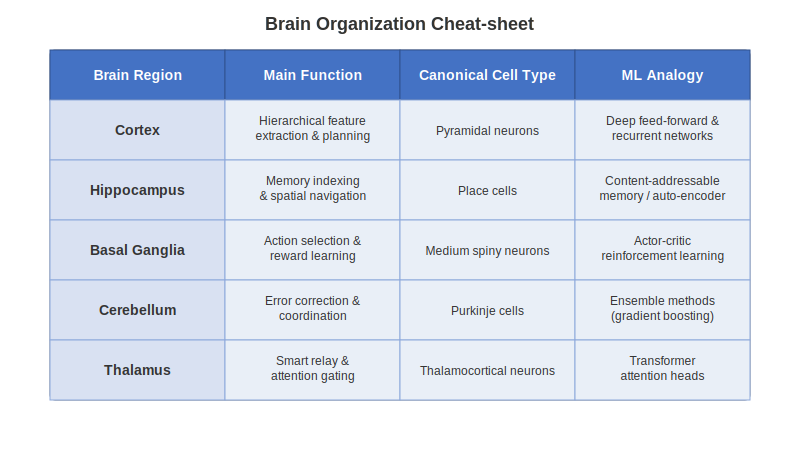

# Chapter 3: Spatial Navigation – Place & Grid Cells

## 3.0 Chapter Goals
- Understand the neural basis of spatial navigation
- Explore the organizational principles of place and grid cells
- Connect spatial coding in the brain to computational principles in AI
- Implement simple models of neural spatial representation

## 3.1 Hippocampal Formation: Organization and Cell Types

The hippocampal formation is a brain structure critical for spatial navigation and memory formation. This section examines its anatomical organization and the specialized cells that form the brain's navigational system.

### Anatomical Organization

The hippocampal formation consists of several interconnected regions:

- **Hippocampus proper (CA1-CA3)**: Processes and stores spatial memories
- **Dentate gyrus (DG)**: Performs pattern separation of similar spatial inputs
- **Entorhinal cortex (EC)**: Serves as the main interface between hippocampus and neocortex

<figure>

<figcaption>Hippocampal circuit drawn by Santiago Ramón y Cajal (1911), showing the flow of information through the structure.</figcaption>
</figure>

### Cellular Organization: The Pyramidal Cell

The principal cells in the hippocampus are pyramidal neurons, which have:

- A triangular cell body (soma)
- Apical dendrites extending toward the surface
- Basal dendrites reaching outward and downward
- A single axon that projects to other regions

This cellular architecture is significant because:

1. The layered organization creates a structured processing pipeline
2. The dendritic arbors receive thousands of inputs from different sources
3. The hierarchical arrangement enables complex pattern recognition

The pyramidal cell architecture parallels the computational structure seen in artificial neural networks, particularly in how information flows through layers and combines across multiple inputs. This similarity is not coincidental—early neural network designs were inspired by these biological principles.

## 3.2 Place Cells: The Brain's Spatial Address System

Place cells are pyramidal neurons in the hippocampus (primarily in regions CA1 and CA3) that exhibit location-specific firing patterns.

### Discovery and Properties

John O'Keefe discovered place cells in 1971 while recording from freely moving rats. These neurons show remarkable properties:

- Each cell fires strongly when the animal is in a specific location ("place field")
- Place fields are typically 20-50 cm in diameter in a rat-sized environment
- Different place cells code for different locations, creating a distributed map
- The collection of all place cells forms a complete representation of the environment

<figure>

<figcaption>Place cell firing fields. The colored regions show where individual hippocampal neurons become active as an animal explores its environment.</figcaption>
</figure>

### Key Properties of Place Cells

Place cells exhibit several important characteristics that make them ideal for spatial representation:

1. **Spatial Specificity**: Place cells remain silent most of the time, firing only when the animal enters a specific location.

2. **Environmental Remapping**: When moved to a new environment, place cells can:
   - Undergo "global remapping" where cells completely change their firing locations
   - Show "rate remapping" where the same locations are encoded but with different firing rates

3. **Stable but Plastic Representation**: Place fields are stable over days or weeks in familiar environments but can rapidly reorganize when environments change.

4. **Multimodal Integration**: Place cell firing integrates various inputs:
   - Visual landmarks
   - Self-motion cues (velocity, direction)
   - Olfactory and tactile information
   - Goal location and task demands

### Computational Principles

Place cells effectively implement a form of **sparse coding**:
- Only a small subset of neurons is active at any given location
- This creates an efficient, low-energy representation
- The sparse code is resistant to noise and damage

These principles parallel design features in many AI systems:
- Sparse representations in machine learning reduce overfitting
- One-hot encoding systems for categorical data
- Locality-sensitive hashing for nearest-neighbor lookups

## 3.3 Grid Cells: The Brain's Coordinate System

While place cells provide discrete location encoding, grid cells in the medial entorhinal cortex (MEC) create a continuous, metric representation of space.

### Discovery and Patterns

Discovered by Edvard and May-Britt Moser in 2005, grid cells fire in a remarkably regular pattern:

- Each grid cell fires at multiple locations arranged in a hexagonal lattice
- The firing fields are evenly spaced throughout the environment
- The spacing and orientation are consistent within cell clusters
- Different grid cells have different scales (spacing between firing fields)

<figure>

<figcaption>Grid cell firing pattern. The black line shows an animal's path through an environment, while the blue dots indicate locations where a single grid cell fired. Note the regular hexagonal pattern.</figcaption>
</figure>

### Grid Cell Organization

Grid cells are organized into modules based on their spatial scale:
- Dorsal MEC contains cells with smaller grid spacing (~25 cm)
- Ventral MEC contains cells with larger grid spacing (~3 m)
- Each module contains cells with similar spacing but offset grid phases
- This creates a combinatorial code that can represent vast spaces with relatively few neurons

This organization is reminiscent of how convolutional neural networks (CNNs) operate:
- Each kernel in a CNN scans across an input field (like the repeating grid fields)
- Different kernels detect different features (like differently phased grid cells)
- The hierarchical scaling of feature detectors in CNNs parallels the scaling of grid spacing

### Geometric Efficiency of Hexagonal Grids

The hexagonal lattice pattern is mathematically optimal for spatial encoding:

1. Hexagonal packing is the most efficient way to cover a 2D plane with circles
2. It minimizes the number of cells needed to represent a given area
3. It provides the highest spatial resolution with a given number of neurons

This geometric efficiency principle also appears in computer vision and signal processing:
- Hexagonal grids have been used in certain specialized CNN architectures
- Hexagonal sampling grids can provide better coverage with fewer points
- Certain image compression algorithms leverage similar geometric efficiencies

## 3.4 The Navigation Circuit: From Single Cells to Systems

Place and grid cells do not operate in isolation but form part of a larger navigation system that includes several specialized cell types:

### Head Direction Cells

Found in multiple brain regions including the thalamus and retrosplenial cortex:
- Act like a neural compass, firing when the animal faces a specific direction
- Maintain consistent preferred directions across environments
- Are calibrated by visual landmarks and updated by vestibular input

### Border/Boundary Cells

Located in the subiculum and entorhinal cortex:
- Fire when the animal is near environmental boundaries (walls, edges, cliffs)
- Help anchor the spatial map to physical landmarks
- Provide error correction for path integration

### Conjunctive Cells

Found primarily in deeper layers of the entorhinal cortex:
- Combine properties of grid cells and head direction cells
- Fire in grid patterns but only when the animal faces certain directions
- Enhance the system's ability to encode complex trajectories

### Path Integration

The navigation circuit performs path integration (dead reckoning):
- Tracking position based solely on self-motion cues (velocity, direction)
- Grid cells are believed to be the computational substrate for this process
- Works even in darkness but accumulates error over time
- Periodically calibrated by sensory information (vision, borders, landmarks)

## 3.5 Parallels to Convolutional Neural Networks

The spatial representation system in the brain shares remarkable similarities with CNNs, providing mutual inspiration between neuroscience and AI.

### Structural Similarities

1. **Receptive Fields**: 
   - Place cells have spatially localized receptive fields
   - CNN neurons similarly respond to specific regions of the input space

2. **Hierarchical Processing**:
   - Grid cells at different scales form a natural hierarchy
   - CNNs use hierarchical layers to process information at different scales

3. **Regular Sampling**:
   - Grid cells sample space in a regular pattern
   - CNN convolutional filters scan across inputs in a regular grid

4. **Invariant Representations**:
   - Place cells maintain consistent fields despite minor environmental changes
   - CNNs develop translation-invariant representations through pooling operations

### Computational Principles

1. **Weight Sharing**:
   - Grid cells use the same firing pattern repeated across space
   - CNNs use the same weights (kernels) applied across different parts of the input

2. **Sparse Coding**:
   - Only a subset of place/grid cells is active at any time
   - ReLU activations in CNNs create sparse representations

3. **Multi-scale Processing**:
   - Grid cells operate at multiple spatial scales
   - CNN architectures use multiple layers to detect features at different scales

### Inspiration Exchange

Neuroscience has informed AI:
- Early CNN architectures were inspired by visual cortex organization
- Grid-like representations have been adapted for reinforcement learning

AI has informed neuroscience:
- CNN visualization techniques help interpret neural recordings
- Network models test theories about navigation circuit function

## 3.6 Code Lab: Modeling Spatial Representations

This section provides practical implementations of computational models that capture key aspects of place and grid cells.

### Place Cell Model

```python
import numpy as np
import matplotlib.pyplot as plt
from matplotlib import cm
from mpl_toolkits.mplot3d import Axes3D

def gaussian_2d(x, y, x0, y0, sigma_x, sigma_y):
    """Generate a 2D Gaussian function centered at (x0, y0)"""
    return np.exp(-((x - x0)**2 / (2 * sigma_x**2) + (y - y0)**2 / (2 * sigma_y**2)))

def create_place_cell_population(n_cells, env_size, field_size):
    """
    Create a population of place cells covering an environment
    
    Parameters:
    n_cells: Number of place cells
    env_size: Size of the environment (width, height)
    field_size: Size of place fields (sigma_x, sigma_y)
    
    Returns:
    centers: Place field centers for each cell
    sigmas: Place field sizes for each cell
    """
    # Randomly distribute place field centers
    centers = np.random.rand(n_cells, 2) * env_size
    
    # Vary place field sizes slightly
    base_sigma = np.array(field_size)
    sigmas = np.random.normal(base_sigma, base_sigma * 0.2, (n_cells, 2))
    sigmas = np.clip(sigmas, base_sigma * 0.5, base_sigma * 1.5)
    
    return centers, sigmas

# Create environment grid
x = np.linspace(0, 10, 100)
y = np.linspace(0, 10, 100)
X, Y = np.meshgrid(x, y)

# Create population of place cells
n_place_cells = 50
centers, sigmas = create_place_cell_population(
    n_place_cells, env_size=(10, 10), field_size=(1.0, 1.0))

# Visualize a few example place cells
fig = plt.figure(figsize=(15, 5))
for i in range(3):
    ax = fig.add_subplot(1, 3, i+1)
    
    # Generate place field
    x0, y0 = centers[i]
    sigma_x, sigma_y = sigmas[i]
    place_field = gaussian_2d(X, Y, x0, y0, sigma_x, sigma_y)
    
    # Plot
    im = ax.imshow(place_field, extent=[0, 10, 0, 10], origin='lower', cmap='viridis')
    ax.set_title(f'Place Cell {i+1}')
    ax.set_xlabel('X Position')
    ax.set_ylabel('Y Position')
    plt.colorbar(im, ax=ax)

plt.tight_layout()
plt.show()

# Function to encode a position with place cells
def encode_position(position, centers, sigmas):
    """Encode a position using the place cell population"""
    x, y = position
    activities = np.zeros(len(centers))
    
    for i, ((x0, y0), (sigma_x, sigma_y)) in enumerate(zip(centers, sigmas)):
        activities[i] = gaussian_2d(x, y, x0, y0, sigma_x, sigma_y)
    
    return activities

# Plot place cell population activity for a sample position
sample_position = (4.0, 7.0)
activities = encode_position(sample_position, centers, sigmas)

plt.figure(figsize=(10, 4))
plt.subplot(1, 2, 1)
plt.bar(range(n_place_cells), activities)
plt.xlabel('Place Cell ID')
plt.ylabel('Firing Rate')
plt.title(f'Population Activity at Position {sample_position}')

# Show the position and place fields
plt.subplot(1, 2, 2)
for i, ((x0, y0), (sigma_x, sigma_y)) in enumerate(zip(centers, sigmas)):
    circle = plt.Circle((x0, y0), sigma_x, fill=False, alpha=0.3)
    plt.gca().add_patch(circle)

plt.scatter(*sample_position, color='red', s=100, marker='x', label='Position')
plt.xlim(0, 10)
plt.ylim(0, 10)
plt.xlabel('X Position')
plt.ylabel('Y Position')
plt.title('Place Field Centers')
plt.legend()
plt.grid(True)

plt.tight_layout()
plt.show()
```

### Grid Cell Model

```python
def generate_grid_pattern(center, spacing, orientation, size=(100, 100)):
    """
    Generate a grid cell firing pattern
    
    Parameters:
    center: Offset of the grid pattern
    spacing: Distance between grid fields
    orientation: Rotation of the grid pattern (radians)
    size: Size of the environment
    
    Returns:
    grid_pattern: 2D array with grid pattern
    """
    width, height = size
    grid = np.zeros((height, width))
    
    # Define the three basis vectors for the grid (120° apart)
    theta1 = orientation
    theta2 = orientation + 2*np.pi/3
    theta3 = orientation + 4*np.pi/3
    
    v1 = spacing * np.array([np.cos(theta1), np.sin(theta1)])
    v2 = spacing * np.array([np.cos(theta2), np.sin(theta2)])
    v3 = spacing * np.array([np.cos(theta3), np.sin(theta3)])
    
    # Generate grid pattern using interference of three plane waves
    for i in range(height):
        for j in range(width):
            # Position relative to grid offset
            x = j - center[0]
            y = i - center[1]
            pos = np.array([x, y])
            
            # Calculate interference pattern from three waves
            f1 = np.cos(2*np.pi * np.dot(pos, v1) / spacing**2)
            f2 = np.cos(2*np.pi * np.dot(pos, v2) / spacing**2)
            f3 = np.cos(2*np.pi * np.dot(pos, v3) / spacing**2)
            
            # Sum the waves and scale to [0, 1]
            grid[i, j] = (f1 + f2 + f3 + 3) / 6
    
    return grid

# Generate and visualize grid cell patterns at different scales
fig, axes = plt.subplots(1, 3, figsize=(15, 5))

grid_spacings = [10, 15, 25]
orientations = [0, np.pi/12, np.pi/8]
centers = [(50, 50), (45, 55), (55, 45)]

for i, (spacing, orientation, center) in enumerate(zip(grid_spacings, orientations, centers)):
    grid_pattern = generate_grid_pattern(center, spacing, orientation, size=(100, 100))
    im = axes[i].imshow(grid_pattern, cmap='viridis', origin='lower')
    axes[i].set_title(f'Grid Cell: Spacing={spacing}, Orientation={orientation:.2f}')
    plt.colorbar(im, ax=axes[i])

plt.tight_layout()
plt.show()

# Show how grid cells at different scales combine to precisely encode location
def plot_combined_grid_encoding():
    """Plot how grids at different scales combine to encode location uniquely"""
    # Number of grid modules
    n_modules = 3
    # Scales
    scales = [5, 8, 13]
    # Orientations
    orientations = [0, np.pi/6, np.pi/4]
    
    # Create a small environment
    size = 50
    environment = np.zeros((size, size, 3))
    
    # Generate grid activations for each module
    for i, (scale, orientation) in enumerate(zip(scales, orientations)):
        grid = generate_grid_pattern((size//2, size//2), scale, orientation, size=(size, size))
        # Normalize to [0, 1]
        grid = (grid - grid.min()) / (grid.max() - grid.min())
        # Assign to RGB channel
        environment[:, :, i] = grid
    
    plt.figure(figsize=(10, 8))
    plt.imshow(environment, origin='lower')
    plt.title('Combined Grid Cell Representation (RGB = different scales)')
    plt.xlabel('X Position')
    plt.ylabel('Y Position')
    plt.colorbar(label='RGB = Different grid cell modules')
    plt.show()

plot_combined_grid_encoding()
```

### Path Integration Model

```python
def simulate_path_integration(initial_pos, velocity, dt, noise_level=0.1, n_steps=100):
    """
    Simulate path integration with accumulating error.
    
    Args:
        initial_pos: Starting position (x, y)
        velocity: List of velocity vectors [(vx, vy), ...]
        dt: Time step
        noise_level: Amount of noise in velocity estimation
        n_steps: Number of steps to simulate
        
    Returns:
        true_positions: Actual positions
        estimated_positions: Positions estimated through path integration
    """
    true_pos = [initial_pos]
    estimated_pos = [initial_pos]
    
    current_true = np.array(initial_pos)
    current_est = np.array(initial_pos)
    
    for i in range(n_steps):
        # Get current velocity (may cycle through provided velocities)
        v = np.array(velocity[i % len(velocity)])
        
        # Add noise to velocity for the estimation
        v_noisy = v + np.random.normal(0, noise_level, size=2)
        
        # Update positions
        current_true = current_true + v * dt
        current_est = current_est + v_noisy * dt
        
        true_pos.append(current_true.copy())
        estimated_pos.append(current_est.copy())
    
    return np.array(true_pos), np.array(estimated_pos)

# Example usage
initial_position = [0, 0]
# Circular movement
velocities = []
for angle in np.linspace(0, 2*np.pi, 20):
    velocities.append([np.cos(angle), np.sin(angle)])

true_path, estimated_path = simulate_path_integration(
    initial_position, velocities, dt=0.1, noise_level=0.05, n_steps=100)

# Plot the paths
plt.figure(figsize=(8, 6))
plt.plot(true_path[:, 0], true_path[:, 1], 'b-', label='True path')
plt.plot(estimated_path[:, 0], estimated_path[:, 1], 'r--', 
         label='Estimated path (path integration)')
plt.scatter(true_path[0, 0], true_path[0, 1], c='green', s=100, label='Start')
plt.xlabel('X position')
plt.ylabel('Y position')
plt.title('Path Integration with Accumulating Error')
plt.legend()
plt.grid(True)
plt.axis('equal')
plt.show()
```

## 3.7 Neural Representations and CNN Principles

This section directly connects the brain's spatial representation system to the principles underlying convolutional neural networks.

### Shared Computational Motifs

1. **Local Receptive Fields**:
   - Place cells fire for specific locations in physical space
   - CNN neurons activate for specific regions in the input space
   - Both create a topographic mapping of their respective domains

2. **Hierarchical Feature Extraction**:
   - Grid cells at different scales (modules) encode space at multiple resolutions
   - CNNs use successive layers to detect features at increasingly abstract levels
   - This multi-resolution approach enables efficient encoding of complex patterns

3. **Pattern Completion and Pattern Separation**:
   - Hippocampal circuits perform pattern completion (filling in missing spatial information)
   - They also perform pattern separation (distinguishing similar locations)
   - CNNs similarly learn to generalize across similar inputs while maintaining class distinctions

4. **Coordinate Transforms**:
   - The navigation system performs coordinate transformations (egocentric to allocentric)
   - CNNs perform analogous transformations through their layered architecture
   - Both systems convert raw input into increasingly abstract representations

### Applications in AI

These principles have informed developments in AI:

1. **DeepMind's Grid-like Representations**: When trained on navigation tasks, artificial agents spontaneously develop grid-like representations similar to entorhinal grid cells.

2. **Successor Representations**: This reinforcement learning technique, inspired by hippocampal predictive coding, represents states based on future visitation patterns.

3. **Memory-Augmented Neural Networks**: Systems like Differentiable Neural Computers (DNCs) incorporate hippocampal-inspired memory systems to store and retrieve information.

4. **Hierarchical Reinforcement Learning**: Multi-scale policy approaches inspired by the brain's hierarchical representation of space and goals.

## 3.8 Take-aways

- The hippocampus contains specialized cells (place cells, grid cells) that form a coordinate system for navigation
- The cellular organization of these systems creates efficient, sparse coding of spatial information
- The regular, multi-scale nature of grid cells parallels the design principles of convolutional networks
- Neural systems balance competing demands: specificity vs. generalization, precision vs. efficiency
- Understanding biological implementations of spatial processing has directly informed AI architecture design
- Conversely, computational models help us understand biological systems through testable predictions

## 3.9 Further Reading & Media

### Key Papers
- O'Keefe, J., & Dostrovsky, J. (1971). "The hippocampus as a spatial map." *Brain Research*, 34(1), 171-175.
- Moser, E. I., Kropff, E., & Moser, M. B. (2008). "Place cells, grid cells, and the brain's spatial representation system." *Annual Review of Neuroscience*, 31, 69-89.
- Banino, A., Barry, C., Uria, B., Blundell, C., Lillicrap, T., Mirowski, P., ... & Kumaran, D. (2018). "Vector-based navigation using grid-like representations in artificial agents." *Nature*, 557(7705), 429-433.
- Cueva, C. J., & Wei, X. X. (2018). "Emergence of grid-like representations by training recurrent neural networks to perform spatial localization." *Science*, 361(6400), 337-341.

### Videos and Lectures
- Edvard Moser – Nobel Lecture on Grid Cells (2014)
- "How Do We Find Our Way? Grid Cells in the Brain" (Frontiers for Young Minds video)
- DeepMind's Podcast Episode on Neuroscience and AI

### Tutorials and Resources
- Kloosterman, F. (2021). "Analyzing navigational data and neural activity." *Current Protocols*, 1(4), e107.
- Chen, Z., Kloosterman, F., Wilson, M. A., & Brown, E. N. (2012). "Uncovering spatial topology represented by rat hippocampal population neuronal codes." *Journal of Computational Neuroscience*, 33(2), 227-255.
- Neuromatch Academy tutorials on spatial navigation and reinforcement learning