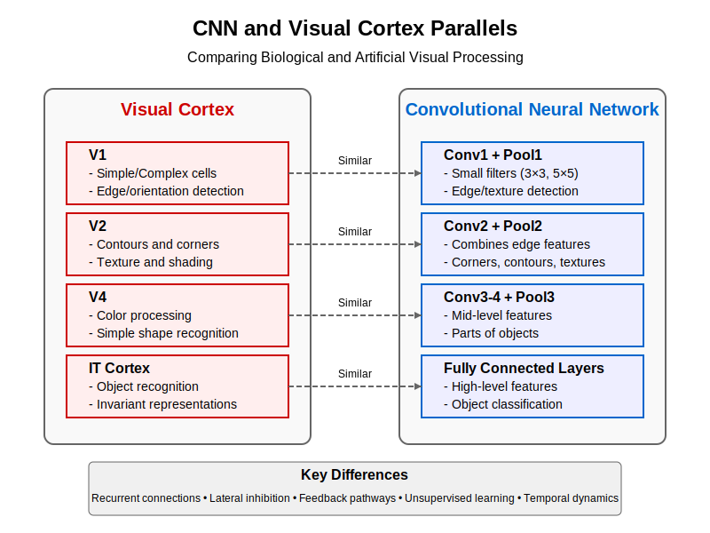

# Chapter 4: Perception Pipeline – Visual Cortex → CNNs

```{admonition} Learning Objectives
:class: note

By the end of this chapter, you will be able to:

- **Trace** the visual processing pipeline from retina to higher cortical areas
- **Understand** receptive fields and hierarchical feature extraction principles
- **Connect** biological vision mechanisms to convolutional neural network architectures
- **Compare** feature representation in the visual cortex with CNN feature maps
- **Implement** simple visual filters and feature detectors in code
```

<div style="page-break-before:always;"></div>

## 4.1 Visual System Architecture

The visual system represents one of the most extensively studied sensory pathways in neuroscience, offering rich insights that have directly influenced artificial intelligence. This section explores how visual information flows from the eye through successively more complex processing stages.


*Figure 4.1: The visual processing pathway from retina through subcortical structures to cortical areas, showing parallel processing streams.*

### 4.1.1 From Retina to LGN to Primary Visual Cortex

Visual processing begins in the retina, which is actually an extension of the brain rather than a simple sensor:

**Retinal Processing**:
- Photoreceptors (rods and cones) transduce light into neural signals
- Horizontal, bipolar, and amacrine cells perform initial processing
- Retinal ganglion cells form center-surround receptive fields
- ~1 million ganglion cell axons form the optic nerve from each eye

```python
import numpy as np
import matplotlib.pyplot as plt
from matplotlib.patches import Circle
from scipy import ndimage

def center_surround_receptive_field(size=15, center_sigma=1.0, surround_sigma=2.0, center_weight=1.0, surround_weight=0.5):
    """Generate a center-surround receptive field similar to retinal ganglion cells."""
    grid = np.arange(-size//2, size//2+1)
    xx, yy = np.meshgrid(grid, grid)
    
    # Create center and surround Gaussians
    center = np.exp(-(xx**2 + yy**2) / (2 * center_sigma**2))
    surround = np.exp(-(xx**2 + yy**2) / (2 * surround_sigma**2))
    
    # Combine to form center-surround
    receptive_field = center_weight * center - surround_weight * surround
    
    return receptive_field

# Create ON-center and OFF-center receptive fields
on_center_rf = center_surround_receptive_field(center_weight=1.0, surround_weight=0.5)
off_center_rf = -on_center_rf

# Visualize the receptive fields
fig, axes = plt.subplots(1, 2, figsize=(10, 5))

im1 = axes[0].imshow(on_center_rf, cmap='RdBu_r')
axes[0].set_title('ON-center Receptive Field')
axes[0].set_xticks([])
axes[0].set_yticks([])
plt.colorbar(im1, ax=axes[0])

im2 = axes[1].imshow(off_center_rf, cmap='RdBu_r')
axes[1].set_title('OFF-center Receptive Field')
axes[1].set_xticks([])
axes[1].set_yticks([])
plt.colorbar(im2, ax=axes[1])

plt.tight_layout()
# plt.show()  # Uncomment to display
```

**Lateral Geniculate Nucleus (LGN)**:
- Subcortical relay station in the thalamus
- Maintains retinotopic organization (spatial mapping)
- Separates input into parallel channels:
  - Parvocellular pathway (P cells): High resolution, color
  - Magnocellular pathway (M cells): Motion, low contrast sensitivity
  - Koniocellular pathway (K cells): Blue-yellow color, other functions

**Primary Visual Cortex (V1)**:
- Located in the occipital lobe
- First stage of cortical visual processing
- Organized in retinotopic map of visual field
- Divided into six layers with distinct cell types and connections
- Contains orientation-selective cells (simple and complex)
- Processes basic features: orientation, spatial frequency, color, motion

From V1, information flows to higher visual areas (V2, V3, V4, etc.) that extract increasingly complex features.

### 4.1.2 Ventral vs Dorsal Streams: "What" vs "Where"

Visual processing bifurcates into two main pathways beyond V1 and V2:

**Ventral Stream (the "What" pathway)**:
- Flows from V1 → V2 → V4 → Inferior Temporal (IT) cortex
- Specializes in object recognition and form processing
- Receptive fields increase in size and complexity along the pathway
- Culminates in cells that respond to complex objects regardless of position, size, or lighting
- Lesions cause object recognition deficits (visual agnosia)

**Dorsal Stream (the "Where"/"How" pathway)**:
- Flows from V1 → V2 → V3 → Middle Temporal (MT/V5) → Posterior Parietal cortex
- Specializes in spatial relationships and motion
- Processes location, movement, and action-relevant properties
- Critical for visuomotor coordination and spatial attention
- Lesions cause spatial awareness deficits (e.g., hemispatial neglect)

This dual-pathway organization has inspired various dual-stream architectures in artificial intelligence, particularly for tasks requiring both recognition and localization.

### 4.1.3 Hierarchical Organization of Visual Cortex

The visual cortex exhibits a clear hierarchical organization:

```python
def display_visual_hierarchy():
    """Display the visual processing hierarchy and key properties."""
    visual_areas = [
        {
            "area": "V1",
            "receptive_field_size": "~1°",
            "feature_complexity": "Oriented edges, bars, gratings",
            "invariance": "Minimal position invariance"
        },
        {
            "area": "V2",
            "receptive_field_size": "~2-4°",
            "feature_complexity": "Contours, textures, illusory contours",
            "invariance": "Limited position invariance"
        },
        {
            "area": "V4",
            "receptive_field_size": "~4-8°",
            "feature_complexity": "Shape fragments, curvature, color",
            "invariance": "Moderate position and size invariance"
        },
        {
            "area": "IT (PIT/CIT/AIT)",
            "receptive_field_size": "~10-30°",
            "feature_complexity": "Object parts, faces, complex shapes",
            "invariance": "Strong invariance to position, size, and viewpoint"
        }
    ]
    
    print("Visual Processing Hierarchy - Ventral Stream")
    print("-" * 80)
    print(f"{'Area':<8} {'RF Size':<15} {'Feature Complexity':<35} {'Invariance':<30}")
    print("-" * 80)
    
    for area in visual_areas:
        print(f"{area['area']:<8} {area['receptive_field_size']:<15} {area['feature_complexity']:<35} {area['invariance']:<30}")
```

Key principles of this hierarchical organization include:

1. **Progressive Abstraction**: Higher areas represent more complex features and objects
2. **Increasing Receptive Field Size**: Receptive fields become larger at higher levels
3. **Growing Invariance**: Higher areas show greater invariance to transformations (position, size, etc.)
4. **Declining Retinotopy**: Spatial organization becomes less precise in higher areas
5. **Increasing Response Latency**: Processing time increases along the hierarchy

### 4.1.4 Feedback Connections and Top-Down Processing

While the visual system is often explained as a feedforward hierarchy, feedback connections are equally important:

- Feedback projections outnumber feedforward connections in the visual cortex
- Higher areas send predictions to lower areas
- Feedback modulates response properties and selectivity
- Facilitates attention, expectation, and context effects
- Enables perceptual completion and object disambiguation

These recurrent connections enable the visual system to integrate prior knowledge and context with incoming sensory signals, forming the basis for predictive processing frameworks.

## 4.2 Receptive Fields

Receptive fields—the regions of visual space that influence a neuron's response—are fundamental to understanding visual processing in both biological and artificial systems.


*Figure 4.2: Different types of receptive fields in the visual pathway, from center-surround to oriented bars to complex pattern detectors.*

### 4.2.1 Simple, Complex, and Hypercomplex Cells

Hubel and Wiesel's groundbreaking work in the 1960s identified three main classes of cells in the visual cortex:

**Simple Cells**:
- Linear summation of inputs within precisely defined excitatory and inhibitory regions
- Selective for orientation, position, and size of stimuli
- Predictable responses based on exact stimulus location
- Example: cells that respond to bars or edges with specific orientations at precise locations

```python
def simple_cell_model(image, orientation_deg, sigma_x=4, sigma_y=1, center_x=0, center_y=0):
    """
    Simulate a simple cell in V1 using a Gabor filter.
    
    Args:
        image: Input image (grayscale)
        orientation_deg: Preferred orientation in degrees
        sigma_x, sigma_y: Gaussian envelope widths
        center_x, center_y: Center coordinates
        
    Returns:
        Simple cell response to the input image
    """
    # Convert orientation to radians
    orientation = np.deg2rad(orientation_deg)
    
    # Create a grid of coordinates
    rows, cols = image.shape
    x, y = np.meshgrid(np.arange(cols), np.arange(rows))
    x = x - cols/2 - center_x
    y = y - rows/2 - center_y
    
    # Rotate coordinates
    x_theta = x * np.cos(orientation) + y * np.sin(orientation)
    y_theta = -x * np.sin(orientation) + y * np.cos(orientation)
    
    # Gabor filter components
    gaussian = np.exp(-(x_theta**2 / (2*sigma_x**2) + y_theta**2 / (2*sigma_y**2)))
    sinusoid = np.sin(2 * np.pi * x_theta / (4*sigma_x))
    
    # Gabor filter (receptive field)
    gabor = gaussian * sinusoid
    
    # Apply the filter (convolve with the image)
    response = ndimage.convolve(image.astype(float), gabor, mode='constant')
    
    return response, gabor

# Example usage (with a synthetic edge image)
def create_edge_image(size=64, angle_deg=45, edge_position=0, edge_width=1):
    """Create a simple edge image for demonstration."""
    angle = np.deg2rad(angle_deg)
    x, y = np.meshgrid(np.linspace(-1, 1, size), np.linspace(-1, 1, size))
    
    # Rotate coordinates
    x_rot = x * np.cos(angle) + y * np.sin(angle)
    
    # Create edge
    edge = (x_rot > edge_position).astype(float)
    
    # Smooth the edge slightly
    edge = ndimage.gaussian_filter(edge, sigma=edge_width)
    
    return edge
```

**Complex Cells**:
- Respond to oriented edges and bars regardless of exact position
- Maintain orientation selectivity but exhibit spatial invariance
- Often modeled as combining outputs from multiple simple cells
- Example: cells that respond to a vertical edge anywhere within their receptive field

```python
def complex_cell_model(image, orientation_deg, sigma_x=4, sigma_y=1, positions=5, spacing=2):
    """
    Simulate a complex cell by combining responses from multiple simple cells.
    
    Args:
        image: Input image
        orientation_deg: Preferred orientation
        sigma_x, sigma_y: Filter parameters
        positions: Number of simple cells to combine
        spacing: Spacing between simple cell centers
        
    Returns:
        Complex cell response
    """
    # Generate responses from multiple simple cells at different positions
    responses = []
    for i in range(positions):
        # Calculate position offset
        offset = (i - positions // 2) * spacing
        
        # Get simple cell response
        simple_response, _ = simple_cell_model(
            image, orientation_deg, sigma_x, sigma_y, center_x=offset, center_y=0)
        
        responses.append(simple_response)
    
    # Complex cell combines simple cell responses (maximum response at each point)
    complex_response = np.maximum.reduce(responses)
    
    return complex_response
```

**Hypercomplex (End-Stopped) Cells**:
- Selective for specific stimulus properties beyond orientation
- Respond to line endings, curvature, or corners
- Can be direction-selective or sensitive to specific motion patterns
- Example: cells that respond to a line segment of specific length but not to a longer line

These cell types implement a hierarchical feature detection system, where complex cells build invariance to position, and hypercomplex cells detect more specialized features needed for object recognition.

### 4.2.2 Gabor Filters and Orientation Selectivity

The orientation selectivity of V1 cells is well-modeled by Gabor filters—sinusoidal gratings modulated by a Gaussian envelope:

```python
def visualize_gabor_filters():
    """Visualize Gabor filters at different orientations and frequencies."""
    orientations = [0, 45, 90, 135]
    frequencies = [0.1, 0.2, 0.3]
    
    fig, axes = plt.subplots(len(frequencies), len(orientations), figsize=(12, 9))
    
    for i, freq in enumerate(frequencies):
        for j, orient in enumerate(orientations):
            # Create Gabor filter
            sigma_x = 10
            sigma_y = 10
            
            x, y = np.meshgrid(np.arange(-20, 21), np.arange(-20, 21))
            
            # Rotate coordinates
            orient_rad = np.deg2rad(orient)
            x_theta = x * np.cos(orient_rad) + y * np.sin(orient_rad)
            y_theta = -x * np.sin(orient_rad) + y * np.cos(orient_rad)
            
            # Create Gabor filter
            gaussian = np.exp(-(x_theta**2 + y_theta**2) / (2 * sigma_x**2))
            sinusoid = np.sin(2 * np.pi * freq * x_theta)
            gabor = gaussian * sinusoid
            
            # Display the filter
            axes[i, j].imshow(gabor, cmap='RdBu_r')
            axes[i, j].set_title(f"{orient}°, f={freq}")
            axes[i, j].axis('off')
    
    plt.tight_layout()
    # plt.show()  # Uncomment to display
```

Key properties of Gabor filters that match V1 neurophysiology:

1. **Orientation Selectivity**: Responds strongly to edges/gratings at a preferred orientation
2. **Spatial Frequency Selectivity**: Tuned to specific scales or frequencies
3. **Localization**: Well-defined in both spatial and frequency domains
4. **Phase Sensitivity**: Different cells prefer different phases of gratings
5. **Bandwidth**: Cells have specific tuning widths for orientation and frequency

The orientation preference of neurons in V1 is organized in a systematic way:
- Cells with similar orientation preferences cluster in "orientation columns"
- Adjacent columns represent gradually changing orientations, forming "pinwheels"
- This organization efficiently covers the space of all possible orientations

### 4.2.3 Center-Surround Organization

Center-surround receptive fields are foundational to early visual processing:

**Retinal Ganglion Cells**:
- ON-center cells: Excited by light in center, inhibited by light in surround
- OFF-center cells: Inhibited by light in center, excited by light in surround
- Function as contrast detectors and edge enhancers
- Perform efficient coding by reducing redundancy in natural images

**LGN Cells**:
- Maintain the center-surround organization from retinal inputs
- P cells: Small receptive fields, color-opponent (red-green)
- M cells: Larger receptive fields, higher contrast sensitivity
- K cells: Blue-yellow color opponency

This center-surround organization implements a form of local normalization and contrast enhancement that is also found in early layers of CNNs.

### 4.2.4 Feature Hierarchy from V1 to IT

As we move from V1 through the ventral stream to IT cortex, cells respond to increasingly complex features:

```python
def feature_hierarchy_visual():
    """Visualization of the feature hierarchy in the ventral visual stream."""
    areas = ["V1", "V2", "V4", "IT"]
    features = [
        "Oriented edges, bars",
        "Contours, textures",
        "Shape fragments, curves",
        "Objects, faces, scenes"
    ]
    
    # This would generate a visualization in a real notebook
    feature_map = {areas[i]: features[i] for i in range(len(areas))}
    return feature_map
```

**V1**: Orientation, spatial frequency, edges, local features

**V2**: Combinations of orientations, contours, textures
- Responds to illusory contours
- Sensitive to border ownership
- Begins processing figure-ground relationships

**V4**: Shape fragments, curvature, color
- Object-part selective responses
- Moderate invariance to size and position
- Attention strongly modulates responses

**IT Cortex**: Objects, faces, complex patterns
- Cells selective for specific object categories
- "Grandmother cells" that respond to particular face identities
- High invariance to transformations (position, size, viewpoint)
- Organized in specialized modules (e.g., fusiform face area)

This hierarchical feature organization is a key principle that directly inspired convolutional neural networks.

## 4.3 CNN Parallels

Convolutional Neural Networks (CNNs) incorporate many principles from the visual system, representing a striking example of neuroscience-inspired AI.


*Figure 4.3: Parallels between the visual cortex hierarchy and layers of a convolutional neural network.*

### 4.3.1 Convolutional Layers as Receptive Fields

Convolutional layers in CNNs implement the same basic principle as receptive fields in the visual cortex:

```python
import torch
import torch.nn as nn
import torch.nn.functional as F

class SimpleConvNet(nn.Module):
    def __init__(self):
        super(SimpleConvNet, self).__init__()
        
        # First convolutional layer - similar to V1 simple cells
        self.conv1 = nn.Conv2d(in_channels=1, out_channels=6, kernel_size=5, padding=2)
        
        # Second convolutional layer - similar to V2
        self.conv2 = nn.Conv2d(in_channels=6, out_channels=16, kernel_size=5)
        
        # Fully connected layers - similar to higher visual areas
        self.fc1 = nn.Linear(16 * 5 * 5, 120)
        self.fc2 = nn.Linear(120, 84)
        self.fc3 = nn.Linear(84, 10)  # 10 output classes
        
    def forward(self, x):
        # Conv + ReLU + Max Pooling: detection + spatial invariance
        x = F.max_pool2d(F.relu(self.conv1(x)), kernel_size=2)
        x = F.max_pool2d(F.relu(self.conv2(x)), kernel_size=2)
        
        # Flatten to vector for fully connected layers
        x = x.view(-1, 16 * 5 * 5)
        
        # Fully connected layers with ReLU
        x = F.relu(self.fc1(x))
        x = F.relu(self.fc2(x))
        x = self.fc3(x)
        
        return x

# Create a simple CNN
simple_cnn = SimpleConvNet()

# Initialize with random image (1 channel, 28x28 pixels)
sample_input = torch.randn(1, 1, 28, 28)

# Visualize the first layer filters after training (in a real notebook)
def visualize_filters(model):
    """Visualize the filters learned in the first convolutional layer."""
    # Extract filters from the first layer
    filters = model.conv1.weight.data.numpy()
    
    # For demonstration purpose, just return the filter shapes
    return filters.shape
```

Key parallels between convolutional layers and visual receptive fields:

1. **Local Connectivity**: Convolutional filters only connect to a small region of the input, just like receptive fields

2. **Weight Sharing**: The same filter is applied across the entire input, similar to how V1 cells with the same orientation preference process different parts of the visual field

3. **Hierarchical Processing**: Deeper layers process the outputs of earlier layers to detect more complex patterns

4. **Feature Detectors**: First-layer filters often learn Gabor-like patterns similar to V1 cells

5. **Parameter Efficiency**: Both systems reduce parameters through spatial weight sharing

### 4.3.2 Pooling Operations and Invariance

Pooling layers in CNNs create invariance to small transformations, analogous to complex cells in V1:

```python
def demonstrate_pooling(image, pool_size=2, stride=2):
    """Demonstrate how pooling creates invariance to small translations."""
    # Create a small translated version of the image
    rows, cols = image.shape
    translation = 1  # Translate by 1 pixel
    
    translated_image = np.zeros_like(image)
    translated_image[translation:, translation:] = image[:-translation, :-translation]
    
    # Apply max pooling to both images
    def max_pool(img, pool_size, stride):
        result = np.zeros((img.shape[0]//stride, img.shape[1]//stride))
        for i in range(0, img.shape[0]-pool_size+1, stride):
            for j in range(0, img.shape[1]-pool_size+1, stride):
                result[i//stride, j//stride] = np.max(img[i:i+pool_size, j:j+pool_size])
        return result
    
    pooled_orig = max_pool(image, pool_size, stride)
    pooled_trans = max_pool(translated_image, pool_size, stride)
    
    # Compute similarity between pooled representations
    similarity = np.corrcoef(pooled_orig.flatten(), pooled_trans.flatten())[0, 1]
    
    # Return results (would visualize in a real notebook)
    return {
        "original_shape": image.shape,
        "pooled_shape": pooled_orig.shape,
        "similarity_after_pooling": similarity
    }
```

Parallels between pooling and biological visual processing:

1. **Translation Invariance**: Max pooling creates robustness to exact positioning, similar to complex cells

2. **Dimensionality Reduction**: Pooling reduces spatial dimensions, similar to increasing receptive field sizes in higher visual areas

3. **Hierarchical Invariance**: Stacking convolutional and pooling layers creates increasing invariance, mirroring the ventral stream

4. **Feature Integration**: Pooling helps integrate features over local regions

The increasing invariance to transformations is a key feature of the ventral stream that CNNs replicate through their architecture.

### 4.3.3 Feature Hierarchies in Deep Networks

Deep CNNs develop feature hierarchies strikingly similar to the visual cortex:

```python
def visualize_cnn_hierarchy():
    """Illustrate the hierarchy of features learned in different CNN layers."""
    
    cnn_hierarchy = {
        "layer1": {
            "feature_type": "Edges, textures, colors",
            "biological_parallel": "V1 simple cells (oriented edge detectors)",
            "receptive_field": "Small (e.g., 5x5 pixels)"
        },
        "layer2": {
            "feature_type": "Corners, contours, simple textures",
            "biological_parallel": "V2 cells (contour integration)",
            "receptive_field": "Medium (effective size grows)"
        },
        "layer3": {
            "feature_type": "Object parts, complex textures",
            "biological_parallel": "V4 cells (shape fragments)",
            "receptive_field": "Large (encompasses significant portion of image)"
        },
        "layer4": {
            "feature_type": "Object detectors, category-specific features",
            "biological_parallel": "IT cells (object and category selective)",
            "receptive_field": "Very large (most of the image)"
        }
    }
    
    return cnn_hierarchy
```

Zeiler and Fergus (2014) demonstrated this hierarchy by visualizing features learned at different layers of a CNN:

1. **First Layer**: Oriented edges, color blobs (like V1)
2. **Middle Layers**: Textures, patterns, object parts (like V2/V4)
3. **Deep Layers**: Object detectors, category-specific features (like IT)

This emergent hierarchy develops through training, without being explicitly programmed—a case of convergent evolution between biological and artificial systems.

### 4.3.4 Visualization of CNN Features

Techniques to visualize CNN features have revealed striking similarities to biological vision:

```python
def feature_visualization_techniques():
    """Summarize techniques for visualizing CNN features."""
    
    techniques = {
        "Activation Maximization": {
            "approach": "Optimize input to maximize activation of specific neurons",
            "insight": "Reveals preferred stimuli of units, similar to neurophysiology experiments"
        },
        "Deconvolution & Guided Backprop": {
            "approach": "Back-project activations to input space to visualize what activated units",
            "insight": "Shows what patterns in input space drive specific features"
        },
        "Feature Inversion": {
            "approach": "Reconstruct image from feature representations",
            "insight": "Reveals what information is preserved at each layer"
        },
        "GradCAM": {
            "approach": "Use gradients to identify important regions for classification",
            "insight": "Shows attention-like focus on diagnostic image regions"
        }
    }
    
    return techniques
```

These visualization techniques have revealed that:

1. Early CNN layers develop Gabor-like filters similar to V1 neurons
2. Intermediate layers detect combinations of edges and textures
3. Deep layers contain units selective for specific objects or parts
4. CNNs develop specialized detectors for faces, text, and other categories

The similarity between CNN feature visualization and neurophysiological recordings is one of the most compelling connections between artificial and biological vision.

## 4.4 From Biology to Deep Learning

The development of CNNs represents a clear example of neuroscience directly inspiring AI advances.

### 4.4.1 Hubel & Wiesel's Discoveries → Neocognitron → LeNet → AlexNet

The lineage from visual neuroscience to modern deep learning is direct and well-documented:

**Hubel & Wiesel (1960s)**:
- Discovered simple and complex cells in cat visual cortex
- Identified hierarchical processing and receptive fields
- Won Nobel Prize in 1981 for this groundbreaking work

**Neocognitron (Fukushima, 1980)**:
- First computational model directly inspired by Hubel & Wiesel
- Introduced alternating feature detection and pooling layers
- Pioneered the basic CNN architecture but lacked effective training

**LeNet (LeCun et al., 1989-1998)**:
- Added backpropagation to train the network end-to-end
- Developed for handwritten digit recognition (MNIST)
- Demonstrated the effectiveness of convolutional architecture
- Limited by computational constraints of the era

**AlexNet (Krizhevsky et al., 2012)**:
- Scaled up CNN approach with GPU implementation
- Won ImageNet competition by large margin
- Triggered the deep learning revolution
- Maintained the same biological inspiration from earlier work

```python
def cnn_evolution_timeline():
    """Create a timeline of CNN evolution from biological inspiration to modern architectures."""
    
    timeline = [
        {"year": "1959-1968", "development": "Hubel & Wiesel discover simple and complex cells in visual cortex"},
        {"year": "1980", "development": "Fukushima's Neocognitron: First hierarchical convolutional architecture"},
        {"year": "1989", "development": "LeCun introduces backpropagation for training CNNs"},
        {"year": "1998", "development": "LeNet-5 demonstrates effective digit recognition"},
        {"year": "2012", "development": "AlexNet wins ImageNet, starts deep learning revolution"},
        {"year": "2014", "development": "VGGNet and GoogLeNet deepen and refine architectures"},
        {"year": "2015", "development": "ResNet introduces skip connections, enabling very deep networks"},
        {"year": "2017+", "development": "Advanced architectures (DenseNet, EfficientNet) optimize CNN design"}
    ]
    
    return timeline
```

This direct lineage demonstrates how neuroscience insights laid the foundation for transformative AI advances decades later.

### 4.4.2 Biological Constraints vs Engineering Solutions

While CNNs draw inspiration from biology, they also diverge in significant ways:

**Biological Features Maintained**:
- Local receptive fields and hierarchical processing
- Feature detection followed by pooling for invariance
- Increasingly complex feature representations
- Parallel processing of different visual attributes

**Engineering Departures**:
- Backpropagation (biologically implausible in its standard form)
- Separate forward and backward passes
- Weight sharing across entire feature maps
- Supervised training with labeled examples
- Batch normalization and other engineering optimizations

```python
def compare_bio_vs_engineering():
    """Compare biological visual systems with CNN engineering approaches."""
    
    comparison = {
        "Learning": {
            "Biology": "Hebbian learning, STDP, reinforcement, unsupervised",
            "CNNs": "Backpropagation, supervised learning with labels"
        },
        "Architecture": {
            "Biology": "Recurrent connections, feedback pathways, modulatory inputs",
            "CNNs": "Primarily feedforward, limited recurrence in some designs"
        },
        "Activation": {
            "Biology": "Spiking neurons with temporal dynamics",
            "CNNs": "Continuous-valued activations (ReLU, etc.)"
        },
        "Efficiency": {
            "Biology": "Extremely energy efficient, sparse activity",
            "CNNs": "Computationally intensive, dense computation"
        },
        "Learning Speed": {
            "Biology": "Fast one-shot learning for some tasks",
            "CNNs": "Requires many examples, but improving with few-shot methods"
        }
    }
    
    return comparison
```

These differences represent engineering pragmatism: CNNs adopt biologically-inspired principles where helpful but diverge where engineering solutions are more effective.

### 4.4.3 Normalization and Gain Control Mechanisms

Both biological and artificial visual systems implement normalization:

**Biological Normalization**:
- Contrast normalization in retina and LGN
- Cross-orientation inhibition in V1
- Surround suppression effects
- Divisive normalization across neural populations
- Adaptation to prevailing input statistics

**CNN Normalization**:
- Batch normalization
- Layer normalization
- Instance normalization
- Group normalization
- Local response normalization (used in AlexNet)

```python
def normalization_example():
    """Demonstrate the effect of normalization in neural processing."""
    
    # Create sample activations
    activations = np.random.gamma(shape=2, scale=2, size=1000)  # Skewed distribution
    
    # Apply divisive normalization (simplified model)
    def divisive_normalization(act, sigma=1.0, neighborhood_size=50):
        normalized = np.zeros_like(act)
        for i in range(len(act)):
            # Define local neighborhood
            start = max(0, i - neighborhood_size//2)
            end = min(len(act), i + neighborhood_size//2)
            neighborhood = act[start:end]
            
            # Compute normalization factor
            norm_factor = np.sqrt(sigma**2 + np.sum(neighborhood**2))
            
            # Normalize
            normalized[i] = act[i] / norm_factor
        
        return normalized
    
    normalized_activations = divisive_normalization(activations)
    
    # Compare statistics
    stats = {
        "original_mean": np.mean(activations),
        "original_std": np.std(activations),
        "original_max": np.max(activations),
        "normalized_mean": np.mean(normalized_activations),
        "normalized_std": np.std(normalized_activations),
        "normalized_max": np.max(normalized_activations)
    }
    
    return stats
```

Normalization serves several key functions:
1. Stabilizes training by controlling activation distributions
2. Enables efficient coding by adapting to input statistics
3. Enhances discriminability by emphasizing differences
4. Manages the dynamic range of neural responses

The parallel implementation of normalization in both systems highlights its computational importance.

### 4.4.4 Attention Mechanisms

Attention mechanisms represent another area of convergence:

**Visual Attention in the Brain**:
- Selective enhancement of relevant visual regions
- Spotlight or zoom lens models of spatial attention
- Feature-based attention that enhances specific attributes
- Modulation by frontal and parietal control networks
- Enhanced processing and perceptual quality in attended regions

**Attention in Deep Learning**:
- Spatial attention mechanisms in CNNs
- Channel attention (e.g., Squeeze-and-Excitation Networks)
- Self-attention in Transformers (now integrated into vision models)
- Cross-attention between modalities
- Hard attention (selecting specific regions) vs. soft attention (weighting)

```python
def attention_mechanisms():
    """Compare biological and artificial attention mechanisms."""
    
    attention_comparison = {
        "Spatial Attention": {
            "Biology": "Enhanced processing at attended locations, controlled by FEF/IPS",
            "AI": "Spatial attention maps, region proposal networks, visual transformers"
        },
        "Feature Attention": {
            "Biology": "Enhanced processing of attended features across visual field",
            "AI": "Channel attention mechanisms, feature emphasizing"
        },
        "Effects": {
            "Biology": "Increased firing rates, improved discriminability, reduced latency",
            "AI": "Weighted feature maps, selected processing pathways"
        },
        "Control": {
            "Biology": "Top-down control from prefrontal and parietal cortex",
            "AI": "Learned attention weights, explicit guidance mechanisms"
        }
    }
    
    return attention_comparison
```

Recent CNN architectures increasingly incorporate attention mechanisms, moving beyond pure feedforward processing toward more brain-like dynamic routing of information.

## 4.5 Beyond Feedforward Processing

While early CNNs focused on feedforward processing, both biological vision and cutting-edge AI incorporate more complex processing dynamics.

### 4.5.1 Recurrence in Visual Processing

The visual cortex contains extensive recurrent connections:

**Biological Recurrence**:
- Local recurrent circuits within cortical areas
- Feedback connections from higher to lower areas
- Horizontal connections linking neurons within layers
- Temporal dynamics and sustained activity patterns

**AI Recurrence**:
- Recurrent convolutional networks
- Convolutional LSTMs
- CORnet and similar biologically-inspired models
- Transformer-based architectures with self-attention

```python
class RecurrentConvLayer(nn.Module):
    """Simple implementation of a recurrent convolutional layer."""
    def __init__(self, input_channels, output_channels, kernel_size=3, padding=1):
        super(RecurrentConvLayer, self).__init__()
        
        self.input_channels = input_channels
        self.output_channels = output_channels
        
        # Forward connection
        self.conv_forward = nn.Conv2d(
            input_channels, output_channels, kernel_size, padding=padding)
        
        # Recurrent connection
        self.conv_recurrent = nn.Conv2d(
            output_channels, output_channels, kernel_size, padding=padding)
        
        # Activation function
        self.relu = nn.ReLU(inplace=True)
        
    def forward(self, x, prev_state=None):
        # Forward pass
        h_new = self.conv_forward(x)
        
        # Add recurrent connection if previous state exists
        if prev_state is not None:
            h_new = h_new + self.conv_recurrent(prev_state)
        
        # Apply non-linearity
        h_new = self.relu(h_new)
        
        return h_new
```

Recurrent processing enables:
1. Integration of information over time
2. Refinement of initial representations
3. Context-sensitive processing
4. Figure-ground segmentation
5. Perceptual completion and illusion

Incorporating recurrence brings AI systems closer to biological vision and can improve performance on challenging tasks.

### 4.5.2 Predictive Coding and Generative Models

The brain appears to implement predictive processing, which has inspired generative models in AI:

**Predictive Coding in the Brain**:
- Higher levels predict lower-level activity
- Prediction errors drive learning and updating
- Balances bottom-up evidence with top-down predictions
- Explains effects like end-stopping and non-classical receptive fields

**Corresponding AI Approaches**:
- Variational autoencoders (VAEs)
- Generative adversarial networks (GANs)
- Diffusion models
- Hierarchical predictive coding models

```python
def predictive_coding_model(input_image, prediction, learning_rate=0.1):
    """Simplified implementation of predictive coding update."""
    
    # Compute prediction error
    prediction_error = input_image - prediction
    
    # Update predictions to minimize error
    new_prediction = prediction + learning_rate * prediction_error
    
    # Return updated prediction and error
    return {
        "prediction": new_prediction,
        "prediction_error": prediction_error,
        "error_magnitude": np.mean(np.abs(prediction_error))
    }
```

Predictive coding offers a unified framework for understanding perception, learning, and attention in both biological and artificial systems.

### 4.5.3 Integration of Context and Prior Knowledge

Both biological and advanced artificial vision systems integrate contextual information:

**Contextual Effects in Biological Vision**:
- Scene context influences object recognition
- Prior knowledge shapes perception of ambiguous stimuli
- Contour integration and grouping phenomena
- Long-range connections create context-dependent responses

**AI Approaches to Context**:
- Scene graph models
- Contextual attention mechanisms
- Memory networks that maintain context
- Multimodal systems integrating vision with language

```python
def contextual_influence_demo():
    """Demonstrate how context influences perception."""
    
    # Example of ambiguous stimuli with different contexts
    contexts = {
        "context_A": "The chef carefully placed the ___ on the dining table.",
        "context_B": "The courier delivered the ___ to the customer.",
        "ambiguous_stimulus": "plate"  # Could be dinner plate or tectonic plate
    }
    
    # Simulated perception based on context (would be model outputs in practice)
    perceptions = {
        "context_A": {
            "interpretation": "dinner plate",
            "confidence": 0.95,
            "associated_features": ["round", "ceramic", "food-related"]
        },
        "context_B": {
            "interpretation": "shipment package",
            "confidence": 0.82,
            "associated_features": ["cardboard", "shipping label", "delivery"]
        }
    }
    
    return {"contexts": contexts, "perceptions": perceptions}
```

Integrating context and prior knowledge brings artificial systems closer to human-like perception with its robust, context-sensitive interpretation.

### 4.5.4 The Free Energy Principle

The free energy principle provides a unifying theoretical framework that may explain many aspects of brain function:

**Key Concepts**:
- The brain minimizes prediction error (free energy)
- Perception is inference about the causes of sensory data
- Learning improves the generative model to better predict inputs
- Attention allocates resources to minimize expected free energy

**AI Implementations**:
- Variational inference methods
- Active inference models
- Energy-based models
- Self-supervised predictive learning approaches

```python
def free_energy_calculation(sensory_data, predicted_data, model_complexity):
    """Simplified calculation of free energy."""
    
    # Prediction error component (accuracy)
    prediction_error = np.mean((sensory_data - predicted_data)**2)
    
    # Complexity penalty (regularization)
    complexity_cost = model_complexity
    
    # Free energy combines both terms
    free_energy = prediction_error + complexity_cost
    
    return {
        "free_energy": free_energy,
        "prediction_error": prediction_error,
        "complexity_cost": complexity_cost
    }
```

The free energy principle provides a theoretical bridge between biological and artificial intelligence, suggesting fundamental computational principles that may underlie both.

## 4.6 Code Lab

Let's explore practical implementations of visual processing concepts from both biological and artificial systems.

### 4.6.1 Implementing Simple Gabor Filters

```python
import numpy as np
import matplotlib.pyplot as plt
from scipy import ndimage
from skimage import data, color

def create_gabor_filter(size=25, sigma=3.0, theta=0, lambda_=5.0, gamma=0.5, psi=0):
    """
    Create a Gabor filter kernel.
    
    Args:
        size: Size of the kernel
        sigma: Standard deviation of the Gaussian envelope
        theta: Orientation (in radians)
        lambda_: Wavelength of sinusoidal component
        gamma: Spatial aspect ratio
        psi: Phase offset
        
    Returns:
        Gabor kernel
    """
    # Generate grid
    x, y = np.meshgrid(np.arange(-size//2, size//2+1), np.arange(-size//2, size//2+1))
    
    # Rotation
    x_theta = x * np.cos(theta) + y * np.sin(theta)
    y_theta = -x * np.sin(theta) + y * np.cos(theta)
    
    # Gaussian envelope
    gb = np.exp(-(x_theta**2 + (gamma * y_theta)**2) / (2 * sigma**2))
    
    # Sinusoidal carrier
    gb *= np.cos(2 * np.pi * x_theta / lambda_ + psi)
    
    return gb

def apply_gabor_bank(image, num_orientations=8):
    """Apply a bank of Gabor filters to an image."""
    if len(image.shape) > 2:
        # Convert to grayscale if color
        image = color.rgb2gray(image)
    
    # Create filters at different orientations
    orientations = np.linspace(0, np.pi, num_orientations)
    responses = []
    filters = []
    
    for theta in orientations:
        # Create filter
        gabor_kernel = create_gabor_filter(theta=theta)
        filters.append(gabor_kernel)
        
        # Apply filter
        response = ndimage.convolve(image, gabor_kernel, mode='nearest')
        responses.append(response)
    
    return responses, filters

# Example usage
def gabor_demo():
    # Load sample image
    image = data.camera()
    
    # Apply Gabor filters
    responses, filters = apply_gabor_bank(image)
    
    # Visualization code (would generate plots in real notebook)
    return {
        "image_shape": image.shape,
        "num_filters": len(filters),
        "filter_shape": filters[0].shape,
        "response_shape": responses[0].shape
    }

# Run the demo
gabor_result = gabor_demo()
print(f"Applied {gabor_result['num_filters']} Gabor filters to image of shape {gabor_result['image_shape']}")
```

### 4.6.2 Building a Basic Convolutional Layer

```python
import torch
import torch.nn as nn
import torch.nn.functional as F
import torchvision.transforms as transforms
from torchvision.datasets import MNIST
from torch.utils.data import DataLoader

class SimpleV1Model(nn.Module):
    """Simple CNN model inspired by V1 processing."""
    def __init__(self, num_orientations=8, num_scales=3):
        super(SimpleV1Model, self).__init__()
        
        self.num_orientations = num_orientations
        self.num_scales = num_scales
        
        # Simple cells (orientation-selective filters)
        self.simple_cells = nn.ModuleList([
            nn.Conv2d(1, num_orientations, kernel_size=3+2*i, padding=1+i)
            for i in range(num_scales)
        ])
        
        # Complex cells (pooling for position invariance)
        self.complex_cells = nn.ModuleList([
            nn.MaxPool2d(kernel_size=2, stride=2)
            for _ in range(num_scales)
        ])
        
    def forward(self, x):
        # Apply simple and complex cells at each scale
        responses = []
        for simple, complex_pool in zip(self.simple_cells, self.complex_cells):
            # Simple cell response
            simple_response = F.relu(simple(x))
            
            # Complex cell response (pooling)
            complex_response = complex_pool(simple_response)
            
            # Flatten and add to responses
            responses.append(complex_response.view(complex_response.size(0), -1))
        
        # Concatenate all responses
        combined = torch.cat(responses, dim=1)
        
        return combined

# Example usage
def train_v1_model(epochs=5, batch_size=64):
    """Train a V1-inspired model on MNIST."""
    # Set device
    device = torch.device("cuda" if torch.cuda.is_available() else "cpu")
    
    # Load MNIST dataset
    transform = transforms.Compose([transforms.ToTensor(), transforms.Normalize((0.5,), (0.5,))])
    train_dataset = MNIST(root='./data', train=True, download=True, transform=transform)
    train_loader = DataLoader(train_dataset, batch_size=batch_size, shuffle=True)
    
    # Create model
    model = SimpleV1Model().to(device)
    
    # For demonstration only - return model architecture
    return {
        "model_type": "V1-inspired CNN",
        "parameters": sum(p.numel() for p in model.parameters()),
        "architecture": str(model)
    }

# Show model architecture
v1_model_info = train_v1_model()
print(f"Model architecture: {v1_model_info['architecture']}")
```

### 4.6.3 Feature Visualization Techniques

```python
def feature_vis_demo(model, layer_idx, feature_map_idx, iterations=100):
    """
    Implement activation maximization to visualize what activates a specific feature.
    
    Args:
        model: Pretrained CNN
        layer_idx: Index of layer to visualize
        feature_map_idx: Index of feature map to visualize
        iterations: Number of optimization iterations
        
    Returns:
        Synthesized image that maximally activates the feature
    """
    # Note: This is a simplified outline of the technique
    
    # Create a random image
    image = np.random.normal(0, 1, (224, 224, 3)) * 0.1
    
    # Convert to tensor
    x = torch.tensor(image, requires_grad=True)
    
    # Optimization loop
    for i in range(iterations):
        # Forward pass
        activations = []
        
        # Here we would:
        # 1. Forward pass through the network up to target layer
        # 2. Extract activation of target feature map
        # 3. Compute loss (negative activation to maximize)
        # 4. Backward pass to get gradients on input
        # 5. Update input image with gradients
        # 6. Apply constraints (e.g., regularization)
        
        # For demonstration, return placeholder
        activations.append(f"Iteration {i}: [simulated activation]")
    
    # For this code template, return a description
    return {
        "technique": "Activation Maximization",
        "target": f"Layer {layer_idx}, Feature Map {feature_map_idx}",
        "iterations": iterations,
        "result": "In a real implementation, returns the synthesized image"
    }
```

### 4.6.4 Transfer Learning with Pre-trained CNNs

```python
import torchvision.models as models
from torch.optim import Adam

def transfer_learning_example():
    """Demonstrate transfer learning with a pre-trained CNN."""
    
    # Load pre-trained model
    resnet = models.resnet18(pretrained=True)
    
    # Freeze early layers
    for param in resnet.parameters():
        param.requires_grad = False
    
    # Replace final fully connected layer
    num_features = resnet.fc.in_features
    num_classes = 10  # e.g., for a custom dataset
    resnet.fc = nn.Linear(num_features, num_classes)
    
    # Create optimizer for only the new layer
    optimizer = Adam(resnet.fc.parameters(), lr=0.001)
    
    # In a real implementation, we would:
    # 1. Load custom dataset
    # 2. Create data loaders
    # 3. Train the modified model
    # 4. Evaluate performance
    
    # For this template, return the model architecture
    return {
        "model": "ResNet-18 with transfer learning",
        "frozen_layers": "All except final FC layer",
        "trainable_parameters": sum(p.numel() for p in resnet.fc.parameters()),
        "total_parameters": sum(p.numel() for p in resnet.parameters())
    }

# Get transfer learning details
transfer_details = transfer_learning_example()
efficiency = (transfer_details["trainable_parameters"] / transfer_details["total_parameters"]) * 100

print(f"Transfer learning trains {efficiency:.2f}% of total parameters")
```

## 4.7 Take-aways

The relationship between biological vision and CNNs demonstrates the power of neuroscience-inspired AI:

1. **Hierarchical Feature Extraction is Universal**: Both biological vision and CNNs build complex representations from simple features through hierarchical processing.

2. **Local to Global Processing Works**: Processing visual information with local receptive fields that grow in size and complexity is a powerful and efficient approach.

3. **Feature Detection Plus Invariance**: The separation of feature detection (simple cells/convolutional layers) and invariance operations (complex cells/pooling layers) is fundamental to both systems.

4. **Beyond Feedforward**: While CNNs began as purely feedforward, both biological vision and cutting-edge AI increasingly incorporate recurrence, feedback, and context.

5. **Convergent Evolution**: The strong similarities between features learned by CNNs and those observed in the visual cortex suggest fundamental principles of efficient visual processing.

6. **Bidirectional Insights**: Neuroscience continues to inspire AI innovations, while AI implementations help test and refine theories about biological vision.

This bidirectional flow of insights exemplifies the value of interdisciplinary research between neuroscience and artificial intelligence.

<div style="page-break-before:always;"></div>

```{admonition} Chapter Summary
:class: important

In this chapter, we explored:

- The **visual system architecture** from retina through thalamus to cortical hierarchies
- **Receptive field properties** of visual neurons, from center-surround to orientation selectivity
- **Gabor filters** as mathematical models of V1 simple cell responses
- The **ventral (what) and dorsal (where) pathways** for object recognition and spatial processing
- **Cortical hierarchies** that transform simple features into complex object representations
- **Direct parallels between biology and CNNs** in architecture and learned features
- **Convolutional layers** as computational analogs to visual receptive fields
- **Pooling operations** that create translation invariance similar to complex cells
- The **historical development** from Hubel & Wiesel to modern deep networks
- **Advanced concepts** like recurrence, attention, and predictive coding in both systems
- **Practical implementations** of biologically-inspired visual processing in code

This chapter demonstrates how the study of biological vision has fundamentally shaped computer vision, and how artificial networks are now helping us better understand the brain's visual system.
```

## 4.8 Further Reading & Media

### Foundational Papers

- Hubel, D. H., & Wiesel, T. N. (1962). Receptive fields, binocular interaction and functional architecture in the cat's visual cortex. *The Journal of physiology, 160*(1), 106-154.

- Fukushima, K. (1980). Neocognitron: A self-organizing neural network model for a mechanism of pattern recognition unaffected by shift in position. *Biological cybernetics, 36*(4), 193-202.

- LeCun, Y., Bottou, L., Bengio, Y., & Haffner, P. (1998). Gradient-based learning applied to document recognition. *Proceedings of the IEEE, 86*(11), 2278-2324.

- Krizhevsky, A., Sutskever, I., & Hinton, G. E. (2012). Imagenet classification with deep convolutional neural networks. *Advances in neural information processing systems, 25*.

### Biological Vision

- Felleman, D. J., & Van Essen, D. C. (1991). Distributed hierarchical processing in the primate cerebral cortex. *Cerebral cortex, 1*(1), 1-47.

- Carandini, M., Demb, J. B., Mante, V., Tolhurst, D. J., Dan, Y., Olshausen, B. A., ... & Rust, N. C. (2005). Do we know what the early visual system does?. *Journal of Neuroscience, 25*(46), 10577-10597.

- DiCarlo, J. J., Zoccolan, D., & Rust, N. C. (2012). How does the brain solve visual object recognition?. *Neuron, 73*(3), 415-434.

### CNN Visualization & Analysis

- Zeiler, M. D., & Fergus, R. (2014). Visualizing and understanding convolutional networks. *European conference on computer vision* (pp. 818-833).

- Yamins, D. L., Hong, H., Cadieu, C. F., Solomon, E. A., Seibert, D., & DiCarlo, J. J. (2014). Performance-optimized hierarchical models predict neural responses in higher visual cortex. *Proceedings of the National Academy of Sciences, 111*(23), 8619-8624.

- Olah, C., Mordvintsev, A., & Schubert, L. (2017). Feature visualization. *Distill, 2*(11), e7.

### Advanced Topics

- Kriegeskorte, N. (2015). Deep neural networks: a new framework for modeling biological vision and brain information processing. *Annual review of vision science, 1*, 417-446.

- Kietzmann, T. C., McClure, P., & Kriegeskorte, N. (2019). Deep neural networks in computational neuroscience. *Oxford Research Encyclopedia of Neuroscience*.

- Kubilius, J., Schrimpf, M., Nayebi, A., Bear, D., Yamins, D. L., & DiCarlo, J. J. (2018). CORnet: Modeling the neural mechanisms of core object recognition. *BioRxiv*, 408385.

### Books

- Wandell, B. A. (1995). *Foundations of vision*. Sinauer Associates.

- Palmer, S. E. (1999). *Vision science: Photons to phenomenology*. MIT press.

- Goodfellow, I., Bengio, Y., & Courville, A. (2016). *Deep learning*. MIT press.
- DiCarlo, Zoccolan & Rust (2012) - "How Does the Brain Solve Visual Object Recognition?"
- Kriegeskorte (2015) - "Deep Neural Networks: A New Framework for Modeling Biological Vision"
- Yamins & DiCarlo (2016) - "Using goal-driven deep learning models to understand sensory cortex"

---

## In-Depth Content


### The Human Visual System

The visual processing pipeline begins with the retina, where photoreceptors convert light into electrical signals. These signals pass through retinal ganglion cells, which perform the first stage of processing - edge detection and contrast enhancement through center-surround receptive fields. The signals then travel via the optic nerve to the lateral geniculate nucleus (LGN) of the thalamus, which acts as a relay station, before reaching the primary visual cortex (V1) in the occipital lobe.

In V1, neurons have small receptive fields that respond to oriented edges in specific parts of the visual field. As information flows to higher areas (V2, V4, IT cortex), neurons have progressively larger receptive fields and respond to more complex patterns - from corners and simple shapes to specific objects or faces. This hierarchical organization forms the basis for the layered architecture in artificial neural networks designed for visual processing.

### Receptive Fields and Hierarchies

A key discovery by Hubel and Wiesel in the 1960s was that neurons in the visual cortex act as feature detectors. Simple cells in V1 respond to oriented edges at specific locations, complex cells respond to oriented edges regardless of exact position, and hypercomplex cells (end-stopped cells) respond to edges of specific lengths or corners.

The receptive field of a visual neuron is the region of visual space that, when stimulated, affects the firing of that neuron. As visual information progresses through the cortical hierarchy, receptive fields become larger and encode more complex features:

1. V1 neurons: Oriented edges, spatial frequency, color
2. V2 neurons: Contours, figure-ground separation
3. V4 neurons: Shape features, curvature
4. IT neurons: Complex objects, faces

This progressive abstraction of visual features - from simple to complex - is the key insight that informed the development of convolutional neural networks.

### Convolutional Neural Networks

CNNs mirror the architecture of the visual cortex in several key ways:

1. **Convolutional layers**: Like visual cortex neurons, CNN filters scan across the image and respond to specific patterns within their receptive field. Early layers detect simple features (edges, textures) while deeper layers combine these to detect complex objects.

2. **Local connectivity**: Rather than connecting to every input pixel (as in fully-connected networks), CNN neurons connect only to a small region, similar to the receptive fields in the visual system.

3. **Hierarchical processing**: CNNs stack multiple layers, progressively building more complex representations - from edges to textures to object parts to whole objects.

4. **Pooling operations**: These provide translation invariance by summarizing features across small spatial regions, similar to how complex cells in V1 respond to oriented edges regardless of their exact position.

Individual CNN neurons, like cortical neurons, respond to inputs in a restricted region (their receptive field) and collectively form a retinotopic map of visual space.

### Examples of Biological Inspiration

Hubel and Wiesel's discovery of edge-detecting cells in the cat visual cortex foreshadowed the edge-detecting filters learned by the first layer of CNNs. When visualized, the filters learned by the first convolutional layer of networks like AlexNet show striking similarity to the Gabor-like filters found in V1 neurons.

### Python/PyTorch Code Examples

```python
import numpy as np
import matplotlib.pyplot as plt
import torch
import torch.nn as nn
import torch.nn.functional as F
from torchvision import models, transforms
from PIL import Image

# Implementing Gabor filters - similar to V1 simple cell receptive fields
def gabor_filter(size, lambda_val, theta, sigma, gamma, psi):
    """
    Create a Gabor filter (similar to V1 simple cell receptive fields)
    
    Parameters:
    size (int): Size of the filter
    lambda_val (float): Wavelength
    theta (float): Orientation in radians
    sigma (float): Standard deviation of the Gaussian envelope
    gamma (float): Spatial aspect ratio
    psi (float): Phase offset
    
    Returns:
    np.array: Gabor filter kernel
    """
    x, y = np.meshgrid(np.arange(-size//2, size//2+1), np.arange(-size//2, size//2+1))
    
    # Rotation
    x_theta = x * np.cos(theta) + y * np.sin(theta)
    y_theta = -x * np.sin(theta) + y * np.cos(theta)
    
    # Gabor function
    gb = np.exp(-(x_theta**2 + gamma**2 * y_theta**2) / (2 * sigma**2)) * np.cos(2 * np.pi * x_theta / lambda_val + psi)
    
    return gb

# Create and visualize a bank of Gabor filters with different orientations
def visualize_gabor_bank():
    # Parameters
    size = 31
    lambda_val = 10.0
    sigma = 5.0
    gamma = 0.5
    psi = 0
    
    # Create filters at different orientations
    orientations = [0, np.pi/6, np.pi/4, np.pi/3, np.pi/2, 2*np.pi/3, 3*np.pi/4, 5*np.pi/6]
    filters = [gabor_filter(size, lambda_val, theta, sigma, gamma, psi) for theta in orientations]
    
    # Visualize
    fig, axes = plt.subplots(2, 4, figsize=(15, 8))
    axes = axes.flatten()
    
    for i, (filt, theta) in enumerate(zip(filters, orientations)):
        axes[i].imshow(filt, cmap='gray')
        axes[i].set_title(f'Orientation: {theta*180/np.pi:.1f}°')
        axes[i].axis('off')
    
    plt.tight_layout()
    plt.show()
    
    return filters

# A simple CNN to demonstrate visual processing hierarchy
class SimpleCNN(nn.Module):
    def __init__(self):
        super(SimpleCNN, self).__init__()
        # First conv layer - like V1 simple cells (edge detectors)
        self.conv1 = nn.Conv2d(1, 16, kernel_size=5, padding=2)
        # Second conv layer - like V2 (combining edges into shapes)
        self.conv2 = nn.Conv2d(16, 32, kernel_size=5, padding=2)
        # Third conv layer - like V4 (more complex shapes)
        self.conv3 = nn.Conv2d(32, 64, kernel_size=3, padding=1)
        # Final layer - like IT (object recognition)
        self.fc = nn.Linear(64 * 3 * 3, 10)  # For MNIST digits (10 classes)
        
    def forward(self, x):
        # Hierarchical feature extraction
        x = F.relu(F.max_pool2d(self.conv1(x), 2))  # Conv + pooling (like complex cells)
        x = F.relu(F.max_pool2d(self.conv2(x), 2))  # Greater invariance
        x = F.relu(F.max_pool2d(self.conv3(x), 2))  # Higher-level features
        x = x.view(-1, 64 * 3 * 3)  # Flatten
        x = self.fc(x)  # Classification
        return x

# Function to visualize the activations at different layers - like recording from different visual areas
def visualize_layer_activations(model, image_path):
    # Load and preprocess image
    img = Image.open(image_path).convert('L')  # Convert to grayscale
    transform = transforms.Compose([
        transforms.Resize((28, 28)),
        transforms.ToTensor(),
    ])
    img_tensor = transform(img).unsqueeze(0)  # Add batch dimension
    
    # Hook to capture activations
    activations = {}
    def hook_fn(name):
        def hook(module, input, output):
            activations[name] = output.detach()
        return hook
    
    # Register hooks
    hooks = []
    hooks.append(model.conv1.register_forward_hook(hook_fn('conv1')))
    hooks.append(model.conv2.register_forward_hook(hook_fn('conv2')))
    hooks.append(model.conv3.register_forward_hook(hook_fn('conv3')))
    
    # Forward pass
    with torch.no_grad():
        output = model(img_tensor)
    
    # Remove hooks
    for hook in hooks:
        hook.remove()
    
    # Visualize activations from different layers
    fig, axes = plt.subplots(3, 5, figsize=(15, 10))
    
    # First layer (V1-like)
    for i in range(5):
        if i < activations['conv1'].size(1):
            axes[0, i].imshow(activations['conv1'][0, i].numpy(), cmap='viridis')
            axes[0, i].set_title(f'V1-like Filter {i+1}')
            axes[0, i].axis('off')
    
    # Second layer (V2-like)
    for i in range(5):
        if i < activations['conv2'].size(1):
            axes[1, i].imshow(activations['conv2'][0, i].numpy(), cmap='viridis')
            axes[1, i].set_title(f'V2-like Filter {i+1}')
            axes[1, i].axis('off')
    
    # Third layer (V4-like)
    for i in range(5):
        if i < activations['conv3'].size(1):
            axes[2, i].imshow(activations['conv3'][0, i].numpy(), cmap='viridis')
            axes[2, i].set_title(f'V4-like Filter {i+1}')
            axes[2, i].axis('off')
    
    plt.tight_layout()
    plt.show()

# Using a pre-trained model to visualize hierarchical features
def visualize_pretrained_features():
    # Load pre-trained VGG16 model
    vgg = models.vgg16(pretrained=True)
    
    # Print the model architecture to see the hierarchical organization
    print(vgg.features)
    
    # Plot filters from the first convolutional layer (edge detectors like V1)
    filters = vgg.features[0].weight.data.numpy()
    
    # Normalize filter values to 0-1 range for display
    filters = (filters - filters.min()) / (filters.max() - filters.min())
    
    # Plot first 16 filters
    fig, axes = plt.subplots(4, 4, figsize=(10, 10))
    axes = axes.flatten()
    
    for i in range(16):
        axes[i].imshow(filters[i, 0])
        axes[i].axis('off')
        axes[i].set_title(f'Filter {i+1}')
    
    plt.tight_layout()
    plt.show()

# Example usage:
# gabor_bank = visualize_gabor_bank()
# model = SimpleCNN()
# visualize_layer_activations(model, 'path_to_image.jpg')
# visualize_pretrained_features()
```

### Suggested Readings

- Hubel & Wiesel (1962), "Receptive fields, binocular interaction and functional architecture in the cat's visual cortex," Journal of Physiology – Classic paper detailing edge-detecting neurons (historical context for CNN inspiration).
- Fukushima (1980), "Neocognitron: A self-organizing neural network model for a mechanism of pattern recognition unaffected by shift in position," Biol. Cybernetics – Early CNN-like model influenced by neuroscience.
- Yamins & DiCarlo (2016), "Using goal-driven deep learning models to understand sensory cortex," Nature Neuroscience – Demonstrates that deep CNNs not only draw inspiration from the brain but can predict neural responses in the primate visual system, validating CNNs as models of vision.

### Supplementary Videos/Lectures

- TED-Ed: "How Your Eyes Make Sense of the World" – Visual explanation of the human visual processing pathway.
- Stanford CS231n (Convolutional Neural Networks for Visual Recognition) – Lecture 1 – Introduction that connects biological vision to CNN design (includes historical notes on Hubel & Wiesel).
- "Do convolutional neural networks mimic the human visual system?" (MIT Quest for Intelligence seminar) – Discusses the parallels and differences between CNNs and actual brain networks for vision.