# Chapter 6: Neurostimulation & Plasticity

```{admonition} Learning Objectives
:class: note

By the end of this chapter, you will be able to:

- **Understand** fundamental mechanisms of neural plasticity and synaptic modification
- **Describe** key neuromodulatory systems (dopamine, acetylcholine, etc.) and their effects
- **Connect** biological plasticity principles to machine learning algorithms
- **Evaluate** non-invasive brain stimulation techniques and their applications
- **Implement** computational models of neural plasticity and stimulation
- **Apply** neuroscience-inspired plasticity concepts to improve AI systems
```

<div style="page-break-before:always;"></div>

## 6.1 Neural Plasticity Mechanisms

Neural plasticity refers to the brain's remarkable ability to modify its structure and function in response to experience. This section explores the fundamental mechanisms that enable learning and adaptation in biological neural networks.

### Hebbian Learning: Cells That Fire Together, Wire Together

Donald Hebb's seminal postulate (1949) established the foundation of modern neural plasticity theory: "When an axon of cell A is near enough to excite cell B and repeatedly or persistently takes part in firing it, some growth process or metabolic change takes place in one or both cells such that A's efficiency, as one of the cells firing B, is increased."

This principle is often simplified as "cells that fire together, wire together." Mathematically, classical Hebbian learning can be expressed as:

$$\Delta w_{ij} = \eta \cdot x_i \cdot y_j$$

Where:
- $\Delta w_{ij}$ is the change in synaptic weight
- $\eta$ is the learning rate
- $x_i$ is the presynaptic activity
- $y_j$ is the postsynaptic activity

While elegant, pure Hebbian learning is unstable as it creates positive feedback loops that can lead to runaway excitation. This necessitates additional regulatory mechanisms.

### Long-Term Potentiation (LTP) and Depression (LTD)

LTP and LTD are cellular mechanisms that implement Hebbian learning by strengthening or weakening synapses.

**Long-Term Potentiation (LTP):**
- High-frequency stimulation (≈100 Hz) can induce lasting increases in synaptic strength
- NMDA receptors act as coincidence detectors that require both presynaptic glutamate release and postsynaptic depolarization
- Calcium influx through NMDA receptors activates CaMKII, leading to AMPA receptor insertion and synaptic strengthening
- First demonstrated in hippocampal slices by Bliss and Lømo (1973)

**Long-Term Depression (LTD):**
- Low-frequency stimulation (≈1 Hz) induces sustained decreases in synaptic strength
- Moderate calcium influx activates phosphatases rather than kinases
- Results in AMPA receptor internalization and synaptic weakening

LTP and LTD can last from hours to months and provide a cellular basis for memory formation and learning.

### Spike-Timing-Dependent Plasticity (STDP)

STDP refines Hebbian learning by incorporating the precise timing relationship between pre- and postsynaptic spikes:

- If a presynaptic neuron fires slightly before a postsynaptic neuron (within ~20ms), the synapse strengthens (LTP)
- If a presynaptic neuron fires after a postsynaptic neuron, the synapse weakens (LTD)
- The magnitude of change decreases exponentially with the time difference

This temporal precision allows neural networks to learn causal relationships and temporal sequences. Mathematically, STDP can be modeled as:

$$\Delta w = \begin{cases}
A_+ \cdot e^{-\Delta t / \tau_+} & \text{if } \Delta t > 0 \\
-A_- \cdot e^{\Delta t / \tau_-} & \text{if } \Delta t < 0
\end{cases}$$

Where $\Delta t = t_{post} - t_{pre}$ is the timing difference between spikes.

### Homeostatic Plasticity

While Hebbian mechanisms enable specific changes in response to activity patterns, homeostatic plasticity maintains network stability:

**Synaptic Scaling:**
- Global adjustment of all synapses to maintain a target activity level
- Multiplicative scaling preserves relative differences between synapses
- Occurs over longer timescales (days) than Hebbian plasticity

**Metaplasticity:**
- "Plasticity of plasticity" - adjustment of plasticity thresholds based on history
- Bienenstock-Cooper-Munro (BCM) theory introduces sliding threshold for potentiation/depression
- Higher activity raises threshold, making LTP harder and LTD easier

**Intrinsic Plasticity:**
- Adjustment of neuronal excitability through ion channel modulation
- Compensates for changes in synaptic inputs to maintain stable firing rates

These homeostatic mechanisms prevent neuronal silence or seizure-like overactivity while allowing meaningful learning to occur.

### Structural vs. Functional Plasticity

Neural plasticity operates on multiple timescales and involves both functional and structural changes:


**Functional Plasticity:**
- Changes in synaptic strength without morphological alterations
- Occurs rapidly (minutes to hours)
- Mediated by receptor trafficking, phosphorylation, and neurotransmitter release changes

**Structural Plasticity:**
- Formation, elimination, and morphological changes of synaptic connections
- Occurs more slowly (hours to days)
- Involves dendritic spine growth/retraction, axonal sprouting, and synaptogenesis
- Converts temporary memories into more permanent forms

### Critical Periods and Adult Plasticity

Critical periods are developmental windows of heightened plasticity:

- Visual system critical period: Ocular dominance plasticity occurs readily in young animals but diminishes in adulthood
- Language acquisition: Enhanced capacity to learn languages without accent before puberty
- Molecular regulators include perineuronal nets, myelin-associated inhibitors, and GABA maturation

While adult plasticity is more restricted, substantial rewiring remains possible:

- Hippocampus and associative cortical areas maintain higher plasticity throughout life
- Adult neurogenesis occurs in specific brain regions (hippocampus, subventricular zone)
- Environmental enrichment, exercise, and certain neurostimulation protocols can reactivate juvenile-like plasticity

## 6.2 Neuromodulatory Systems

Neuromodulators are chemical messengers that regulate neural activity and plasticity on broader spatial and temporal scales than fast neurotransmitters. They constitute the brain's internal control system for learning and adaptation.


### Dopamine: The Reward Signal

The dopaminergic system plays a crucial role in reward-based learning and motivation:

**Anatomical Organization:**
- Nigrostriatal pathway (substantia nigra → striatum): Motor control
- Mesolimbic pathway (VTA → nucleus accumbens, amygdala): Reward learning
- Mesocortical pathway (VTA → prefrontal cortex): Executive function, working memory

**Receptor Types:**
- D1-like receptors (D1, D5): Coupled to Gs proteins, increase cAMP, generally excitatory
- D2-like receptors (D2, D3, D4): Coupled to Gi proteins, decrease cAMP, generally inhibitory

**Key Functions:**
- Reward prediction error signaling: Phasic dopamine release encodes the difference between expected and actual rewards
- Incentive salience: Makes rewarding stimuli "wanted" rather than just "liked"
- Working memory gating: Controls information flow into prefrontal working memory circuits
- Motor program selection: Facilitates movement initiation via basal ganglia circuits

**Plasticity Effects:**
- D1 receptor activation enhances LTP in striatum and prefrontal cortex
- Can convert LTD to LTP when timed appropriately with synaptic activity
- Provides the third factor in three-factor learning rules (Hebbian plasticity gated by reward)

**Computational Parallel:**
- Temporal difference (TD) learning in reinforcement learning algorithms
- Actor-critic models with dopamine as the TD error signal
- Reward-modulated STDP in neuromorphic computing

### Acetylcholine: The Attention Modulator

The cholinergic system regulates attention, arousal, and memory formation:

**Anatomical Organization:**
- Basal forebrain nuclei (including nucleus basalis) → widespread cortical projections
- Brainstem nuclei → thalamus, midbrain, and other subcortical structures

**Receptor Types:**
- Nicotinic receptors: Ionotropic, fast-acting, enhance neural excitability
- Muscarinic receptors: Metabotropic, slower modulatory effects via G-protein signaling

**Key Functions:**
- Attention: Enhances processing of behaviorally relevant stimuli
- Signal-to-noise ratio: Increases response to relevant inputs while suppressing background activity
- Cortical plasticity: Enables experience-dependent map reorganization
- Memory encoding: Essential for forming new episodic memories

**Plasticity Effects:**
- Enhances LTP in hippocampus when released during learning
- Lowers threshold for spike-timing-dependent plasticity
- Enables map reorganization in sensory cortices during learning

**Computational Parallel:**
- Attention mechanisms in artificial neural networks
- Dropout regularization (mimicking fluctuating acetylcholine levels during sleep/wake cycles)
- Precision weighting in predictive coding models

### Norepinephrine: The Alertness Signal

The noradrenergic system regulates arousal and behavioral flexibility:

**Anatomical Organization:**
- Primary source: Locus coeruleus
- Widespread projections throughout cerebral cortex, cerebellum, brainstem, and spinal cord

**Receptor Types:**
- α1: Excitatory, increases neural responsiveness
- α2: Inhibitory, provides negative feedback to locus coeruleus
- β1, β2: Enhance excitability and synaptic transmission

**Key Functions:**
- Arousal regulation: Transitions between sleep, drowsiness, and alertness
- Attention shifting: Facilitates reorienting to novel or significant stimuli
- Stress response: Coordinates physiological responses to threat
- Memory consolidation: Enhances storage of emotionally salient information

**Plasticity Effects:**
- Enhances LTP in amygdala (emotional learning)
- Promotes memory consolidation when released during emotional arousal
- Facilitates synaptic tagging, determining which memories are stored long-term

**Computational Parallel:**
- Exploration-exploitation tradeoff in reinforcement learning
- Learning rate adjustment based on environmental novelty or uncertainty
- Adaptive gain control in attention networks

### Serotonin: The Mood Regulator

The serotonergic system influences mood, impulse control, and time horizons for decision-making:

**Anatomical Organization:**
- Primary source: Raphe nuclei in brainstem
- Projects widely throughout cortex, limbic system, and spinal cord

**Receptor Types:**
- Seven families (5-HT1-7) with at least 14 known subtypes
- Diverse effects depending on receptor subtype and location

**Key Functions:**
- Mood regulation: Balanced activity essential for emotional stability
- Impulse control: Inhibits premature responding and aggression
- Appetite and sleep regulation: Modulates hypothalamic functions
- Social behavior: Influences social cognition and interaction

**Plasticity Effects:**
- Complex and often region-specific effects on plasticity
- Promotes neurogenesis in hippocampus
- Facilitates ocular dominance plasticity in visual cortex
- Modulates stress effects on plasticity

**Computational Parallel:**
- Temporal discounting in reinforcement learning
- Mood-dependent learning bias in decision models
- Inhibitory control in cognitive architectures

### Interactions and Integration

Neuromodulatory systems do not operate in isolation but form a complex, interconnected regulatory network:

- Dopamine-acetylcholine interactions in striatum control learning from rewards
- Norepinephrine-serotonin balance influences impulsivity and patience
- Dopamine-serotonin balance regulates approach vs. avoidance behaviors
- Acetylcholine-norepinephrine interactions control attention allocation

This orchestrated control enables sophisticated regulation of neural plasticity across different brain states and behavioral contexts.

## 6.3 Brain Stimulation Techniques

Brain stimulation techniques allow direct manipulation of neural activity and plasticity. These methods span from non-invasive approaches accessible to researchers and clinicians to invasive procedures reserved for specific clinical populations.



### Transcranial Direct Current Stimulation (tDCS)

tDCS applies weak direct electrical current to the scalp to modulate brain activity:

**Mechanism:**
- Low-intensity direct current (typically 1-2 mA) delivered through scalp electrodes
- Anodal stimulation: Increases neural excitability by slightly depolarizing neurons
- Cathodal stimulation: Decreases neural excitability by slightly hyperpolarizing neurons

**Physiological Effects:**
- During stimulation: Shifts in resting membrane potential without directly triggering action potentials
- After-effects: NMDA receptor-dependent changes in synaptic strength (LTP-like)
- Secondary changes in neurotransmitter systems (GABA, glutamate, dopamine)

**Spatial Resolution:**
- Limited by large electrode size (traditional setup)
- High-definition tDCS (HD-tDCS) uses smaller electrodes for improved focality
- Computational models help optimize montages for targeted effects

**Applications:**
- Working memory enhancement via dorsolateral prefrontal cortex stimulation
- Motor learning facilitation through primary motor cortex stimulation
- Mood regulation in depression through frontal asymmetry modulation
- Pain reduction via motor cortex or thalamic stimulation

**Limitations:**
- Significant individual variability in response
- Modest effect sizes and variable reproducibility
- Limited spatial precision compared to other techniques

### Transcranial Magnetic Stimulation (TMS)

TMS uses rapidly changing magnetic fields to induce electrical currents in brain tissue:

**Mechanism:**
- Brief, strong magnetic field (1-2 Tesla) induces electrical currents via electromagnetic induction
- Current flow in neural tissue can elicit action potentials
- Effects depend on stimulation protocol and brain state during application

**Protocols:**
- Single-pulse TMS: Brief neural activation or disruption
- Paired-pulse TMS: Measures cortical inhibition and facilitation
- Repetitive TMS (rTMS):
  - Low-frequency (≤1 Hz): Generally inhibitory
  - High-frequency (≥5 Hz): Generally excitatory
  - Theta-burst stimulation: More rapid induction of plasticity

**Spatial and Temporal Resolution:**
- Better spatial precision than tDCS (~1-2 cm)
- Excellent temporal precision (sub-millisecond)
- Depth limited to cortical structures without special coils

**Applications:**
- FDA-approved for treatment-resistant depression
- Therapeutic applications in anxiety disorders, OCD, and addiction
- Motor rehabilitation after stroke
- Mapping cortical functions and connectivity
- "Virtual lesion" approach in cognitive neuroscience

**Limitations:**
- Requires specialized equipment and trained operators
- Can be uncomfortable due to muscle activation and loud clicking
- Potential seizure risk in predisposed individuals

### Deep Brain Stimulation (DBS)

DBS involves surgically implanted electrodes delivering electrical pulses to specific deep brain structures:

**Mechanism:**
- Implanted electrodes connected to programmable pulse generator
- Continuous or intermittent high-frequency stimulation (typically 130-180 Hz)
- Creates functional inhibition within stimulated nucleus while activating output fibers

**Target Areas:**
- Movement disorders: Subthalamic nucleus, globus pallidus, thalamus
- Psychiatric conditions: Anterior limb of internal capsule, nucleus accumbens, subgenual cingulate
- Epilepsy: Anterior nucleus of thalamus, centromedian nucleus
- Experimental targets: Fornix and nucleus basalis for Alzheimer's disease

**Effects:**
- Immediate symptom relief in movement disorders
- Gradual improvement in psychiatric conditions
- Modulation of network activity beyond the stimulation site
- Potential neuroplasticity induction with long-term use

**Applications:**
- Parkinson's disease: Remarkably effective for motor symptoms
- Essential tremor: Typically targeting the thalamus
- Dystonia: Often targeting globus pallidus
- Treatment-resistant OCD (FDA approved under Humanitarian Device Exemption)
- Experimental treatment for depression, addiction, and dementia

**Limitations:**
- Invasive neurosurgical procedure with associated risks
- High cost and limited accessibility
- Need for battery replacement and ongoing adjustments
- Potential side effects including mood changes, speech issues, and impulse control disorders

### Other Neurostimulation Approaches

**Transcranial Alternating Current Stimulation (tACS):**
- Delivers oscillating current at specific frequencies to entrain brain rhythms
- Can influence cognitive functions associated with specific oscillatory bands (theta for memory, alpha for attention, etc.)
- More frequency-specific effects than tDCS, potentially enabling more targeted cognitive modulation

**Transcranial Focused Ultrasound (tFUS):**
- Uses focused acoustic energy to modulate neural activity
- Superior spatial resolution (millimeter precision) compared to tDCS/TMS
- Can reach deep brain structures non-invasively
- Currently primarily experimental but showing clinical promise

**Vagus Nerve Stimulation (VNS):**
- Stimulates the vagus nerve in neck via implanted device or non-invasive auricular stimulation
- Approved for epilepsy and depression
- Enhances plasticity by engaging multiple neuromodulatory systems
- Paired with rehabilitation can enhance recovery from stroke or TBI

**Optogenetics (Research Tool):**
- Uses light-sensitive proteins (opsins) to control genetically-defined neuron populations
- Unparalleled precision in circuit control (millisecond temporal and cell-type specificity)
- Primarily a research tool in animal models, with human applications limited by gene delivery requirements
- Has revolutionized understanding of circuit function and plasticity mechanisms

## 6.4 Cognitive Enhancement Applications

Neurostimulation techniques have been applied to enhance various cognitive domains, with applications spanning from basic research to clinical interventions.

### Memory Augmentation

**Working Memory Enhancement:**
- Left DLPFC stimulation with anodal tDCS improves capacity and manipulation
- Effects appear larger in individuals with lower baseline performance
- Theta-frequency stimulation (4-8 Hz) using tACS enhances performance on n-back tasks
- Combined with cognitive training, may produce longer-lasting benefits

**Long-term Memory Improvement:**
- Stimulation during encoding phase of memory formation shows greater effects than during retrieval
- Temporal lobe tDCS enhances verbal and episodic memory formation
- Slow oscillation tDCS during slow-wave sleep enhances memory consolidation
- Hippocampal-targeted stimulation methods in development for memory disorders

**Mechanisms:**
- Enhanced neural synchrony between prefrontal and parietal regions for working memory
- Facilitated LTP-like processes in hippocampal-cortical networks for long-term memory
- Improved coordination of memory reactivation during consolidation
- Modulation of cholinergic and glutamatergic signaling essential for memory function

### Attention Modulation

**Sustained Attention:**
- Right frontal tDCS improves vigilance and reduces fatigue effects
- Alpha-frequency tACS to parietal cortex stabilizes attentional focus
- Effects enhanced when stimulation timed to individual alpha phase

**Selective Attention:**
- Right parietal stimulation enhances spatial attention and reduces neglect symptoms
- Alpha suppression via tACS improves filtering of distractors
- Gamma-band stimulation enhances feature binding and object perception

**Mechanisms:**
- Enhanced top-down control signals from frontal regions
- Improved signal-to-noise ratio in sensory processing
- Modulation of alpha oscillations that normally gate information flow
- Potential enhancement of cholinergic function, mimicking endogenous attention systems

### Motor Learning Facilitation

**Skill Acquisition:**
- Primary motor cortex (M1) anodal tDCS accelerates motor sequence learning
- Effects most pronounced during acquisition phase rather than retention
- Cerebellar stimulation particularly effective for adaptation and error-based learning
- Paired associative stimulation (PAS) strengthens specific motor circuits

**Consolidation Enhancement:**
- Post-training stimulation during rest periods boosts consolidation
- Sleep combined with stimulation shows synergistic effects on motor memory
- Stimulation-induced increases in slow-wave activity correlate with improved retention

**Applications:**
- Rehabilitation after stroke or injury
- Sports training and performance optimization
- Recovery of fine motor skills in aging
- Musician training and performance

### Clinical Applications

**Stroke Rehabilitation:**
- Inhibitory stimulation to contralesional hemisphere and/or excitatory to ipsilesional hemisphere
- Based on interhemispheric competition model of recovery
- Most effective when paired with targeted behavioral therapy
- Emerging evidence for connectivity-based personalized targeting

**Depression Treatment:**
- Left DLPFC stimulation to address frontal hypoactivity in depression
- High-frequency rTMS FDA-approved for treatment-resistant depression
- tDCS shows promise as a more accessible alternative
- Accelerated protocols (multiple daily sessions) reduce treatment timeframe

**Cognitive Decline:**
- Multifocal tDCS approaches target large-scale networks affected in dementia
- Stimulation paired with cognitive training shows greater benefits
- Early intervention may be critical before substantial neurodegeneration
- Both compensatory (recruiting intact areas) and restorative (enhancing affected circuits) approaches

**Addiction and Impulse Control:**
- Dorsolateral prefrontal cortex stimulation reduces cravings
- May strengthen top-down control over limbic reward circuits
- Preliminary evidence for reduced consumption in alcohol and tobacco users
- Combines effectively with cognitive behavioral therapy

## 6.5 Computational Models

Computational models provide a bridge between neuroscience and AI, allowing insights from plasticity and neurostimulation to inform machine learning approaches and vice versa.

### Reinforcement Learning and Dopamine

The striking correspondence between dopamine signals and temporal difference errors in reinforcement learning represents one of the most successful intersections of neuroscience and AI:

**Actor-Critic Architecture:**
- Parallels basal ganglia organization
- Critic (ventral striatum): Learns state values and computes prediction errors
- Actor (dorsal striatum): Selects actions based on learned policy
- Dopamine signals function as the TD error that drives learning in both components

**Temporal Difference Learning:**
- TD error: δ = r + γV(s') - V(s)
- Closely matches the pattern of phasic dopamine firing
- Explains shift from reward to predictive cue with learning
- Accounts for dopamine suppression when expected rewards are omitted

**Computational Implementation:**

```python
import numpy as np

def dopamine_based_rl(n_states=5, n_trials=100, learning_rate=0.1, discount_factor=0.9):
    """Simulate dopamine-like reward prediction error in reinforcement learning"""
    # Environment: simple chain with rewards at the end
    reward = np.zeros(n_states)
    reward[-1] = 1.0  # Reward at the end state
    
    # Initialize value function (prediction of future reward)
    V = np.zeros(n_states)
    
    # Storage for plotting
    values_over_time = []
    prediction_errors = []
    
    # Learning loop
    for trial in range(n_trials):
        # Start at state 0
        state = 0
        values_this_trial = [V.copy()]
        trial_prediction_errors = []
        
        # Move through the chain
        while state < n_states - 1:
            # Move to next state
            next_state = state + 1
            
            # Get reward
            r = reward[next_state]
            
            # Compute prediction error (dopamine-like signal)
            prediction_error = r + discount_factor * V[next_state] - V[state]
            trial_prediction_errors.append(prediction_error)
            
            # Update value function
            V[state] += learning_rate * prediction_error
            
            # Store values for plotting
            values_this_trial.append(V.copy())
            
            # Move to next state
            state = next_state
        
        values_over_time.append(values_this_trial[-1])
        prediction_errors.append(trial_prediction_errors)
    
    return V, values_over_time, prediction_errors
```

**Three-Factor Learning Rules:**
- Extends Hebbian plasticity with dopaminergic modulation
- Weight change: Δw = η · pre · post · dopamine
- Eligibility traces: Synaptic "tags" allow delayed reward to affect recent synaptic activity
- Bridges reinforcement learning and neurobiological plasticity

### Neural Network Plasticity Rules

Biologically-inspired learning rules offer alternatives to backpropagation that may be more neurally plausible:

**STDP Implementation:**
- Local learning rule using only information available at the synapse
- Weight update based on spike timing without global error signals
- Can extract statistical regularities from input patterns
- Used in neuromorphic computing systems like SpiNNaker and BrainScaleS

**Homeostatic Regulation:**
- Synaptic scaling in artificial networks:
  - Multiplicative scaling: w_i → w_i * (target_activity / actual_activity)
  - Preserves relative synaptic weights while regulating overall activity
- Intrinsic plasticity: Adaptive thresholds that maintain target firing rates
- Crucial for stable learning in recurrent networks and systems trained on streaming data

**Implementation Example:**

```python
def stdp_update(pre_times, post_times, weights, A_plus=0.005, A_minus=0.0025, tau=20.0):
    """
    Update synaptic weights according to STDP rule
    
    Parameters:
    - pre_times: spike times of presynaptic neurons
    - post_times: spike times of postsynaptic neurons
    - weights: current synaptic weights
    - A_plus: LTP learning rate
    - A_minus: LTD learning rate
    - tau: time constant of STDP window
    
    Returns:
    - updated weights
    """
    new_weights = weights.copy()
    
    # For each synapse (pre-post pair)
    for i, pre_spikes in enumerate(pre_times):
        for j, post_spikes in enumerate(post_times):
            # For each pair of pre and post spikes
            for t_pre in pre_spikes:
                for t_post in post_spikes:
                    # Compute time difference
                    delta_t = t_post - t_pre
                    
                    # Apply STDP rule
                    if delta_t > 0:  # Post after pre -> LTP
                        dw = A_plus * np.exp(-delta_t / tau)
                        new_weights[i, j] += dw
                    else:  # Pre after post -> LTD
                        dw = A_minus * np.exp(delta_t / tau)
                        new_weights[i, j] -= dw
    
    # Apply weight constraints (optional)
    new_weights = np.clip(new_weights, 0, 1)
    
    return new_weights
```

### Meta-Learning in AI

Paralleling neuromodulatory systems, meta-learning approaches adjust how networks learn:

**Learning Rate Modulation:**
- Dynamic adjustment of learning rates analogous to neuromodulation
- Cyclical learning rate schedules inspired by oscillatory brain dynamics
- Adaptive optimizers (Adam, RMSProp) as artificial meta-plasticity systems

**Implementation Example:**

```python
import torch
import torch.nn as nn
import torch.optim as optim
from torch.utils.data import DataLoader

def train_with_lr_schedule(model, train_loader, criterion, epochs, lr_schedule):
    """
    Train a model with a specific learning rate schedule
    
    Parameters:
    model: PyTorch neural network
    train_loader: DataLoader with training data
    criterion: Loss function
    epochs: Number of training epochs
    lr_schedule: Function that takes epoch number and returns learning rate
    
    Returns:
    losses: List of training losses
    """
    losses = []
    learning_rates = []
    
    for epoch in range(epochs):
        # Get learning rate for this epoch (neuromodulation-like)
        lr = lr_schedule(epoch)
        learning_rates.append(lr)
        
        # Create optimizer with current learning rate
        optimizer = optim.SGD(model.parameters(), lr=lr)
        
        running_loss = 0.0
        for inputs, targets in train_loader:
            optimizer.zero_grad()
            outputs = model(inputs)
            loss = criterion(outputs, targets)
            loss.backward()
            optimizer.step()
            running_loss += loss.item()
            
        epoch_loss = running_loss / len(train_loader)
        losses.append(epoch_loss)
        
    return losses, learning_rates

# Different learning rate schedules (analogous to different neuromodulation patterns)
def constant_lr(epoch, lr=0.01):
    return lr

def decaying_lr(epoch, initial_lr=0.1, decay=0.9):
    return initial_lr * (decay ** epoch)

def cyclical_lr(epoch, min_lr=0.001, max_lr=0.1, cycle_length=10):
    return min_lr + 0.5 * (max_lr - min_lr) * (1 + np.sin(np.pi * epoch / cycle_length))
```

**Attention Mechanisms:**
- Self-attention in transformers as analogous to cholinergic modulation
- Selective enhancement of relevant inputs while suppressing distractors
- Parallels acetylcholine's role in signal-to-noise enhancement
- Key-query-value operations conceptually similar to neuromodulatory gating

### Stimulation Effects on Neural Networks

Models of brain stimulation can inform novel approaches to AI optimization:

**Simulating tDCS in Neural Networks:**
- Modeled as shifts in neuronal excitability or response bias
- Implementation example:

```python
class tDCSNeuralNetwork(nn.Module):
    def __init__(self, input_size, hidden_size, output_size):
        super(tDCSNeuralNetwork, self).__init__()
        self.fc1 = nn.Linear(input_size, hidden_size)
        self.relu = nn.ReLU()
        self.fc2 = nn.Linear(hidden_size, output_size)
        
        # tDCS modulation parameters
        self.anodal_regions = None  # Neurons with increased excitability
        self.cathodal_regions = None  # Neurons with decreased excitability
        self.modulation_strength = 0.2
        
    def set_stimulation(self, anodal_mask=None, cathodal_mask=None, strength=0.2):
        """
        Set which neurons receive stimulation
        """
        self.anodal_regions = anodal_mask
        self.cathodal_regions = cathodal_mask
        self.modulation_strength = strength
    
    def forward(self, x):
        # First layer
        x = self.fc1(x)
        
        # Apply tDCS effects to hidden layer activations (modulating excitability)
        if self.anodal_regions is not None:
            # Increase activity in stimulated regions
            mask = torch.zeros_like(x)
            mask[:, self.anodal_regions] = self.modulation_strength
            x = x + mask
            
        if self.cathodal_regions is not None:
            # Decrease activity in inhibited regions
            mask = torch.zeros_like(x)
            mask[:, self.cathodal_regions] = self.modulation_strength
            x = x - mask
        
        # Continue forward pass
        x = self.relu(x)
        x = self.fc2(x)
        return x
```

**Oscillatory Entrainment:**
- tACS-inspired approaches add oscillatory components to network activation
- Phase alignment between internal dynamics and external oscillations
- Potential for enhanced information routing in complex networks

**Network Connectivity Modulation:**
- Graph theoretical approaches to identify optimal stimulation targets
- Enhanced activation of hub nodes for network-wide effects
- Personalized stimulation based on individual network architecture

### Fine-Tuning AI Models

Fine-tuning pre-trained AI models parallels how brain stimulation enhances learning in existing neural circuits:

**Transfer Learning Parallels:**
- Pre-trained models as analogous to developed brain circuitry
- Fine-tuning as selective enhancement of plasticity in specific circuits
- Both approaches more efficient than training/learning from scratch

**Adapter Modules:**
- Small, trainable components added to pre-trained models
- Conceptually similar to targeted plasticity in specific brain pathways
- Efficiently adapt existing knowledge to new tasks

**Low-Rank Adaptation (LoRA):**
- Minimal parameter updates through low-rank decomposition of weight changes
- Analogous to minimal interventions of neurostimulation
- Preserves core knowledge while enabling task-specific adaptation

## 6.6 Code Lab: Neurostimulation and Learning Simulations

We've incorporated several code examples throughout this chapter to illustrate key concepts. Here, we'll pull these together into a complete simulation framework for exploring how neurostimulation might influence learning in neural systems.

### Simulating tDCS Effects on Learning

This simulation demonstrates how tDCS-like stimulation might affect learning in a neural network:

```python
import numpy as np
import matplotlib.pyplot as plt
import torch
import torch.nn as nn
import torch.optim as optim
from torch.utils.data import DataLoader, TensorDataset

def simulate_tdcs_learning():
    """Simulate how tDCS might affect the learning of a classification task"""
    # Generate data for a classification task
    np.random.seed(42)
    torch.manual_seed(42)
    
    # Create two-class classification problem
    n_samples = 500
    n_features = 20
    
    X = torch.randn(n_samples, n_features)
    # Task depends heavily on specific features (e.g., features 5-10)
    w = torch.zeros(n_features)
    w[5:10] = 1.0  # These features are important
    
    # Generate labels
    logits = X @ w
    y = (logits > 0).float()
    
    # Split data
    train_X, train_y = X[:400], y[:400]
    test_X, test_y = X[400:], y[400:]
    
    train_loader = DataLoader(TensorDataset(train_X, train_y.unsqueeze(1)), 
                              batch_size=32, shuffle=True)
    test_loader = DataLoader(TensorDataset(test_X, test_y.unsqueeze(1)), 
                             batch_size=32, shuffle=False)
    
    # Create two identical models
    torch.manual_seed(42)
    model_baseline = tDCSNeuralNetwork(n_features, 30, 1)
    
    torch.manual_seed(42)
    model_tdcs = tDCSNeuralNetwork(n_features, 30, 1)
    # Stimulate neurons that process the relevant features (5-10)
    # In a real brain, we wouldn't know which neurons are important,
    # but this simplification helps illustrate the concept
    model_tdcs.set_stimulation(anodal_mask=list(range(5, 15)), strength=0.3)
    
    # Training setup
    criterion = nn.BCEWithLogitsLoss()
    optimizer_baseline = optim.Adam(model_baseline.parameters(), lr=0.01)
    optimizer_tdcs = optim.Adam(model_tdcs.parameters(), lr=0.01)
    
    # Training loop
    epochs = 30
    baseline_train_acc = []
    tdcs_train_acc = []
    baseline_test_acc = []
    tdcs_test_acc = []
    
    for epoch in range(epochs):
        # Train baseline model
        model_baseline.train()
        correct = 0
        total = 0
        for inputs, targets in train_loader:
            optimizer_baseline.zero_grad()
            outputs = model_baseline(inputs)
            loss = criterion(outputs, targets)
            loss.backward()
            optimizer_baseline.step()
            
            pred = (outputs > 0).float()
            correct += (pred == targets).sum().item()
            total += targets.size(0)
        
        baseline_train_acc.append(correct / total)
        
        # Train tDCS model
        model_tdcs.train()
        correct = 0
        total = 0
        for inputs, targets in train_loader:
            optimizer_tdcs.zero_grad()
            outputs = model_tdcs(inputs)
            loss = criterion(outputs, targets)
            loss.backward()
            optimizer_tdcs.step()
            
            pred = (outputs > 0).float()
            correct += (pred == targets).sum().item()
            total += targets.size(0)
        
        tdcs_train_acc.append(correct / total)
        
        # Evaluate on test set
        model_baseline.eval()
        model_tdcs.eval()
        baseline_correct = 0
        tdcs_correct = 0
        total = 0
        
        with torch.no_grad():
            for inputs, targets in test_loader:
                # Baseline model
                outputs = model_baseline(inputs)
                pred = (outputs > 0).float()
                baseline_correct += (pred == targets).sum().item()
                
                # tDCS model
                outputs = model_tdcs(inputs)
                pred = (outputs > 0).float()
                tdcs_correct += (pred == targets).sum().item()
                
                total += targets.size(0)
        
        baseline_test_acc.append(baseline_correct / total)
        tdcs_test_acc.append(tdcs_correct / total)
    
    # Plot results
    plt.figure(figsize=(12, 5))
    
    plt.subplot(1, 2, 1)
    plt.plot(baseline_train_acc, 'b-', label='Baseline')
    plt.plot(tdcs_train_acc, 'r-', label='With tDCS')
    plt.xlabel('Epoch')
    plt.ylabel('Accuracy')
    plt.title('Training Accuracy')
    plt.legend()
    plt.grid(True, linestyle='--', alpha=0.7)
    
    plt.subplot(1, 2, 2)
    plt.plot(baseline_test_acc, 'b-', label='Baseline')
    plt.plot(tdcs_test_acc, 'r-', label='With tDCS')
    plt.xlabel('Epoch')
    plt.ylabel('Accuracy')
    plt.title('Test Accuracy')
    plt.legend()
    plt.grid(True, linestyle='--', alpha=0.7)
    
    plt.tight_layout()
    plt.suptitle('Effect of Simulated tDCS on Learning Performance', y=1.05)
    plt.show()
    
    print(f"Final test accuracy (Baseline): {baseline_test_acc[-1]:.4f}")
    print(f"Final test accuracy (With tDCS): {tdcs_test_acc[-1]:.4f}")
    print(f"Improvement with tDCS: {(tdcs_test_acc[-1] - baseline_test_acc[-1])*100:.2f}%")
```

This simulation demonstrates how tDCS-like stimulation of relevant neural populations can accelerate learning and improve performance, paralleling findings from neurostimulation research in humans.

### Modeling Neuromodulatory Systems

This example simulates how different neuromodulatory "states" (implemented as learning rate schedules) affect neural network training:

```python
def compare_neuromodulatory_states():
    """Compare how different neuromodulatory states (learning rate schedules) affect learning"""
    # Generate data
    X, y = generate_toy_data(n_samples=1000, input_dim=10, noise=0.1)
    train_data = TensorDataset(X, y)
    train_loader = DataLoader(train_data, batch_size=32, shuffle=True)
    
    # Create models with identical initialization
    torch.manual_seed(42)
    model1 = SimpleNet(10, 20, 1)  # "Baseline" state
    torch.manual_seed(42)
    model2 = SimpleNet(10, 20, 1)  # "Dopaminergic" state (high initial learning rate)
    torch.manual_seed(42)
    model3 = SimpleNet(10, 20, 1)  # "Noradrenergic" state (cyclical learning rate)
    
    criterion = nn.MSELoss()
    epochs = 50
    
    # Train with different learning rate schedules (neuromodulatory states)
    losses1, lrs1 = train_with_lr_schedule(model1, train_loader, criterion, epochs, 
                                           lambda e: constant_lr(e, lr=0.01))
    losses2, lrs2 = train_with_lr_schedule(model2, train_loader, criterion, epochs, 
                                           lambda e: decaying_lr(e, initial_lr=0.1, decay=0.9))
    losses3, lrs3 = train_with_lr_schedule(model3, train_loader, criterion, epochs, 
                                           lambda e: cyclical_lr(e, min_lr=0.001, max_lr=0.1))
    
    # Plot results
    plt.figure(figsize=(12, 5))
    
    plt.subplot(1, 2, 1)
    plt.plot(losses1, 'b-', label='Baseline State')
    plt.plot(losses2, 'r-', label='Dopaminergic State')
    plt.plot(losses3, 'g-', label='Noradrenergic State')
    plt.xlabel('Epoch')
    plt.ylabel('Loss')
    plt.title('Learning Curves with Different Neuromodulatory States')
    plt.legend()
    plt.grid(True, linestyle='--', alpha=0.7)
    
    plt.subplot(1, 2, 2)
    plt.plot(lrs1, 'b-', label='Baseline State')
    plt.plot(lrs2, 'r-', label='Dopaminergic State')
    plt.plot(lrs3, 'g-', label='Noradrenergic State')
    plt.xlabel('Epoch')
    plt.ylabel('Learning Rate')
    plt.title('Neuromodulatory State Dynamics')
    plt.legend()
    plt.grid(True, linestyle='--', alpha=0.7)
    
    plt.tight_layout()
    plt.show()
```

This example illustrates how different neuromodulatory "states" can optimize learning for different situations - consistent learning for stable environments (baseline), rapid early learning for salient rewards (dopaminergic), or attention to both global patterns and local details (noradrenergic).

## 6.7 Take-aways

This chapter has explored the fundamental mechanisms of neural plasticity, the neuromodulatory systems that regulate them, and the neurostimulation techniques that can influence them. Key insights include:

1. **Neural plasticity operates on multiple timescales and through various mechanisms**
   - From rapid synaptic changes (LTP/LTD, STDP) to slower structural remodeling
   - Both Hebbian and homeostatic processes are necessary for stable learning
   - Different brain regions maintain different plasticity capacities throughout life

2. **Neuromodulatory systems act as the brain's control panel for learning and adaptation**
   - Dopamine signals reward prediction errors and drives reinforcement learning
   - Acetylcholine enhances attention and regulates signal-to-noise ratio
   - Norepinephrine modulates arousal and exploration-exploitation balance
   - Serotonin influences mood, impulsivity, and temporal discounting
   - These systems interact in complex ways to orchestrate adaptive behavior

3. **Neurostimulation techniques provide tools to modulate brain activity and plasticity**
   - Non-invasive methods (tDCS, TMS) offer accessible approaches to influence cortical function
   - Invasive techniques (DBS) provide more targeted modulation for clinical conditions
   - Effects depend on stimulation parameters, brain state, and individual differences
   - Most effective when combined with behavioral training or rehabilitation

4. **Computational models bridge neuroscience and AI**
   - Reinforcement learning algorithms parallel dopaminergic learning systems
   - Biologically-inspired plasticity rules offer alternatives to backpropagation
   - Meta-learning and neuromodulation share conceptual frameworks
   - Stimulation and fine-tuning use similar principles to enhance learning in existing networks

5. **Cognitive enhancement applications span multiple domains**
   - Memory augmentation through targeted stimulation of memory circuits
   - Attention modulation by enhancing relevant networks
   - Motor learning facilitation through optimized plasticity in motor circuits
   - Clinical applications for rehabilitation, treatment, and cognitive preservation

Understanding the interplay between plasticity mechanisms, neuromodulatory systems, and external stimulation not only advances our knowledge of the brain but also inspires new approaches to artificial intelligence. As these fields continue to converge, we can expect increasingly sophisticated models of learning and adaptation that draw from the remarkable flexibility of biological neural systems.

<div style="page-break-before:always;"></div>

```{admonition} Chapter Summary
:class: important

In this chapter, we explored:

- **Neural plasticity mechanisms** including Hebbian learning, LTP/LTD, STDP, and homeostatic processes
- **Neuromodulatory systems** such as dopamine, acetylcholine, norepinephrine, and serotonin that regulate learning
- **Brain stimulation techniques** like tDCS, TMS, and DBS that can modulate neural activity and enhance plasticity
- The **biological basis of reinforcement learning** through dopaminergic signaling of reward prediction errors
- **Computational models** that bridge biological plasticity with machine learning algorithms
- **Meta-learning approaches** that parallel the brain's adaptation to different learning contexts
- **Cognitive enhancement applications** spanning memory, attention, and motor learning
- **Clinical applications** of neurostimulation for rehabilitation and treatment
- **Simulations and code** demonstrating the effects of stimulation and neuromodulation on learning

This chapter connects fundamental neuroscience concepts of plasticity with both practical neurostimulation applications and their algorithmic parallels in artificial intelligence, highlighting how understanding the brain's adaptive mechanisms can inspire new approaches to machine learning.
```

## 6.8 Further Reading & Media

### Neural Plasticity
- Citri, A., & Malenka, R. C. (2008). "Synaptic plasticity: multiple forms, functions, and mechanisms." *Neuropsychopharmacology*, 33(1), 18-41.
- Zenke, F., Agnes, E. J., & Gerstner, W. (2015). "Diverse synaptic plasticity mechanisms orchestrated to form and retrieve memories in spiking neural networks." *Nature Communications*, 6(1), 1-13.
- Turrigiano, G. (2012). "Homeostatic synaptic plasticity: local and global mechanisms for stabilizing neuronal function." *Cold Spring Harbor Perspectives in Biology*, 4(1), a005736.

### Neuromodulatory Systems
- Dayan, P., & Yu, A. J. (2006). "Phasic norepinephrine: a neural interrupt signal for unexpected events." *Network: Computation in Neural Systems*, 17(4), 335-350.
- Schultz, W. (2016). "Dopamine reward prediction error coding." *Dialogues in Clinical Neuroscience*, 18(1), 23-32.
- Avery, M. C., & Krichmar, J. L. (2017). "Neuromodulatory systems and their interactions: a review of models, theories, and experiments." *Frontiers in Neural Circuits*, 11, 108.

### Brain Stimulation
- Nitsche, M. A., & Paulus, W. (2011). "Transcranial direct current stimulation–update 2011." *Restorative Neurology and Neuroscience*, 29(6), 463-492.
- Polanía, R., Nitsche, M. A., & Ruff, C. C. (2018). "Studying and modifying brain function with non-invasive brain stimulation." *Nature Neuroscience*, 21(2), 174-187.
- Johnson, M. D., Lim, H. H., Netoff, T. I., Connolly, A. T., Johnson, N., Roy, A., ... & Vitek, J. L. (2013). "Neuromodulation for brain disorders: challenges and opportunities." *IEEE Transactions on Biomedical Engineering*, 60(3), 610-624.

### Computational Models and AI
- Marblestone, A. H., Wayne, G., & Kording, K. P. (2016). "Toward an integration of deep learning and neuroscience." *Frontiers in Computational Neuroscience*, 10, 94.
- Richards, B. A., Lillicrap, T. P., Beaudoin, P., Bengio, Y., Bogacz, R., Christensen, A., ... & Kording, K. P. (2019). "A deep learning framework for neuroscience." *Nature Neuroscience*, 22(11), 1761-1770.
- Wang, J. X., Kurth-Nelson, Z., Kumaran, D., Tirumala, D., Soyer, H., Leibo, J. Z., ... & Botvinick, M. (2018). "Prefrontal cortex as a meta-reinforcement learning system." *Nature Neuroscience*, 21(6), 860-868.

### Videos and Online Resources
- "Brain Hacking: Does tDCS make you smarter?" (Seeker YouTube channel)
- "The Plastic Brain" (BBC documentary on neuroplasticity)
- Two Minute Papers: "AI Learns to Learn (Meta-learning)"
- Neuromatch Academy - Computational Neuroscience course (online lectures on plasticity and learning)
- Huberman Lab Podcast - Episodes on neuroplasticity and neuromodulation