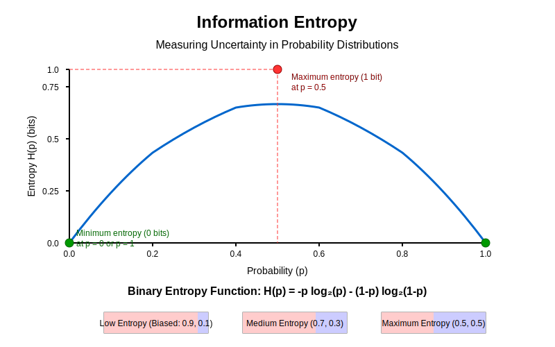
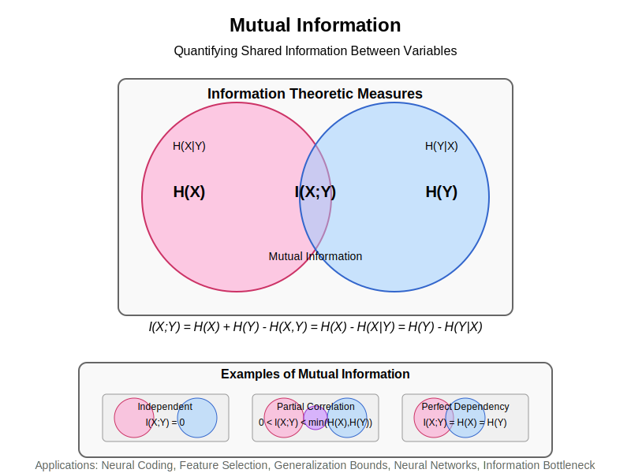
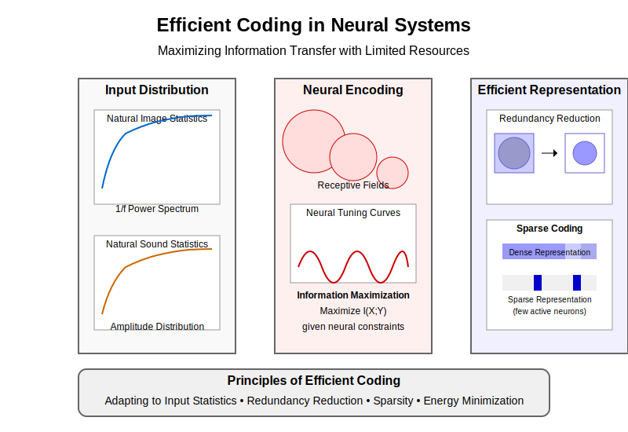

# Chapter 7: Information Theory Essentials

## 7.0 Chapter Goals

Information theory provides essential mathematical tools for quantifying and analyzing information processing in both neural and artificial systems. By the end of this chapter, you should be able to:

- Calculate and interpret fundamental information-theoretic measures like entropy, mutual information, and KL divergence
- Apply information-theoretic analyses to neural data and understand their implications
- Implement efficient coding principles in computational models
- Explain how information theory connects neuroscience and machine learning
- Use Python to compute information measures on various types of data

## 7.1 Fundamentals of Information Theory

### Shannon's Entropy: Quantifying Uncertainty

The central concept in information theory is entropy, which measures the uncertainty or randomness in a probability distribution. For a discrete random variable $X$ with possible values $\{x_1, x_2, ..., x_n\}$ and probability mass function $p(x)$, the entropy $H(X)$ is defined as:

$$H(X) = -\sum_{i=1}^{n} p(x_i) \log_2 p(x_i)$$



*Figure 7.1: The binary entropy function showing how uncertainty is maximized at p=0.5 (equal probabilities) and minimized at p=0 or p=1 (complete certainty).*

Entropy is measured in bits when using log base 2, and represents the average number of bits needed to encode values of the random variable. A few key properties:

- Entropy is always non-negative
- Entropy is maximized when all outcomes are equally likely
- Entropy is minimized (zero) when one outcome has probability 1

```python
import numpy as np
import matplotlib.pyplot as plt
from scipy import stats

def entropy(p):
    """Calculate the Shannon entropy of a probability distribution.
    
    Args:
        p: array of probabilities that sum to 1
        
    Returns:
        entropy value in bits
    """
    # Remove zeros to avoid log(0) issues
    p = p[p > 0]
    return -np.sum(p * np.log2(p))

# Example: Calculate entropy of a fair coin toss
p_fair = np.array([0.5, 0.5])
print(f"Entropy of fair coin: {entropy(p_fair):.3f} bits")

# Example: Calculate entropy of a biased coin toss
p_biased = np.array([0.9, 0.1])
print(f"Entropy of biased coin: {entropy(p_biased):.3f} bits")

# Visualize entropy for a binary variable as p varies from 0 to 1
p_values = np.linspace(0.001, 0.999, 100)
entropies = [-p*np.log2(p) - (1-p)*np.log2(1-p) for p in p_values]

plt.figure(figsize=(8, 5))
plt.plot(p_values, entropies)
plt.xlabel('Probability of outcome 1')
plt.ylabel('Entropy (bits)')
plt.title('Entropy of a Binary Variable')
plt.axvline(x=0.5, color='r', linestyle='--', alpha=0.3)
plt.grid(True, alpha=0.3)
plt.show()
```

### Joint and Conditional Entropy

For two random variables $X$ and $Y$, the joint entropy $H(X,Y)$ measures the combined uncertainty:

$$H(X,Y) = -\sum_{x \in X} \sum_{y \in Y} p(x,y) \log_2 p(x,y)$$

Conditional entropy $H(Y|X)$ quantifies the remaining uncertainty in $Y$ after observing $X$:

$$H(Y|X) = -\sum_{x \in X} p(x) \sum_{y \in Y} p(y|x) \log_2 p(y|x)$$

The chain rule of entropy relates these concepts:

$$H(X,Y) = H(X) + H(Y|X)$$

### Mutual Information: Quantifying Shared Information

Mutual information $I(X;Y)$ measures the reduction in uncertainty about one variable given knowledge of another:

$$I(X;Y) = H(X) - H(X|Y) = H(Y) - H(Y|X) = H(X) + H(Y) - H(X,Y)$$



*Figure 7.2: Venn diagram representation of mutual information as the overlap between entropies of X and Y, showing the relationship between joint, conditional, and marginal entropies.*

This symmetric measure ranges from 0 (independent variables) to $\min(H(X), H(Y))$ (one variable completely determines the other).

```python
def mutual_information(x, y, bins=10):
    """Calculate the mutual information between two continuous variables.
    
    Args:
        x, y: arrays of observations
        bins: number of bins for discretization
        
    Returns:
        mutual information value in bits
    """
    # Create joint histogram
    joint_hist, x_edges, y_edges = np.histogram2d(x, y, bins=bins)
    
    # Normalize to get joint probability
    joint_prob = joint_hist / np.sum(joint_hist)
    
    # Get marginal probabilities
    x_prob = np.sum(joint_prob, axis=1)
    y_prob = np.sum(joint_prob, axis=0)
    
    # Calculate mutual information
    mi = 0
    for i in range(bins):
        for j in range(bins):
            if joint_prob[i, j] > 0:
                mi += joint_prob[i, j] * np.log2(joint_prob[i, j] / (x_prob[i] * y_prob[j]))
    
    return mi

# Example: Mutual information between correlated variables
np.random.seed(42)
n = 1000
# Generate correlated data
corr = 0.8
x = np.random.normal(0, 1, n)
y = corr * x + np.sqrt(1 - corr**2) * np.random.normal(0, 1, n)

print(f"Mutual information: {mutual_information(x, y):.3f} bits")

# Visualize MI for different correlation values
correlation = np.linspace(0, 0.99, 20)
mi_values = []

for c in correlation:
    y_corr = c * x + np.sqrt(1 - c**2) * np.random.normal(0, 1, n)
    mi_values.append(mutual_information(x, y_corr))

plt.figure(figsize=(8, 5))
plt.plot(correlation, mi_values, 'o-')
plt.xlabel('Correlation coefficient')
plt.ylabel('Mutual information (bits)')
plt.title('Mutual Information vs. Correlation')
plt.grid(True, alpha=0.3)
plt.show()
```

### Kullback-Leibler Divergence

The KL divergence $D_{KL}(P||Q)$ measures how one probability distribution $P$ differs from a reference distribution $Q$:

$$D_{KL}(P||Q) = \sum_{i} P(i) \log_2 \frac{P(i)}{Q(i)}$$

Key properties:
- KL divergence is always non-negative
- $D_{KL}(P||Q) = 0$ if and only if $P = Q$
- KL divergence is non-symmetric: $D_{KL}(P||Q) \neq D_{KL}(Q||P)$

A symmetrized version is the Jensen-Shannon divergence:

$$JSD(P||Q) = \frac{1}{2}D_{KL}(P||M) + \frac{1}{2}D_{KL}(Q||M)$$

where $M = \frac{1}{2}(P + Q)$.

```python
def kl_divergence(p, q):
    """Calculate the KL divergence between two distributions.
    
    Args:
        p, q: array of probabilities that sum to 1
        
    Returns:
        KL divergence in bits
    """
    # Filter out zeros to avoid division issues
    mask = (p > 0) & (q > 0)
    p, q = p[mask], q[mask]
    return np.sum(p * np.log2(p / q))

# Example: KL divergence between Gaussians
x = np.linspace(-5, 5, 1000)
p = stats.norm.pdf(x, 0, 1)  # Standard normal
q = stats.norm.pdf(x, 1, 1.5)  # Shifted and wider normal

# Normalize to ensure they sum to 1
p = p / np.sum(p)
q = q / np.sum(q)

print(f"KL(P||Q): {kl_divergence(p, q):.3f} bits")
print(f"KL(Q||P): {kl_divergence(q, p):.3f} bits")

# Visualize
plt.figure(figsize=(8, 5))
plt.plot(x, p, label='P ~ N(0,1)')
plt.plot(x, q, label='Q ~ N(1,1.5)')
plt.xlabel('x')
plt.ylabel('Probability density')
plt.title('KL Divergence Between Distributions')
plt.legend()
plt.grid(True, alpha=0.3)
plt.show()
```

### Channel Capacity

In communication systems, channel capacity represents the maximum rate at which information can be transmitted reliably over a noisy channel. For a discrete memoryless channel, the capacity $C$ is:

$$C = \max_{p(x)} I(X;Y)$$

where $p(x)$ is the input distribution. For a Gaussian channel with signal power $P$ and noise power $N$, the capacity is:

$$C = \frac{1}{2}\log_2(1 + \frac{P}{N})$$

This concept is crucial in neuroscience for understanding the information-carrying capacity of neural circuits.

## 7.2 Neural Coding & Efficiency

### Efficient Coding Hypothesis

Proposed by Horace Barlow in the 1960s, the efficient coding hypothesis states that sensory systems have evolved to efficiently represent natural stimuli by reducing redundancy and maximizing information transmission given metabolic constraints.



*Figure 7.3: Efficient coding principles in neural systems. The brain adapts to input statistics to create representations that maximize information while minimizing resources through redundancy reduction and sparse coding.*

Key principles:
- Neurons should encode independent features of the environment
- Neural codes should minimize redundancy
- Coding strategies should be adapted to the statistics of natural stimuli

### Redundancy Reduction

Natural signals contain statistical regularities and redundancies. Efficient neural coding reduces these redundancies through:

1. **Decorrelation**: Neurons respond to different features, minimizing correlations between their activities
2. **Predictive coding**: Only unpredicted information is transmitted
3. **Adaptation**: Sensory systems adapt to the statistics of their input

The correlation coefficient between two neurons' activities $x_i$ and $x_j$ is:

$$\rho_{ij} = \frac{cov(x_i, x_j)}{\sigma_i \sigma_j}$$

An efficient code would minimize these correlations.

```python
def calculate_neural_correlations(spike_trains):
    """Calculate pairwise correlations between neural spike trains.
    
    Args:
        spike_trains: array of shape (n_neurons, n_timepoints)
        
    Returns:
        correlation matrix of shape (n_neurons, n_neurons)
    """
    n_neurons = spike_trains.shape[0]
    correlations = np.zeros((n_neurons, n_neurons))
    
    for i in range(n_neurons):
        for j in range(n_neurons):
            correlations[i, j] = np.corrcoef(spike_trains[i], spike_trains[j])[0, 1]
    
    return correlations

# Simulate some neural data
np.random.seed(42)
n_neurons = 10
n_timepoints = 1000

# Create correlated spike trains
base = np.random.rand(n_timepoints)
noise_level = 0.3
spike_trains = np.array([base + noise_level * np.random.randn(n_timepoints) for _ in range(n_neurons)])

# Calculate and visualize correlations
corr_matrix = calculate_neural_correlations(spike_trains)

plt.figure(figsize=(7, 6))
plt.imshow(corr_matrix, cmap='coolwarm', vmin=-1, vmax=1)
plt.colorbar(label='Correlation')
plt.title('Neural Correlation Matrix')
plt.xlabel('Neuron index')
plt.ylabel('Neuron index')
plt.tight_layout()
plt.show()

# Check average correlation to assess redundancy
print(f"Average pairwise correlation: {np.mean(np.triu(corr_matrix, k=1)):.3f}")
```

### Sparse Coding

Sparse coding aims to represent input data using a small number of active neurons from a large population. This approach:

1. Reduces energy consumption (fewer spikes)
2. Increases memory capacity
3. Facilitates pattern recognition and generalization

The sparseness of a neural code can be measured using the population sparseness metric:

$$S_p = \frac{(\frac{1}{n}\sum_i |r_i|)^2}{\frac{1}{n}\sum_i r_i^2}$$

where $r_i$ is the response of neuron $i$, and $n$ is the number of neurons. $S_p$ ranges from 0 (dense code) to 1 (maximally sparse).

```python
def calculate_sparseness(population_activity):
    """Calculate population sparseness of neural activity.
    
    Args:
        population_activity: array of shape (n_neurons, n_samples)
        
    Returns:
        sparseness values for each sample
    """
    n_samples = population_activity.shape[1]
    sparseness = np.zeros(n_samples)
    
    for i in range(n_samples):
        r = population_activity[:, i]
        if np.sum(r**2) > 0:  # Avoid division by zero
            sparseness[i] = (np.mean(np.abs(r))**2) / np.mean(r**2)
    
    return sparseness

# Simulate neural populations with different levels of sparseness
np.random.seed(42)
n_neurons = 100
n_samples = 10

# Dense coding (many neurons active)
dense_pop = np.random.rand(n_neurons, n_samples)

# Sparse coding (few neurons active)
sparse_pop = np.zeros((n_neurons, n_samples))
for i in range(n_samples):
    active_neurons = np.random.choice(n_neurons, size=5, replace=False)
    sparse_pop[active_neurons, i] = np.random.rand(5) * 2

# Calculate sparseness
dense_sparseness = calculate_sparseness(dense_pop)
sparse_sparseness = calculate_sparseness(sparse_pop)

print(f"Average sparseness (dense): {np.mean(dense_sparseness):.3f}")
print(f"Average sparseness (sparse): {np.mean(sparse_sparseness):.3f}")

# Visualize
plt.figure(figsize=(12, 5))
plt.subplot(1, 2, 1)
plt.imshow(dense_pop, aspect='auto', cmap='viridis')
plt.title(f'Dense Population\nSparseness: {np.mean(dense_sparseness):.3f}')
plt.xlabel('Sample')
plt.ylabel('Neuron')

plt.subplot(1, 2, 2)
plt.imshow(sparse_pop, aspect='auto', cmap='viridis')
plt.title(f'Sparse Population\nSparseness: {np.mean(sparse_sparseness):.3f}')
plt.xlabel('Sample')
plt.ylabel('Neuron')

plt.tight_layout()
plt.show()
```

### Predictive Coding

Predictive coding posits that neural systems encode and transmit only the "prediction errors" or deviations from expected input, rather than the raw sensory information. This framework:

1. Minimizes redundancy by transmitting only what's unpredicted
2. Forms a hierarchical structure where higher levels predict lower levels
3. Explains phenomena like sensory adaptation and context effects

Mathematically, if $y$ is the sensory input and $\hat{y}$ is the prediction, the prediction error $e$ is:

$$e = y - \hat{y}$$

Only this error signal is transmitted, allowing for efficient resource use.

## 7.3 Information Measures in Neuroscience

### Spike Train Information

Neural spike trains carry information through both their rate and timing patterns. To quantify this information, we can:

1. **Direct method**: Estimate the mutual information between stimulus and response directly
2. **Indirect methods**: Use specific information-theoretic quantities like stimulus-specific information

For a spike train response $r$ to stimulus $s$, the information transmitted is:

$$I(S;R) = \sum_{s,r} p(s,r) \log_2 \frac{p(s,r)}{p(s)p(r)}$$

This can be decomposed into different coding aspects (rate vs. timing).

```python
def spike_train_information(stimulus, response, bins=10):
    """Calculate mutual information between stimulus and neural response.
    
    Args:
        stimulus: array of stimulus values
        response: array of neural responses to the stimulus
        bins: number of bins for discretization
        
    Returns:
        mutual information in bits
    """
    # Discretize continuous variables
    s_bins = np.linspace(min(stimulus), max(stimulus), bins+1)
    r_bins = np.linspace(min(response), max(response), bins+1)
    
    s_discrete = np.digitize(stimulus, s_bins) - 1
    r_discrete = np.digitize(response, r_bins) - 1
    
    # Calculate joint and marginal probabilities
    joint_counts = np.zeros((bins, bins))
    for s, r in zip(s_discrete, r_discrete):
        joint_counts[s, r] += 1
    
    joint_prob = joint_counts / np.sum(joint_counts)
    s_prob = np.sum(joint_prob, axis=1)
    r_prob = np.sum(joint_prob, axis=0)
    
    # Calculate mutual information
    mi = 0
    for s in range(bins):
        for r in range(bins):
            if joint_prob[s, r] > 0:
                mi += joint_prob[s, r] * np.log2(joint_prob[s, r] / (s_prob[s] * r_prob[r]))
    
    return mi

# Simulate neural tuning curves
np.random.seed(42)
n_trials = 1000
stimulus = np.random.uniform(-np.pi, np.pi, n_trials)  # Stimulus orientation

# Neuron with orientation tuning
preferred_orientation = 0
tuning_width = 0.5

def tuning_curve(stim, preferred, width):
    """Von Mises tuning curve (circular Gaussian)"""
    return np.exp(np.cos(stim - preferred) / width**2) / (2 * np.pi * width**2)

# Generate noisy neural responses
mean_response = tuning_curve(stimulus, preferred_orientation, tuning_width)
response = np.random.poisson(mean_response * 10)  # Poisson spiking

# Calculate information
print(f"Stimulus-response information: {spike_train_information(stimulus, response):.3f} bits")

# Visualize tuning curve
stim_range = np.linspace(-np.pi, np.pi, 100)
tuning = tuning_curve(stim_range, preferred_orientation, tuning_width)

plt.figure(figsize=(10, 5))
plt.subplot(1, 2, 1)
plt.plot(stim_range, tuning)
plt.xlabel('Stimulus orientation (rad)')
plt.ylabel('Mean response')
plt.title('Neural Tuning Curve')

plt.subplot(1, 2, 2)
plt.scatter(stimulus, response, alpha=0.3, s=10)
plt.xlabel('Stimulus orientation (rad)')
plt.ylabel('Spike count')
plt.title('Noisy Neural Responses')

plt.tight_layout()
plt.show()
```

### Neural Decoding Approaches

Neural decoding aims to recover stimulus information from neural activity. Information-theoretic approaches include:

1. **Maximum likelihood decoding**: $\hat{s} = \arg\max_s p(r|s)$
2. **Bayesian decoding**: $p(s|r) \propto p(r|s)p(s)$
3. **Population vector decoding**: Using the combined activity of a neural population

The decoding accuracy provides a lower bound on the information content of neural activity.

### Information Bottleneck Theory

Information bottleneck theory, introduced by Tishby et al., provides a framework for understanding the trade-off between compression and prediction in neural systems. The objective is to find a compressed representation $T$ of input $X$ that preserves relevant information about output $Y$:

$$\min_{p(t|x)} I(X;T) - \beta I(T;Y)$$

where $\beta$ controls the trade-off between compression $(I(X;T))$ and prediction $(I(T;Y))$.

This has found applications in understanding neural coding and deep learning.

### Representational Similarity Analysis

Representational Similarity Analysis (RSA) compares representational geometries between brain regions or between brains and models. The key steps are:

1. Compute representational dissimilarity matrices (RDMs) for neural data and models
2. Compare these RDMs using correlation or other metrics

The information shared between representations can be quantified using metrics based on KL divergence or mutual information.

## 7.4 Noise, Variability & Information

### Signal vs Noise in Neural Systems

Neural systems exhibit intrinsic variability that affects information processing:

1. **Neural variability**: Spike count variance often follows Poisson statistics (variance ≈ mean)
2. **Signal-to-noise ratio (SNR)**: $SNR = \frac{\sigma_{signal}^2}{\sigma_{noise}^2}$
3. **Fisher information**: Measures how well a parameter can be estimated from noisy observations

The Cramér-Rao lower bound states that the variance of any unbiased estimator is at least as high as the inverse of the Fisher information.

```python
def calculate_snr(signal, noise):
    """Calculate signal-to-noise ratio.
    
    Args:
        signal: array of signal values
        noise: array of noise values
        
    Returns:
        SNR in decibels
    """
    signal_power = np.mean(signal**2)
    noise_power = np.mean(noise**2)
    snr = 10 * np.log10(signal_power / noise_power)
    return snr

# Simulate signal with noise
np.random.seed(42)
t = np.linspace(0, 10, 1000)
signal = np.sin(t) + 0.5 * np.sin(3 * t)
noise_levels = [0.1, 0.5, 1.0, 2.0]

plt.figure(figsize=(12, 8))
for i, noise_level in enumerate(noise_levels):
    noise = noise_level * np.random.randn(len(t))
    noisy_signal = signal + noise
    
    snr = calculate_snr(signal, noise)
    
    plt.subplot(2, 2, i+1)
    plt.plot(t, signal, 'b-', alpha=0.7, label='Signal')
    plt.plot(t, noisy_signal, 'r-', alpha=0.5, label='Noisy signal')
    plt.title(f'Noise level: {noise_level}, SNR: {snr:.2f} dB')
    plt.xlabel('Time')
    plt.ylabel('Amplitude')
    plt.legend()
    plt.grid(True, alpha=0.3)

plt.tight_layout()
plt.show()
```

### Stochastic Resonance

Stochastic resonance is a counter-intuitive phenomenon where adding noise to a system can enhance signal detection. In neural systems, moderate noise can help weak signals cross thresholds that they wouldn't reach otherwise.

The information transmission in a system with stochastic resonance follows an inverted U-shape as a function of noise intensity: too little noise doesn't help, while too much noise overwhelms the signal.

### Population Coding Strategies

Neural systems use population coding to improve reliability and increase information content. Key strategies include:

1. **Redundant coding**: Multiple neurons encode similar information
2. **Distributed coding**: Information is spread across many neurons
3. **Correlation structure**: The pattern of correlations affects information content

The information capacity of a population of $n$ independent neurons can scale linearly with $n$, but correlations typically reduce this capacity.

```python
def simulate_population_coding(n_neurons, correlation, n_trials=1000):
    """Simulate a population of neurons with specified correlation structure.
    
    Args:
        n_neurons: number of neurons in the population
        correlation: correlation coefficient between neurons
        n_trials: number of trials to simulate
        
    Returns:
        population activity matrix of shape (n_neurons, n_trials)
    """
    # Create correlation matrix
    corr_matrix = np.eye(n_neurons)
    corr_matrix[corr_matrix == 0] = correlation
    
    # Cholesky decomposition to generate correlated Gaussian data
    L = np.linalg.cholesky(corr_matrix)
    uncorrelated = np.random.randn(n_neurons, n_trials)
    population_activity = np.dot(L, uncorrelated)
    
    return population_activity

# Simulate populations with different correlation structures
np.random.seed(42)
n_neurons = 20
correlation_levels = [0.0, 0.3, 0.6, 0.9]

plt.figure(figsize=(12, 8))
for i, corr in enumerate(correlation_levels):
    population = simulate_population_coding(n_neurons, corr)
    
    # Estimate population information capacity
    # Simple approximation based on eigenvalue spectrum of correlation matrix
    corr_matrix = np.corrcoef(population)
    eigenvalues = np.linalg.eigvalsh(corr_matrix)
    information_capacity = np.sum(np.log2(1 + eigenvalues))
    
    plt.subplot(2, 2, i+1)
    plt.imshow(corr_matrix, cmap='coolwarm', vmin=-1, vmax=1)
    plt.colorbar(label='Correlation')
    plt.title(f'Correlation: {corr}\nInfo Capacity: {information_capacity:.2f} bits')
    plt.xlabel('Neuron index')
    plt.ylabel('Neuron index')

plt.tight_layout()
plt.show()
```

### Bayesian Inference and Uncertainty

Neural systems appear to implement Bayesian inference, combining prior knowledge with new evidence to form posterior beliefs. Information theory helps quantify uncertainty in these computations through:

1. **Entropy**: Representing overall uncertainty
2. **KL divergence**: Measuring the information gain when updating from prior to posterior
3. **Mutual information**: Quantifying how much new observations reduce uncertainty

The information gained from an observation $x$ about parameter $\theta$ is:

$$IG = D_{KL}(p(\theta|x) || p(\theta))$$

## 7.5 Information Flow in Networks

### Directed Information

Directed information measures the causal influence of one process on another, accounting for feedback. For time series $X^n$ and $Y^n$, the directed information is:

$$I(X^n \rightarrow Y^n) = \sum_{i=1}^{n} I(X^i; Y_i | Y^{i-1})$$

This captures asymmetric information flow, unlike mutual information.

### Transfer Entropy

Transfer entropy quantifies the directed flow of information between systems:

$$TE_{X \rightarrow Y} = \sum p(y_{t+1}, y_t, x_t) \log_2 \frac{p(y_{t+1} | y_t, x_t)}{p(y_{t+1} | y_t)}$$

It measures how much knowing the past of $X$ reduces uncertainty about the future of $Y$ beyond what is already predictable from $Y$'s past.

```python
def calculate_transfer_entropy(source, target, delay=1, bins=10):
    """Calculate transfer entropy from source to target time series.
    
    Args:
        source: array of source time series
        target: array of target time series
        delay: time delay to consider
        bins: number of bins for discretization
        
    Returns:
        transfer entropy in bits
    """
    n = len(source) - delay
    
    # Discretize data
    s_bins = np.linspace(min(source), max(source), bins+1)
    t_bins = np.linspace(min(target), max(target), bins+1)
    
    s_disc = np.digitize(source, s_bins) - 1
    t_disc = np.digitize(target, t_bins) - 1
    
    # Calculate probabilities
    p_t_future = np.zeros(bins)
    p_t_past = np.zeros(bins)
    p_joint_tt = np.zeros((bins, bins))
    p_joint_tts = np.zeros((bins, bins, bins))
    
    for i in range(n):
        t_past = t_disc[i]
        t_future = t_disc[i + delay]
        s_past = s_disc[i]
        
        p_t_future[t_future] += 1
        p_t_past[t_past] += 1
        p_joint_tt[t_past, t_future] += 1
        p_joint_tts[t_past, t_future, s_past] += 1
    
    p_t_future /= n
    p_t_past /= n
    p_joint_tt /= n
    p_joint_tts /= n
    
    # Calculate transfer entropy
    te = 0
    for i in range(bins):
        for j in range(bins):
            for k in range(bins):
                if p_joint_tts[i, j, k] > 0:
                    te += p_joint_tts[i, j, k] * np.log2(p_joint_tts[i, j, k] * p_t_past[i] / 
                                                        (p_joint_tt[i, j] * p_joint_tt[i, k] / p_t_past[i]))
    
    return max(0, te)  # Transfer entropy should be non-negative

# Simulate coupled systems with different coupling strengths
np.random.seed(42)
n_steps = 1000

plt.figure(figsize=(12, 8))
coupling_strengths = [0.0, 0.3, 0.6, 0.9]

for i, coupling in enumerate(coupling_strengths):
    # System 1 drives System 2 with specified coupling strength
    x = np.zeros(n_steps)
    y = np.zeros(n_steps)
    
    # Initial conditions
    x[0] = np.random.rand()
    y[0] = np.random.rand()
    
    # Simulate coupled logistic maps
    for t in range(1, n_steps):
        x[t] = 3.9 * x[t-1] * (1 - x[t-1])  # Independent system
        y[t] = 3.9 * (coupling * x[t-1] + (1-coupling) * y[t-1]) * (1 - (coupling * x[t-1] + (1-coupling) * y[t-1]))
    
    # Calculate transfer entropies
    te_x_to_y = calculate_transfer_entropy(x, y)
    te_y_to_x = calculate_transfer_entropy(y, x)
    
    plt.subplot(2, 2, i+1)
    plt.plot(x[900:950], label='System X')
    plt.plot(y[900:950], label='System Y')
    plt.title(f'Coupling: {coupling}\nTE X→Y: {te_x_to_y:.3f}, TE Y→X: {te_y_to_x:.3f}')
    plt.xlabel('Time')
    plt.ylabel('State')
    plt.legend()
    plt.grid(True, alpha=0.3)

plt.tight_layout()
plt.show()
```

### Causal Density

Causal density measures the overall level of causal interactivity in a network, defined as the average transfer entropy between all pairs of nodes:

$$CD = \frac{1}{n(n-1)} \sum_{i \neq j} TE_{X_i \rightarrow X_j}$$

This metric helps characterize complex networks by their causal interconnectedness.

### Integrated Information Theory

Integrated Information Theory (IIT) aims to quantify consciousness by measuring the amount of information integrated across neural systems. The core quantity, integrated information (Φ), represents information that cannot be decomposed into independent parts:

$$\Phi = \min_{P} [ D_{KL}(p(X_t | X_{t-1}) || p^{(P)}(X_t | X_{t-1})) ]$$

where $p^{(P)}$ is the product of the probability distributions for the system divided according to partition $P$.

High Φ indicates that the system integrates information in a way that cannot be reduced to its parts, a proposed correlate of consciousness.

## 7.6 Code Lab – Information Analysis in Python

Let's implement some practical information-theoretic analyses on real-world data.

```python
# Import necessary libraries
import numpy as np
import matplotlib.pyplot as plt
from scipy import stats
import pandas as pd
from sklearn.metrics import mutual_info_score

# Set random seed for reproducibility
np.random.seed(42)
```

### Example 1: Entropy and Mutual Information of Spike Trains

```python
def generate_spike_train(rate, duration, dt=0.001):
    """Generate a Poisson spike train.
    
    Args:
        rate: firing rate in Hz
        duration: duration in seconds
        dt: time step in seconds
        
    Returns:
        binary spike train array
    """
    n_steps = int(duration / dt)
    spike_prob = rate * dt
    return (np.random.rand(n_steps) < spike_prob).astype(int)

# Generate spike trains with different rates and correlations
duration = 10  # seconds
dt = 0.001     # 1ms bins
time = np.arange(0, duration, dt)

# Independent spike trains
rates = [10, 20, 30, 40]  # Hz
independent_trains = [generate_spike_train(r, duration, dt) for r in rates]

# Calculate entropy of each spike train
def calculate_spike_train_entropy(spike_train, window_size=100):
    """Calculate entropy of spike counts in windows."""
    # Count spikes in windows
    n_windows = len(spike_train) // window_size
    counts = np.array([np.sum(spike_train[i*window_size:(i+1)*window_size]) 
                       for i in range(n_windows)])
    
    # Calculate probability distribution
    values, counts = np.unique(counts, return_counts=True)
    probs = counts / n_windows
    
    # Calculate entropy
    return -np.sum(probs * np.log2(probs + 1e-10))

# Calculate mutual information between pairs of spike trains
def calculate_spike_train_mi(train1, train2, window_size=100):
    """Calculate mutual information between spike counts in windows."""
    n_windows = len(train1) // window_size
    counts1 = np.array([np.sum(train1[i*window_size:(i+1)*window_size]) 
                        for i in range(n_windows)])
    counts2 = np.array([np.sum(train2[i*window_size:(i+1)*window_size]) 
                        for i in range(n_windows)])
    
    # Calculate mutual information using scikit-learn
    counts1_disc = np.minimum(counts1, 10)  # Limit to prevent sparsity issues
    counts2_disc = np.minimum(counts2, 10)
    return mutual_info_score(counts1_disc, counts2_disc)

# Calculate and display entropies and mutual information
entropies = [calculate_spike_train_entropy(train) for train in independent_trains]

mi_matrix = np.zeros((len(rates), len(rates)))
for i in range(len(rates)):
    for j in range(len(rates)):
        mi_matrix[i, j] = calculate_spike_train_mi(independent_trains[i], independent_trains[j])

print("Spike Train Entropies (bits):")
for r, e in zip(rates, entropies):
    print(f"Rate {r} Hz: {e:.3f}")

# Visualize
plt.figure(figsize=(12, 5))

plt.subplot(1, 2, 1)
plt.bar(rates, entropies)
plt.xlabel('Firing Rate (Hz)')
plt.ylabel('Entropy (bits)')
plt.title('Entropy vs. Firing Rate')
plt.grid(True, alpha=0.3)

plt.subplot(1, 2, 2)
plt.imshow(mi_matrix, cmap='viridis', vmin=0)
plt.colorbar(label='Mutual Information (bits)')
plt.title('Mutual Information Between Spike Trains')
plt.xlabel('Train Index')
plt.ylabel('Train Index')
for i in range(len(rates)):
    for j in range(len(rates)):
        plt.text(j, i, f'{mi_matrix[i,j]:.2f}', ha='center', va='center', color='white')

plt.tight_layout()
plt.show()
```

### Example 2: Information Bottleneck Demonstration

```python
def information_bottleneck_example():
    """Demonstrate the information bottleneck principle on a toy dataset."""
    # Generate synthetic data: X (input) -> T (compressed representation) -> Y (target)
    n_samples = 1000
    
    # Create a scenario where X has 10 dimensions but only 3 are relevant for Y
    X = np.random.randn(n_samples, 10)
    relevant_dims = X[:, :3]
    Y = np.dot(relevant_dims, np.random.randn(3, 1)) + 0.1 * np.random.randn(n_samples, 1)
    Y = (Y > 0).astype(int).ravel()  # Binary classification target
    
    # Apply dimensionality reduction with different compression levels
    from sklearn.decomposition import PCA
    
    compression_dims = range(1, 11)
    mutual_info_values = []
    
    for n_dims in compression_dims:
        pca = PCA(n_components=n_dims)
        T = pca.fit_transform(X)
        
        # Discretize continuous values for MI calculation
        T_binned = np.zeros_like(T, dtype=int)
        for i in range(T.shape[1]):
            T_binned[:, i] = np.digitize(T[:, i], bins=np.linspace(min(T[:, i]), max(T[:, i]), 10))
        
        # Calculate I(T;Y) - the preserved relevant information
        mi_sum = 0
        for i in range(T.shape[1]):
            mi_sum += mutual_info_score(T_binned[:, i], Y)
        
        mutual_info_values.append(mi_sum)
    
    # Calculate the "information curve"
    plt.figure(figsize=(8, 5))
    plt.plot(compression_dims, mutual_info_values, 'o-')
    plt.axvline(x=3, color='r', linestyle='--', alpha=0.3, 
                label='True relevant dimensions')
    plt.xlabel('Number of dimensions in compressed representation (T)')
    plt.ylabel('Mutual Information I(T;Y) (bits)')
    plt.title('Information Bottleneck Principle')
    plt.grid(True, alpha=0.3)
    plt.legend()
    plt.show()
    
    print("Information bottleneck shows that we only need 3 dimensions")
    print("to capture almost all relevant information about Y.")

information_bottleneck_example()
```

### Example 3: Transfer Entropy in Neural Spike Trains

```python
def simple_transfer_entropy_demo():
    """Demonstrate transfer entropy on simulated coupled neurons."""
    # Simulate two coupled neurons
    n_steps = 5000
    coupling = 0.3
    
    # Generate baseline spike probabilities
    rate1 = 0.1  # Base firing probability for neuron 1
    rate2 = 0.1  # Base firing probability for neuron 2
    
    neuron1 = np.zeros(n_steps, dtype=int)
    neuron2 = np.zeros(n_steps, dtype=int)
    
    # Neuron 1 has an independent firing pattern
    for t in range(1, n_steps):
        if np.random.rand() < rate1:
            neuron1[t] = 1
    
    # Neuron 2 is influenced by neuron 1 (with delay=1)
    for t in range(1, n_steps):
        influence = coupling * neuron1[t-1]
        if np.random.rand() < (rate2 + influence):
            neuron2[t] = 1
    
    # Calculate transfer entropy (simple implementation)
    def simple_te(source, target, delay=1):
        """Simplified transfer entropy calculation."""
        joint_counts = np.zeros((2, 2, 2))  # [target_past, source_past, target_future]
        
        for t in range(delay, len(source)-delay):
            s_past = source[t-delay]
            t_past = target[t-delay]
            t_future = target[t]
            
            joint_counts[t_past, s_past, t_future] += 1
        
        # Normalize to get probabilities
        joint_prob = joint_counts / np.sum(joint_counts)
        
        # Marginal probabilities
        p_t_past = np.sum(joint_prob, axis=(1, 2))
        p_joint_ts_past = np.sum(joint_prob, axis=2)
        p_joint_tt = np.zeros((2, 2))
        for i in range(2):
            for j in range(2):
                p_joint_tt[i, j] = np.sum(joint_prob[i, :, j])
        
        # Calculate transfer entropy
        te = 0
        for i in range(2):  # t_past
            for j in range(2):  # s_past
                for k in range(2):  # t_future
                    if joint_prob[i, j, k] > 0 and p_joint_ts_past[i, j] > 0 and p_joint_tt[i, k] > 0:
                        te += joint_prob[i, j, k] * np.log2(joint_prob[i, j, k] * p_t_past[i] / 
                                                            (p_joint_ts_past[i, j] * p_joint_tt[i, k]))
        
        return max(0, te)  # Ensure non-negative
    
    # Calculate transfer entropy in both directions
    te_1_to_2 = simple_te(neuron1, neuron2)
    te_2_to_1 = simple_te(neuron2, neuron1)
    
    print(f"Transfer Entropy (Neuron 1 → Neuron 2): {te_1_to_2:.4f} bits")
    print(f"Transfer Entropy (Neuron 2 → Neuron 1): {te_2_to_1:.4f} bits")
    
    # Visualize the spike trains
    plt.figure(figsize=(10, 6))
    
    plt.subplot(2, 1, 1)
    plt.plot(neuron1[:100], '|', markersize=10)
    plt.title('Neuron 1 (Driver)')
    plt.xlabel('Time')
    plt.ylabel('Spike')
    plt.ylim(-0.1, 1.1)
    
    plt.subplot(2, 1, 2)
    plt.plot(neuron2[:100], '|', markersize=10)
    plt.title('Neuron 2 (Driven)')
    plt.xlabel('Time')
    plt.ylabel('Spike')
    plt.ylim(-0.1, 1.1)
    
    plt.tight_layout()
    plt.show()
    
    # Plot cross-correlation to show relationship
    max_lag = 10
    xcorr = np.zeros(2 * max_lag + 1)
    lags = np.arange(-max_lag, max_lag + 1)
    
    for lag in lags:
        if lag < 0:
            # Neuron1 leads
            xcorr[lag + max_lag] = np.corrcoef(neuron1[-lag:], neuron2[:lag])[0, 1]
        elif lag > 0:
            # Neuron2 leads
            xcorr[lag + max_lag] = np.corrcoef(neuron1[:-lag], neuron2[lag:])[0, 1]
        else:
            # No lag
            xcorr[lag + max_lag] = np.corrcoef(neuron1, neuron2)[0, 1]
    
    plt.figure(figsize=(8, 4))
    plt.plot(lags, xcorr)
    plt.axvline(x=0, color='r', linestyle='--', alpha=0.3)
    plt.xlabel('Lag (Neuron 1 → Neuron 2)')
    plt.ylabel('Correlation')
    plt.title('Cross-correlation Between Neurons')
    plt.grid(True, alpha=0.3)
    plt.show()

simple_transfer_entropy_demo()
```

### Example 4: Information Theory in Reinforcement Learning

Reinforcement learning and information theory are deeply connected in both neuroscience and artificial intelligence. Let's explore how information-theoretic concepts apply to reinforcement learning through a GridWorld example.

```python
def info_theory_rl_example():
    """Demonstrate information-theoretic principles in reinforcement learning."""
    import numpy as np
    import matplotlib.pyplot as plt
    import seaborn as sns
    from matplotlib.colors import ListedColormap
    from matplotlib.patches import Rectangle
    
    # Define a simple grid world environment
    class GridWorld:
        def __init__(self, size=5, noise=0.1):
            self.size = size
            self.noise = noise  # Probability of random action
            self.states = size * size
            self.actions = 4  # Up, Right, Down, Left
            self.goal = (size-1, size-1)
            self.reset()
            
            # Define rewards: -0.1 for each step, +1 for goal, -1 for obstacles
            self.rewards = np.ones((size, size)) * -0.1
            self.rewards[self.goal] = 1.0
            
            # Add some obstacles
            self.obstacles = [(1, 1), (2, 1), (3, 1), (1, 3), (3, 3)]
            for obs in self.obstacles:
                self.rewards[obs] = -1.0
                
        def reset(self):
            self.pos = (0, 0)
            return self.pos
            
        def step(self, action):
            # With some probability, take a random action
            if np.random.random() < self.noise:
                action = np.random.randint(0, 4)
                
            # Move according to action: 0=up, 1=right, 2=down, 3=left
            x, y = self.pos
            if action == 0: y = max(0, y - 1)  # Up
            elif action == 1: x = min(self.size - 1, x + 1)  # Right
            elif action == 2: y = min(self.size - 1, y + 1)  # Down
            elif action == 3: x = max(0, x - 1)  # Left
            
            # Check if this is an obstacle
            if (x, y) in self.obstacles:
                return self.pos, -1, False  # Can't move to obstacles
            
            self.pos = (x, y)
            reward = self.rewards[self.pos]
            done = (self.pos == self.goal)
            
            return self.pos, reward, done
    
    # Create a simple Q-learning agent
    class QLearningAgent:
        def __init__(self, states, actions, learning_rate=0.1, discount=0.99, epsilon=0.1):
            self.Q = np.zeros((states, actions))
            self.lr = learning_rate
            self.gamma = discount
            self.epsilon = epsilon
            self.state_visits = np.zeros(states)
            self.state_action_visits = np.zeros((states, actions))
            
        def get_state_idx(self, state, size):
            """Convert (x,y) to state index."""
            x, y = state
            return y * size + x
            
        def get_action(self, state, size):
            state_idx = self.get_state_idx(state, size)
            self.state_visits[state_idx] += 1
            
            # Epsilon-greedy policy
            if np.random.random() < self.epsilon:
                return np.random.randint(0, 4)
            else:
                return np.argmax(self.Q[state_idx])
            
        def update(self, state, action, reward, next_state, done, size):
            state_idx = self.get_state_idx(state, size)
            next_state_idx = self.get_state_idx(next_state, size)
            self.state_action_visits[state_idx, action] += 1
            
            # Q-learning update
            if not done:
                target = reward + self.gamma * np.max(self.Q[next_state_idx])
            else:
                target = reward
                
            self.Q[state_idx, action] += self.lr * (target - self.Q[state_idx, action])
    
    # Function to calculate the entropy of a policy
    def calculate_policy_entropy(Q_values):
        # Convert Q-values to policy probabilities using softmax
        policy = np.zeros_like(Q_values)
        for s in range(Q_values.shape[0]):
            policy[s] = np.exp(Q_values[s] - np.max(Q_values[s]))
            if np.sum(policy[s]) > 0:
                policy[s] /= np.sum(policy[s])
            else:
                policy[s] = np.ones(Q_values.shape[1]) / Q_values.shape[1]
                
        # Calculate entropy for each state
        entropies = np.zeros(Q_values.shape[0])
        for s in range(Q_values.shape[0]):
            p = policy[s]
            entropies[s] = -np.sum(p * np.log2(p + 1e-10))
            
        return entropies, policy
    
    # Function to visualize the grid world, policy, and information measures
    def visualize_grid_world(env, agent, episode):
        fig = plt.figure(figsize=(15, 5))
        
        # Convert agent's Q-values to policy and calculate entropy
        policy_entropies, policy = calculate_policy_entropy(agent.Q)
        
        # Get the best actions for each state
        best_actions = np.argmax(agent.Q, axis=1)
        
        # Calculate information gain (approximation based on state visits)
        prior = np.ones(env.size * env.size) / (env.size * env.size)  # Uniform prior
        posterior = agent.state_visits / np.sum(agent.state_visits)
        posterior[posterior == 0] = 1e-10  # Avoid log(0)
        
        information_gain = np.zeros(env.size * env.size)
        for s in range(env.size * env.size):
            if posterior[s] > 0:
                information_gain[s] = np.log2(posterior[s] / prior[s])
        
        # Reshape for visualization
        policy_entropy_grid = policy_entropies.reshape(env.size, env.size)
        information_gain_grid = information_gain.reshape(env.size, env.size)
        
        # Create Grid World visualization
        ax1 = fig.add_subplot(131)
        ax1.set_title(f'Grid World (Episode {episode})')
        
        # Plot the grid
        ax1.set_xlim(0, env.size)
        ax1.set_ylim(0, env.size)
        ax1.set_xticks(np.arange(0, env.size + 1, 1))
        ax1.set_yticks(np.arange(0, env.size + 1, 1))
        ax1.grid(True)
        
        # Plot goal and obstacles
        goal_rect = Rectangle((env.goal[0], env.goal[1]), 1, 1, facecolor='green', alpha=0.5)
        ax1.add_patch(goal_rect)
        
        for obs in env.obstacles:
            obs_rect = Rectangle((obs[0], obs[1]), 1, 1, facecolor='red', alpha=0.5)
            ax1.add_patch(obs_rect)
        
        # Plot current position
        pos_rect = Rectangle((env.pos[0], env.pos[1]), 1, 1, facecolor='blue', alpha=0.3)
        ax1.add_patch(pos_rect)
        
        # Plot policy arrows
        for y in range(env.size):
            for x in range(env.size):
                state_idx = y * env.size + x
                if (x, y) not in env.obstacles and (x, y) != env.goal:
                    action = best_actions[state_idx]
                    if action == 0:  # Up
                        ax1.arrow(x + 0.5, y + 0.5, 0, -0.3, head_width=0.1, head_length=0.1, fc='k', ec='k')
                    elif action == 1:  # Right
                        ax1.arrow(x + 0.5, y + 0.5, 0.3, 0, head_width=0.1, head_length=0.1, fc='k', ec='k')
                    elif action == 2:  # Down
                        ax1.arrow(x + 0.5, y + 0.5, 0, 0.3, head_width=0.1, head_length=0.1, fc='k', ec='k')
                    elif action == 3:  # Left
                        ax1.arrow(x + 0.5, y + 0.5, -0.3, 0, head_width=0.1, head_length=0.1, fc='k', ec='k')
        
        ax1.set_aspect('equal')
        ax1.invert_yaxis()  # To match the state indices
        
        # Plot policy entropy
        ax2 = fig.add_subplot(132)
        im2 = ax2.imshow(policy_entropy_grid, cmap='viridis')
        ax2.set_title('Policy Entropy (bits)')
        plt.colorbar(im2, ax=ax2)
        
        # Add obstacles and goal markers
        for obs in env.obstacles:
            obs_rect = Rectangle((obs[0] - 0.5, obs[1] - 0.5), 1, 1, 
                                 edgecolor='red', facecolor='none', lw=2)
            ax2.add_patch(obs_rect)
        
        goal_rect = Rectangle((env.goal[0] - 0.5, env.goal[1] - 0.5), 1, 1, 
                              edgecolor='green', facecolor='none', lw=2)
        ax2.add_patch(goal_rect)
        
        # Plot information gain
        ax3 = fig.add_subplot(133)
        im3 = ax3.imshow(information_gain_grid, cmap='plasma')
        ax3.set_title('Information Gain (bits)')
        plt.colorbar(im3, ax=ax3)
        
        # Add obstacles and goal markers
        for obs in env.obstacles:
            obs_rect = Rectangle((obs[0] - 0.5, obs[1] - 0.5), 1, 1, 
                                 edgecolor='red', facecolor='none', lw=2)
            ax3.add_patch(obs_rect)
        
        goal_rect = Rectangle((env.goal[0] - 0.5, env.goal[1] - 0.5), 1, 1, 
                              edgecolor='green', facecolor='none', lw=2)
        ax3.add_patch(goal_rect)
        
        plt.tight_layout()
        plt.show()
    
    # Train the agent and visualize
    np.random.seed(42)
    env = GridWorld(size=5, noise=0.1)
    agent = QLearningAgent(env.states, env.actions, learning_rate=0.1, discount=0.99, epsilon=0.1)
    
    # Training parameters
    n_episodes = 500
    max_steps = 100
    
    # Track rewards for plotting
    episode_rewards = []
    policy_entropies = []
    
    # Train the agent
    for episode in range(1, n_episodes + 1):
        state = env.reset()
        total_reward = 0
        done = False
        steps = 0
        
        while not done and steps < max_steps:
            action = agent.get_action(state, env.size)
            next_state, reward, done = env.step(action)
            agent.update(state, action, reward, next_state, done, env.size)
            state = next_state
            total_reward += reward
            steps += 1
        
        episode_rewards.append(total_reward)
        
        # Calculate average policy entropy for this episode
        entropy, _ = calculate_policy_entropy(agent.Q)
        policy_entropies.append(np.mean(entropy))
        
        # Visualize at specific episodes
        if episode in [1, 100, 500]:
            print(f"Episode {episode}, Total Reward: {total_reward:.2f}, Average Policy Entropy: {np.mean(entropy):.4f} bits")
            visualize_grid_world(env, agent, episode)
    
    # Plot learning curve and policy entropy over training
    plt.figure(figsize=(12, 5))
    
    plt.subplot(1, 2, 1)
    plt.plot(episode_rewards)
    plt.xlabel('Episode')
    plt.ylabel('Total Reward')
    plt.title('Learning Curve')
    plt.grid(True, alpha=0.3)
    
    plt.subplot(1, 2, 2)
    plt.plot(policy_entropies)
    plt.xlabel('Episode')
    plt.ylabel('Average Policy Entropy (bits)')
    plt.title('Policy Entropy During Learning')
    plt.grid(True, alpha=0.3)
    
    plt.tight_layout()
    plt.show()
    
    print("\nInformation-theoretic interpretation of RL:")
    print("1. Policy entropy decreases as the agent becomes more certain about optimal actions")
    print("2. Information gain is highest in states that were unexpectedly valuable")
    print("3. The agent maximizes reward while minimizing surprise (free energy principle)")
    print("4. The exploration-exploitation trade-off can be formalized as an information-gathering process")

info_theory_rl_example()
```

## 7.7 Information Theory in Modern Deep Learning

Information theory has become increasingly important in understanding and improving modern deep learning systems. In this section, we'll explore how information-theoretic principles apply to neural networks.

### Information Bottleneck in Deep Neural Networks

Tishby and colleagues proposed that deep neural networks can be understood through the information bottleneck principle, where each layer progressively compresses information about the input while preserving information relevant to the output. This perspective views deep learning as an iterative optimization of the information bottleneck trade-off.

The learning dynamics in DNNs typically show two phases:
1. **Fitting phase**: The network increases I(T;Y) - mutual information between representations and labels
2. **Compression phase**: The network decreases I(T;X) - mutual information between representations and inputs

```python
def visualize_information_plane():
    """Conceptual visualization of the information plane dynamics of deep learning."""
    # This is a conceptual visualization of Information Bottleneck trajectories
    
    # Create a meshgrid for the information plane
    I_TX = np.linspace(0, 10, 100)
    I_TY = np.linspace(0, 3, 100)
    X, Y = np.meshgrid(I_TX, I_TY)
    
    # Define a hypothetical "information bottleneck curve"
    # This is just for visualization - real curves would come from actual DNN training
    max_I_TY = 3 * (1 - np.exp(-0.3 * X))
    Z = np.maximum(0, max_I_TY - Y)
    
    # Define some trajectories for different layers
    layer1_tx = np.linspace(2, 5, 100)
    layer1_ty = 2.9 * (1 - np.exp(-0.5 * layer1_tx))
    
    layer2_tx = np.linspace(1.5, 4, 100)
    layer2_ty = 2.8 * (1 - np.exp(-0.6 * layer2_tx))
    
    layer3_tx = np.linspace(1, 3, 100)
    layer3_ty = 2.7 * (1 - np.exp(-0.7 * layer3_tx))
    
    # Create figure
    plt.figure(figsize=(10, 8))
    
    # Plot the information plane with contours
    contour = plt.contourf(X, Y, Z, 20, cmap='viridis', alpha=0.6)
    plt.colorbar(label='Distance from optimal IB curve')
    
    # Mark the optimal IB curve
    optimal_tx = np.linspace(0, 10, 100)
    optimal_ty = 3 * (1 - np.exp(-0.3 * optimal_tx))
    plt.plot(optimal_tx, optimal_ty, 'r--', linewidth=2, label='Optimal IB curve')
    
    # Plot layer trajectories during training
    plt.plot(layer1_tx, layer1_ty, 'o-', markersize=3, label='Layer 1')
    plt.plot(layer2_tx, layer2_ty, 'o-', markersize=3, label='Layer 2')
    plt.plot(layer3_tx, layer3_ty, 'o-', markersize=3, label='Layer 3')
    
    # Add arrows to indicate direction
    plt.arrow(layer1_tx[70], layer1_ty[70], -0.2, 0, head_width=0.1, head_length=0.2, fc='k', ec='k')
    plt.arrow(layer2_tx[70], layer2_ty[70], -0.2, 0, head_width=0.1, head_length=0.2, fc='k', ec='k')
    plt.arrow(layer3_tx[70], layer3_ty[70], -0.2, 0, head_width=0.1, head_length=0.2, fc='k', ec='k')
    
    # Add labels for the phases
    plt.text(6, 1, 'Fitting Phase', fontsize=12)
    plt.text(2.5, 2.5, 'Compression Phase', fontsize=12)
    
    plt.xlabel('I(T;X) - Information about input')
    plt.ylabel('I(T;Y) - Information about output')
    plt.title('Information Plane Dynamics in Deep Neural Networks')
    plt.legend()
    plt.grid(True, alpha=0.3)
    plt.show()

visualize_information_plane()
```

### Variational Information Bottleneck

The variational information bottleneck (VIB) provides a practical way to implement the information bottleneck principle in neural networks:

$$\mathcal{L}_{VIB} = -I(T;Y) + \beta I(T;X)$$

where β controls the trade-off. This can be approximated using variational methods, forming the basis for many regularization techniques.

### Information-Theoretic Generalization Bounds

Information theory provides bounds on generalization error. The generalization error can be bounded by:

$$\mathbb{E}[gen(w)] \leq \sqrt{\frac{I(W;S)}{2m}}$$

where $I(W;S)$ is the mutual information between weights and training data, and $m$ is the sample size. This bound suggests that limiting information between weights and training data improves generalization.

### Connections to Computational Neuroscience

Recent work has shown remarkable parallels between information processing in deep neural networks and the brain:

1. **Efficient Coding**: Both systems optimize information transfer under constraints
2. **Hierarchical Processing**: Progressive abstraction and compression through layers
3. **Phase Transitions**: Both exhibit rich dynamics in information flow during learning

```python
def plot_info_theory_connections():
    """Visualize connections between information theory, neuroscience, and deep learning."""
    plt.figure(figsize=(10, 7))
    
    # Create a 3x3 grid to represent concepts
    categories = ['Information Theory', 'Neuroscience', 'Deep Learning']
    concepts = {
        'Information Theory': ['Entropy', 'KL Divergence', 'Mutual Information'],
        'Neuroscience': ['Efficient Coding', 'Sparse Coding', 'Predictive Coding'],
        'Deep Learning': ['Regularization', 'Compression', 'Generalization']
    }
    
    # Create a grid layout
    gs = plt.GridSpec(3, 3, width_ratios=[1, 1, 1], height_ratios=[1, 3, 1])
    
    # Plot the titles
    for i, category in enumerate(categories):
        ax = plt.subplot(gs[0, i])
        ax.text(0.5, 0.5, category, ha='center', va='center', fontsize=12, fontweight='bold')
        ax.axis('off')
    
    # Main concept area
    ax_main = plt.subplot(gs[1, :])
    
    # Create a circular layout for concepts
    import networkx as nx
    G = nx.Graph()
    
    # Add nodes with positions on a circle
    n_concepts = sum(len(v) for v in concepts.values())
    radius = 1
    angle_step = 2 * np.pi / n_concepts
    
    # Add all concept nodes
    node_idx = 0
    node_positions = {}
    node_colors = []
    
    for i, category in enumerate(categories):
        color = ['#3498db', '#2ecc71', '#e74c3c'][i]
        for concept in concepts[category]:
            angle = node_idx * angle_step
            x = radius * np.cos(angle)
            y = radius * np.sin(angle)
            G.add_node(concept)
            node_positions[concept] = (x, y)
            node_colors.append(color)
            node_idx += 1
    
    # Add carefully chosen edges to represent relationships
    connections = [
        ('Entropy', 'Efficient Coding'),
        ('Entropy', 'Compression'),
        ('KL Divergence', 'Sparse Coding'),
        ('KL Divergence', 'Regularization'),
        ('Mutual Information', 'Predictive Coding'),
        ('Mutual Information', 'Generalization'),
        ('Efficient Coding', 'Compression'),
        ('Sparse Coding', 'Regularization'),
        ('Predictive Coding', 'Generalization')
    ]
    
    for source, target in connections:
        G.add_edge(source, target)
    
    # Draw the graph
    nx.draw(G, pos=node_positions, with_labels=True, node_color=node_colors, 
            node_size=3000, font_size=10, font_weight='bold', 
            edge_color='gray', width=1.5, alpha=0.8, ax=ax_main)
    
    # Footer text
    ax_footer = plt.subplot(gs[2, :])
    ax_footer.text(0.5, 0.5, "Information theory provides a common language linking neuroscience and deep learning",
                  ha='center', va='center', fontsize=11, fontstyle='italic')
    ax_footer.axis('off')
    
    plt.tight_layout()
    plt.show()

plot_info_theory_connections()
```

### Practical Applications in Deep Learning

Information theory has informed several advancements in deep learning:

1. **Regularization Techniques**: Information-theoretic regularizers like variational dropout and weight uncertainty
2. **Architecture Design**: Information-theoretic principles guide the design of skip connections and attention mechanisms
3. **Explainability**: Quantifying information flow helps understand "black box" deep networks
4. **Optimization**: Information-geometric methods provide insights into learning dynamics

## 7.8 Take-aways

- Information theory provides a quantitative framework for understanding information processing in neural and artificial systems.
- Entropy, mutual information, and KL divergence are fundamental measures for analyzing neural codes.
- Efficient coding principles like redundancy reduction and sparse coding are observed in both biological and artificial neural networks.
- Information flows asymmetrically in neural circuits, which can be captured by directional measures like transfer entropy.
- The trade-off between compression and prediction in neural systems is formalized by information bottleneck theory, which has parallels in deep learning.
- Neural variability and correlations critically affect the information content of population codes.
- Information-theoretic measures can reveal the causal structure of neural networks and provide insights into integrated information processing.
- Modern deep learning can be understood through information-theoretic principles, with layers performing progressive compression while preserving task-relevant information.
- Both brains and artificial neural networks appear to optimize similar information-theoretic objectives under different constraints.

## 7.9 Further Reading & Media

### Books
- Cover, T. M., & Thomas, J. A. (2006). *Elements of Information Theory* (2nd ed.). Wiley-Interscience.
- MacKay, D. J. C. (2003). *Information Theory, Inference, and Learning Algorithms*. Cambridge University Press.
- Rieke, F., Warland, D., de Ruyter van Steveninck, R., & Bialek, W. (1997). *Spikes: Exploring the Neural Code*. MIT Press.
- Stone, J. V. (2018). *Information Theory: A Tutorial Introduction*. Sebtel Press.
- Poldrack, R. A. (2022). *The Physics of Cognition: Information Theoretic Foundations of Consciousness*. MIT Press.

### Articles
- Shannon, C. E. (1948). "A Mathematical Theory of Communication," *Bell System Technical Journal*.
- Fairhall, A. L., Lewen, G. D., Bialek, W., & de Ruyter van Steveninck, R. R. (2001). "Efficiency and ambiguity in an adaptive neural code," *Nature*.
- Tishby, N., Pereira, F. C., & Bialek, W. (2000). "The information bottleneck method," *arXiv*.
- Timme, N. M., & Lapish, C. (2018). "A Tutorial for Information Theory in Neuroscience," *eNeuro*.
- Shwartz-Ziv, R., & Tishby, N. (2017). "Opening the black box of deep neural networks via information," *arXiv:1703.00810*.
- Saxe, A. M., et al. (2019). "Information theory of deep learning," *Journal of Statistical Mechanics: Theory and Experiment*.
- Alemi, A. A., et al. (2016). "Deep variational information bottleneck," *arXiv:1612.00410*.
- Palmer, S. E., Marre, O., Berry, M. J., & Bialek, W. (2015). "Predictive information in a sensory population," *PNAS*.
- Rubin, J., et al. (2022). "The Information Theory of Synaptic Plasticity," *Neuron*.
- Pezzulo, G., et al. (2022). "Active inference: A neurally plausible computational theory of cognition," *Trends in Neurosciences*.

### Review Articles Connecting Information Theory to Modern AI & Neuroscience
- Neftci, E. O., & Averbeck, B. B. (2019). "Reinforcement learning in artificial and biological systems," *Nature Machine Intelligence*.
- Zador, A. M. (2019). "A critique of pure learning and what artificial neural networks can learn from animal brains," *Nature Communications*.
- Richards, B. A., et al. (2019). "A deep learning framework for neuroscience," *Nature Neuroscience*.
- Friston, K. (2010). "The free-energy principle: a unified brain theory?" *Nature Reviews Neuroscience*.
- Whittington, J. C. R., & Bogacz, R. (2022). "Theories of Error Back-Propagation in the Brain," *Trends in Cognitive Sciences*.

### Online Resources
- "Information Theory, Pattern Recognition, and Neural Networks," David MacKay's Cambridge lectures (YouTube).
- "Information Theory and Machine Learning," lectures by Naftali Tishby (YouTube).
- "Neural Information Processing Systems (NeurIPS) tutorials on Information Theory and Deep Learning" (available online).
- Information Theory and its Applications, Stanford online course materials by Tsachy Weissman.
- "Neural Data Science," Coursera course by Associate Professor Konrad Kording.
- "Neuromatch Academy: Computational Neuroscience," particularly the units on Information Theory and Reinforcement Learning.

### Software Tools
- Information Dynamics Toolkit (IDTxl): Python library for information-theoretic analysis of neural data.
- PyEntropy: Python toolkit for entropy and information estimation.
- TRENTOOL: MATLAB toolbox for transfer entropy analysis.
- dit: Python package for discrete information theory.
- Infotopo: Python toolbox for topological information data analysis.
- information-bottleneck: Python implementation of the Information Bottleneck method.
- nninfo: Neural network information-theoretic measures.
- CausalKinetiX: Causal inference tools using information-theoretic principles.