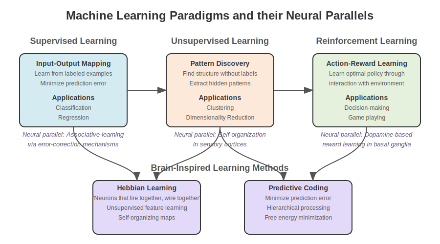
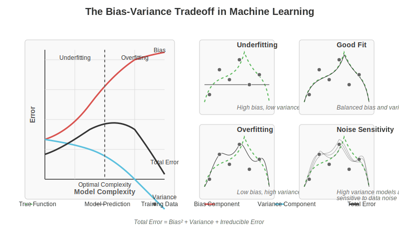
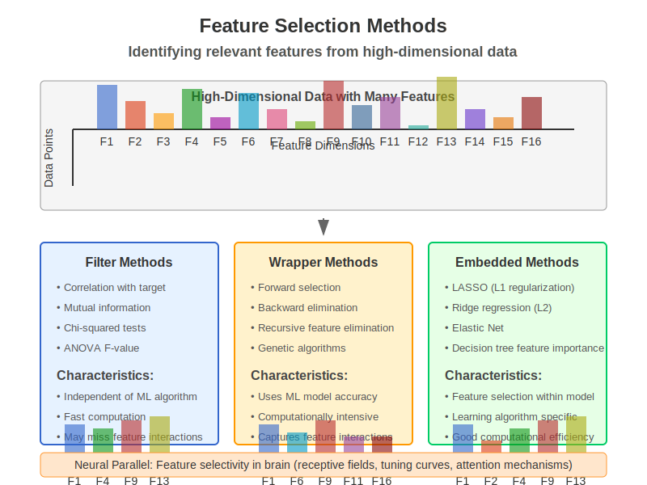
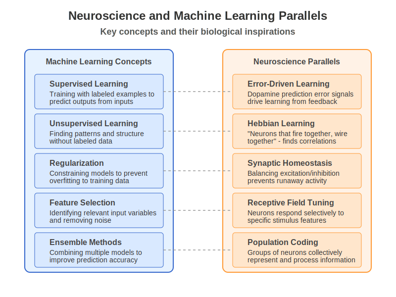

# Chapter 9: Classical Machine-Learning Foundations

<div style="page-break-before:always;"></div>

## 9.0 Chapter Goals

This chapter provides a foundation for understanding machine learning algorithms with connections to neuroscience. By the end of this chapter, you should be able to:

- Implement and analyze key machine learning algorithms from scratch
- Distinguish between different learning paradigms and choose appropriate methods for different problems
- Evaluate and interpret model performance with appropriate metrics
- Recognize the biological inspirations and parallels in classical ML algorithms
- Apply classical machine learning methods to neuroscience data

## 9.1 Learning Paradigms

Machine learning approaches can be categorized into different paradigms based on the nature of the learning signal and goal.


*Figure 9.1: Comparison of supervised, unsupervised, and reinforcement learning paradigms with their neuroscience parallels.*

### Supervised Learning

In supervised learning, the algorithm learns a mapping from inputs to outputs based on labeled examples. This parallels associative learning in biological systems, where organisms learn to associate stimuli with outcomes.

Formally, given a dataset $\mathcal{D} = \{(x_i, y_i)\}_{i=1}^{n}$ of input-output pairs, supervised learning aims to find a function $f: \mathcal{X} \rightarrow \mathcal{Y}$ that minimizes a loss function $\mathcal{L}(f(x), y)$.

**Common applications:**
- Classification (discrete output spaces)
- Regression (continuous output spaces)
- Sequence prediction (structured output spaces)

```python
import numpy as np
import matplotlib.pyplot as plt
from sklearn.model_selection import train_test_split
from sklearn.metrics import accuracy_score, mean_squared_error

# Example: Creating a synthetic dataset for supervised learning
np.random.seed(42)

# Classification example
X_class = np.random.randn(100, 2)  # 100 samples, 2 features
y_class = (X_class[:, 0] + X_class[:, 1] > 0).astype(int)  # Simple decision boundary

# Regression example
X_reg = np.random.randn(100, 1)  # 100 samples, 1 feature
y_reg = 2 * X_reg.ravel() + 1 + 0.2 * np.random.randn(100)  # Linear relationship with noise

# Visualize the datasets
plt.figure(figsize=(12, 5))

plt.subplot(1, 2, 1)
plt.scatter(X_class[:, 0], X_class[:, 1], c=y_class, cmap='viridis', edgecolors='k')
plt.colorbar(label='Class')
plt.xlabel('Feature 1')
plt.ylabel('Feature 2')
plt.title('Classification Dataset')
plt.grid(alpha=0.3)

plt.subplot(1, 2, 2)
plt.scatter(X_reg, y_reg)
plt.xlabel('Feature')
plt.ylabel('Target')
plt.title('Regression Dataset')
plt.grid(alpha=0.3)

plt.tight_layout()
plt.show()
```

### Unsupervised Learning

Unsupervised learning discovers patterns and structure in data without explicit output labels. This maps to the brain's ability to extract regularities from sensory inputs and form internal representations.

Key objectives include:
- Density estimation: modeling the underlying data distribution $p(x)$
- Clustering: grouping similar data points
- Dimensionality reduction: finding compact representations that preserve important structure

```python
# Example: Simple K-means clustering from scratch
def kmeans(X, k, max_iters=100, tol=1e-4):
    """
    Implement K-means clustering from scratch.
    
    Args:
        X: data matrix of shape (n_samples, n_features)
        k: number of clusters
        max_iters: maximum number of iterations
        tol: convergence tolerance
        
    Returns:
        centroids: cluster centers
        labels: cluster assignments for each data point
    """
    # Initialize centroids randomly from the data
    indices = np.random.choice(X.shape[0], k, replace=False)
    centroids = X[indices]
    
    for _ in range(max_iters):
        # Assign each point to the nearest centroid
        distances = np.sqrt(((X[:, np.newaxis, :] - centroids) ** 2).sum(axis=2))
        labels = np.argmin(distances, axis=1)
        
        # Update centroids
        new_centroids = np.array([X[labels == i].mean(axis=0) for i in range(k)])
        
        # Check for convergence
        if np.all(np.abs(new_centroids - centroids) < tol):
            break
            
        centroids = new_centroids
    
    return centroids, labels

# Generate a simple dataset with 3 clusters
np.random.seed(42)
n_samples = 300
cluster_centers = [(-5, -5), (0, 0), (5, 5)]
cluster_stds = [1, 1.5, 1]

X_cluster = np.vstack([
    np.random.normal(center, std, (n_samples // 3, 2)) 
    for center, std in zip(cluster_centers, cluster_stds)
])

# Run our K-means implementation
centroids, labels = kmeans(X_cluster, k=3)

# Visualize results
plt.figure(figsize=(10, 6))
plt.scatter(X_cluster[:, 0], X_cluster[:, 1], c=labels, cmap='viridis', alpha=0.7, edgecolors='k')
plt.scatter(centroids[:, 0], centroids[:, 1], marker='*', s=200, c='red', label='Centroids')
plt.title('K-means Clustering Result')
plt.xlabel('Feature 1')
plt.ylabel('Feature 2')
plt.legend()
plt.grid(alpha=0.3)
plt.show()
```

### Reinforcement Learning

Reinforcement learning involves an agent learning to maximize rewards through interactions with an environment. This paradigm closely resembles how animals learn from experience, particularly through dopamine-based reward systems in the basal ganglia.

Key components:
- State space $\mathcal{S}$: possible situations
- Action space $\mathcal{A}$: possible decisions
- Reward function $r(s,a)$: feedback signal
- Policy $\pi(a|s)$: strategy for selecting actions
- Value function $V(s)$: expected future reward from state $s$

RL seeks to find a policy that maximizes expected cumulative reward:

$$\pi^* = \arg\max_{\pi} \mathbb{E}\left[\sum_{t=0}^{\infty} \gamma^t r_t \right]$$

where $\gamma$ is a discount factor that prioritizes immediate rewards.

```python
# Example: Simple Q-learning for a grid world environment
def q_learning_demo():
    """Simple Q-learning demonstration in a grid world."""
    # Define a simple 4x4 grid world
    # States: 0-15 (grid positions)
    # Actions: 0-3 (up, right, down, left)
    # Rewards: -1 for each step, +10 for goal, -10 for trap
    
    # Environment parameters
    n_states = 16
    n_actions = 4
    goal_state = 15
    trap_states = [5, 7, 11, 12]
    
    # Create the Q-table
    Q = np.zeros((n_states, n_actions))
    
    # Learning parameters
    alpha = 0.1  # Learning rate
    gamma = 0.9  # Discount factor
    epsilon = 0.1  # Exploration rate
    max_episodes = 500
    
    # Define state transitions
    def get_next_state(state, action):
        # Grid layout (4x4):
        # 0  1  2  3
        # 4  5  6  7
        # 8  9  10 11
        # 12 13 14 15
        
        row, col = state // 4, state % 4
        
        if action == 0:  # Up
            row = max(0, row - 1)
        elif action == 1:  # Right
            col = min(3, col + 1)
        elif action == 2:  # Down
            row = min(3, row + 1)
        elif action == 3:  # Left
            col = max(0, col - 1)
            
        return row * 4 + col
    
    # Define rewards
    def get_reward(state):
        if state == goal_state:
            return 10
        elif state in trap_states:
            return -10
        else:
            return -1
    
    # Training loop
    rewards_per_episode = []
    
    for episode in range(max_episodes):
        state = 0  # Start at top-left
        done = False
        total_reward = 0
        
        while not done:
            # Epsilon-greedy action selection
            if np.random.random() < epsilon:
                action = np.random.randint(n_actions)
            else:
                action = np.argmax(Q[state])
            
            # Take action and observe next state and reward
            next_state = get_next_state(state, action)
            reward = get_reward(next_state)
            total_reward += reward
            
            # Update Q-value using the Q-learning update rule
            Q[state, action] += alpha * (reward + gamma * np.max(Q[next_state]) - Q[state, action])
            
            # Move to next state
            state = next_state
            
            # Check if episode is done
            if state == goal_state or state in trap_states:
                done = True
        
        rewards_per_episode.append(total_reward)
        
    # Plot learning progress
    plt.figure(figsize=(10, 5))
    plt.plot(np.convolve(rewards_per_episode, np.ones(20)/20, mode='valid'))
    plt.xlabel('Episode')
    plt.ylabel('Average Reward (20-episode window)')
    plt.title('Q-learning Progress')
    plt.grid(alpha=0.3)
    plt.show()
    
    # Visualize the learned policy
    policy = np.argmax(Q, axis=1)
    
    # Convert policy to arrows for visualization
    arrows = ['^', '>', 'v', '<']
    policy_grid = np.array([[arrows[policy[r*4 + c]] for c in range(4)] for r in range(4)])
    
    # Mark trap and goal states
    for trap in trap_states:
        r, c = trap // 4, trap % 4
        policy_grid[r, c] = 'X'
    policy_grid[goal_state // 4, goal_state % 4] = 'G'
    
    print("Learned Policy:")
    print(policy_grid)
    
    return Q

# Run the Q-learning demo
q_table = q_learning_demo()
```

### Transfer Learning

Transfer learning leverages knowledge gained from one task to improve performance on a related task. This relates to how biological learning generalizes across contexts.

Key approaches include:
- Feature-based transfer: reusing representations
- Instance-based transfer: using samples from the source domain
- Parameter-based transfer: adapting model parameters

**Biological parallel:** Humans use prior knowledge to quickly adapt to new tasks, much like a pre-trained model fine-tuned on a new dataset.

### Online vs Batch Learning

- **Batch Learning**: Process the entire dataset at once. Similar to deliberate, reflective learning.
- **Online Learning**: Update the model with each new example. Similar to incremental, continuous learning in animals.

The trade-off involves computational efficiency versus adaptation to changing distributions.

## 9.2 Core ML Algorithms

### Linear Models

Linear models form the foundation of machine learning, relating to simple input-output mappings in neural circuits.

#### Linear Regression

Linear regression models the relationship between inputs and a continuous output using a linear function:

$$\hat{y} = w_0 + w_1 x_1 + w_2 x_2 + ... + w_d x_d = w_0 + \sum_{j=1}^{d} w_j x_j$$

The model parameters are typically learned by minimizing the mean squared error:

$$\min_{w} \frac{1}{n} \sum_{i=1}^{n} (y_i - \hat{y}_i)^2$$

This has a closed-form solution: $w = (X^T X)^{-1} X^T y$, where $X$ is the design matrix.

```python
# Implement linear regression from scratch
class LinearRegression:
    def __init__(self):
        self.weights = None
        self.bias = None
        
    def fit(self, X, y):
        """Fit the linear regression model."""
        # Add bias term
        X_bias = np.column_stack([np.ones(X.shape[0]), X])
        
        # Closed-form solution
        coeffs = np.linalg.inv(X_bias.T @ X_bias) @ X_bias.T @ y
        
        self.bias = coeffs[0]
        self.weights = coeffs[1:]
        
    def predict(self, X):
        """Make predictions."""
        return self.bias + X @ self.weights
    
# Demonstrate linear regression
np.random.seed(42)
X = np.random.randn(100, 1)
y = 3 * X.ravel() + 2 + 0.5 * np.random.randn(100)  # True parameters: w=3, b=2

# Split into train and test sets
X_train, X_test, y_train, y_test = train_test_split(X, y, test_size=0.2)

# Fit our model
model = LinearRegression()
model.fit(X_train, y_train)

# Make predictions
y_pred = model.predict(X_test)

# Calculate error
mse = mean_squared_error(y_test, y_pred)

# Plot results
plt.figure(figsize=(8, 6))
plt.scatter(X_train, y_train, label='Training data')
plt.scatter(X_test, y_test, label='Test data')

# Plot the regression line
x_line = np.linspace(X.min(), X.max(), 100).reshape(-1, 1)
y_line = model.predict(x_line)
plt.plot(x_line, y_line, 'r-', label='Fitted line')

plt.xlabel('X')
plt.ylabel('y')
plt.title(f'Linear Regression (w={model.weights[0]:.2f}, b={model.bias:.2f}, MSE={mse:.2f})')
plt.legend()
plt.grid(alpha=0.3)
plt.show()
```

#### Logistic Regression

Logistic regression extends linear models to classification tasks by applying a sigmoid function to the linear output:

$$P(y=1|x) = \sigma(w^T x + b) = \frac{1}{1 + e^{-(w^T x + b)}}$$

The parameters are learned by maximizing the log-likelihood (or minimizing the negative log-likelihood):

$$\min_{w} -\sum_{i=1}^{n} [y_i \log(\sigma(w^T x_i)) + (1-y_i) \log(1-\sigma(w^T x_i))]$$

**Biological parallel:** The sigmoid activation function resembles the firing rate response of neurons to input current.

```python
# Implement logistic regression from scratch
class LogisticRegression:
    def __init__(self, learning_rate=0.01, max_iter=1000):
        self.learning_rate = learning_rate
        self.max_iter = max_iter
        self.weights = None
        self.bias = None
        
    def sigmoid(self, z):
        """Sigmoid activation function."""
        return 1 / (1 + np.exp(-np.clip(z, -500, 500)))  # Clip to avoid overflow
    
    def fit(self, X, y):
        """Fit the logistic regression model using gradient descent."""
        n_samples, n_features = X.shape
        
        # Initialize parameters
        self.weights = np.zeros(n_features)
        self.bias = 0
        
        # Gradient descent
        for _ in range(self.max_iter):
            # Linear model
            linear_model = X @ self.weights + self.bias
            y_pred = self.sigmoid(linear_model)
            
            # Compute gradients
            dw = (1/n_samples) * np.dot(X.T, (y_pred - y))
            db = (1/n_samples) * np.sum(y_pred - y)
            
            # Update parameters
            self.weights -= self.learning_rate * dw
            self.bias -= self.learning_rate * db
    
    def predict_proba(self, X):
        """Predict probabilities."""
        linear_model = X @ self.weights + self.bias
        return self.sigmoid(linear_model)
    
    def predict(self, X, threshold=0.5):
        """Make binary predictions."""
        return (self.predict_proba(X) >= threshold).astype(int)

# Generate a simple classification dataset
np.random.seed(42)
X = np.random.randn(100, 2)
y = ((X[:, 0] + X[:, 1]) > 0).astype(int)

# Add some noise to make it more interesting
noise_indices = np.random.choice(100, 10)
y[noise_indices] = 1 - y[noise_indices]

# Split data
X_train, X_test, y_train, y_test = train_test_split(X, y, test_size=0.2)

# Fit our model
log_reg = LogisticRegression(learning_rate=0.1)
log_reg.fit(X_train, y_train)

# Make predictions
y_pred = log_reg.predict(X_test)
accuracy = accuracy_score(y_test, y_pred)

# Visualize decision boundary
plt.figure(figsize=(8, 6))

# Plot data points
plt.scatter(X[:, 0], X[:, 1], c=y, cmap='viridis', edgecolors='k')

# Create a grid of points to visualize the decision boundary
xx, yy = np.meshgrid(np.linspace(-3, 3, 100), np.linspace(-3, 3, 100))
X_grid = np.c_[xx.ravel(), yy.ravel()]
Z = log_reg.predict(X_grid).reshape(xx.shape)

# Plot decision boundary
plt.contourf(xx, yy, Z, alpha=0.3, cmap='viridis')
plt.contour(xx, yy, Z, colors='k', linewidths=0.5)

plt.xlabel('Feature 1')
plt.ylabel('Feature 2')
plt.title(f'Logistic Regression Decision Boundary (Accuracy: {accuracy:.2f})')
plt.colorbar(label='Predicted class')
plt.grid(alpha=0.3)
plt.show()
```

### Support Vector Machines

Support Vector Machines (SVMs) find the hyperplane that maximizes the margin between classes, focusing on the boundary cases (support vectors).

For linearly separable data, the optimization problem is:

$$\min_{w,b} \frac{1}{2} ||w||^2 \text{ subject to } y_i(w \cdot x_i + b) \geq 1 \text{ for all } i$$

The kernel trick extends SVMs to non-linear boundaries by implicitly mapping data to higher-dimensional spaces.

**Biological parallel:** The margin-maximizing property relates to the brain's ability to generalize from limited examples and enhance robustness to noise.

```python
# Example: Using scikit-learn's SVM implementation
from sklearn.svm import SVC
from sklearn.datasets import make_moons

# Create a more complex dataset
X, y = make_moons(n_samples=100, noise=0.15, random_state=42)

# Split data
X_train, X_test, y_train, y_test = train_test_split(X, y, test_size=0.2)

# Create and train an SVM with radial basis function kernel
svm = SVC(kernel='rbf', gamma=1, C=10)
svm.fit(X_train, y_train)

# Make predictions
y_pred = svm.predict(X_test)
accuracy = accuracy_score(y_test, y_pred)

# Visualize the decision boundary
plt.figure(figsize=(8, 6))

# Plot training data
plt.scatter(X[:, 0], X[:, 1], c=y, cmap='viridis', edgecolors='k')

# Create a grid and compute SVM predictions
xx, yy = np.meshgrid(np.linspace(X[:, 0].min()-0.5, X[:, 0].max()+0.5, 100),
                     np.linspace(X[:, 1].min()-0.5, X[:, 1].max()+0.5, 100))
Z = svm.predict(np.c_[xx.ravel(), yy.ravel()]).reshape(xx.shape)

# Plot decision boundary and margins
plt.contourf(xx, yy, Z, alpha=0.3, cmap='viridis')
plt.contour(xx, yy, Z, colors='k', linewidths=0.5)

# Highlight support vectors
plt.scatter(svm.support_vectors_[:, 0], svm.support_vectors_[:, 1], 
            s=100, facecolors='none', edgecolors='k', label='Support Vectors')

plt.xlabel('Feature 1')
plt.ylabel('Feature 2')
plt.title(f'SVM with RBF Kernel (Accuracy: {accuracy:.2f})')
plt.legend()
plt.grid(alpha=0.3)
plt.show()
```

### Decision Trees and Random Forests

Decision trees make predictions by recursive binary partitioning of the feature space.

Key concepts:
- Decision nodes: Test feature values against thresholds
- Leaf nodes: Contain predictions
- Splitting criteria: Gini impurity, entropy, variance reduction

Random forests combine multiple trees to reduce overfitting and improve generalization:
1. Bootstrap aggregating (bagging) of training samples
2. Random feature subset selection at each split
3. Majority voting (classification) or averaging (regression)

**Biological parallel:** Hierarchical decision-making in the prefrontal cortex may implement tree-like structures.

```python
# Implement a simple decision tree for classification
class DecisionTreeNode:
    def __init__(self, feature_idx=None, threshold=None, left=None, right=None, value=None):
        self.feature_idx = feature_idx  # Index of feature to split on
        self.threshold = threshold      # Threshold for the split
        self.left = left                # Left subtree (feature < threshold)
        self.right = right              # Right subtree (feature >= threshold)
        self.value = value              # Prediction value if leaf node

class SimpleDecisionTree:
    def __init__(self, max_depth=5, min_samples_split=2):
        self.max_depth = max_depth
        self.min_samples_split = min_samples_split
        self.root = None
        
    def fit(self, X, y):
        """Build decision tree."""
        self.root = self._grow_tree(X, y, depth=0)
        
    def _grow_tree(self, X, y, depth):
        """Recursively grow the decision tree."""
        n_samples, n_features = X.shape
        n_classes = len(np.unique(y))
        
        # Check stopping criteria
        if (depth >= self.max_depth or 
            n_samples < self.min_samples_split or 
            n_classes == 1):
            # Create leaf node with majority class
            leaf_value = np.argmax(np.bincount(y.astype(int)))
            return DecisionTreeNode(value=leaf_value)
        
        # Find best split
        best_feature, best_threshold = self._best_split(X, y)
        
        # Split the data
        left_indices = X[:, best_feature] < best_threshold
        right_indices = ~left_indices
        
        # Create child nodes
        left_tree = self._grow_tree(X[left_indices], y[left_indices], depth + 1)
        right_tree = self._grow_tree(X[right_indices], y[right_indices], depth + 1)
        
        return DecisionTreeNode(
            feature_idx=best_feature,
            threshold=best_threshold,
            left=left_tree,
            right=right_tree
        )
    
    def _best_split(self, X, y):
        """Find the best feature and threshold for splitting."""
        n_samples, n_features = X.shape
        best_gini = float('inf')
        best_feature = None
        best_threshold = None
        
        for feature_idx in range(n_features):
            # Get unique threshold values
            thresholds = np.unique(X[:, feature_idx])
            
            for threshold in thresholds:
                # Split data based on threshold
                left_indices = X[:, feature_idx] < threshold
                right_indices = ~left_indices
                
                # Skip if either side is empty
                if np.sum(left_indices) == 0 or np.sum(right_indices) == 0:
                    continue
                
                # Calculate Gini impurity
                left_gini = self._gini(y[left_indices])
                right_gini = self._gini(y[right_indices])
                
                # Weighted average of Gini impurity
                n_left = np.sum(left_indices)
                n_right = np.sum(right_indices)
                gini = (n_left * left_gini + n_right * right_gini) / n_samples
                
                # Update best split if this is better
                if gini < best_gini:
                    best_gini = gini
                    best_feature = feature_idx
                    best_threshold = threshold
        
        return best_feature, best_threshold
    
    def _gini(self, y):
        """Calculate Gini impurity."""
        m = len(y)
        if m == 0:
            return 0
        
        # Count occurrences of each class
        _, counts = np.unique(y, return_counts=True)
        probabilities = counts / m
        
        # Calculate Gini impurity
        return 1 - np.sum(probabilities**2)
    
    def predict(self, X):
        """Predict class labels for samples in X."""
        return np.array([self._predict_sample(x, self.root) for x in X])
    
    def _predict_sample(self, x, node):
        """Predict class for a single sample."""
        # If leaf node, return the value
        if node.value is not None:
            return node.value
        
        # Otherwise, check the feature and go left or right
        if x[node.feature_idx] < node.threshold:
            return self._predict_sample(x, node.left)
        else:
            return self._predict_sample(x, node.right)

# Create a more complex dataset
from sklearn.datasets import make_classification
X, y = make_classification(n_samples=100, n_features=2, n_redundant=0, n_informative=2,
                           random_state=42, n_clusters_per_class=1)

# Split the data
X_train, X_test, y_train, y_test = train_test_split(X, y, test_size=0.2)

# Train our decision tree
tree = SimpleDecisionTree(max_depth=3)
tree.fit(X_train, y_train)

# Make predictions
y_pred = tree.predict(X_test)
accuracy = accuracy_score(y_test, y_pred)

# Visualize the decision boundaries
plt.figure(figsize=(10, 6))

# Plot the data points
plt.scatter(X[:, 0], X[:, 1], c=y, cmap='viridis', edgecolors='k')

# Create a grid and compute decision tree predictions
xx, yy = np.meshgrid(np.linspace(X[:, 0].min()-0.5, X[:, 0].max()+0.5, 100),
                     np.linspace(X[:, 1].min()-0.5, X[:, 1].max()+0.5, 100))
Z = tree.predict(np.c_[xx.ravel(), yy.ravel()]).reshape(xx.shape)

# Plot decision boundary
plt.contourf(xx, yy, Z, alpha=0.3, cmap='viridis')
plt.contour(xx, yy, Z, colors='k', linewidths=0.5)

plt.xlabel('Feature 1')
plt.ylabel('Feature 2')
plt.title(f'Decision Tree Boundaries (Accuracy: {accuracy:.2f})')
plt.grid(alpha=0.3)
plt.show()
```

### Clustering Algorithms

Clustering algorithms group similar instances without labeled training data.

#### K-means

K-means partitions data into k clusters by minimizing within-cluster variance:

1. Initialize k cluster centers
2. Assign each point to the nearest center
3. Update centers to be the mean of assigned points
4. Repeat until convergence

**Biological parallel:** Visual cortex forms categories from exposure to similar stimuli, akin to unsupervised clustering.

#### Hierarchical Clustering

Hierarchical clustering builds a tree of nested clusters:

- Agglomerative (bottom-up): Start with each point as a cluster and merge
- Divisive (top-down): Start with one cluster and split

```python
# Implement hierarchical clustering from scratch
def hierarchical_clustering(X, n_clusters):
    """Agglomerative hierarchical clustering."""
    # Start with each sample in its own cluster
    n_samples = X.shape[0]
    clusters = [[i] for i in range(n_samples)]
    
    # Calculate pairwise distances between all points
    distances = np.zeros((n_samples, n_samples))
    for i in range(n_samples):
        for j in range(i+1, n_samples):
            distances[i, j] = distances[j, i] = np.sqrt(np.sum((X[i] - X[j])**2))
    
    # Merge clusters until we reach the desired number
    while len(clusters) > n_clusters:
        # Find the two closest clusters
        min_dist = float('inf')
        merge_pair = (0, 0)
        
        for i in range(len(clusters)):
            for j in range(i+1, len(clusters)):
                # Calculate average linkage distance (mean of pairwise distances)
                cluster_dist = 0
                count = 0
                for x in clusters[i]:
                    for y in clusters[j]:
                        cluster_dist += distances[x, y]
                        count += 1
                cluster_dist /= count
                
                if cluster_dist < min_dist:
                    min_dist = cluster_dist
                    merge_pair = (i, j)
        
        # Merge the closest clusters
        i, j = merge_pair
        clusters[i].extend(clusters[j])
        clusters.pop(j)
    
    # Create cluster labels for each sample
    labels = np.zeros(n_samples, dtype=int)
    for cluster_idx, cluster in enumerate(clusters):
        for sample_idx in cluster:
            labels[sample_idx] = cluster_idx
    
    return labels

# Generate data with 3 clusters
np.random.seed(42)
n_samples = 150
centers = [(-5, -5), (0, 0), (5, 5)]
stds = [1, 1.5, 1]

X_cluster = np.vstack([
    np.random.normal(centers[i], stds[i], (n_samples // 3, 2)) 
    for i in range(3)
])

# Apply hierarchical clustering
labels = hierarchical_clustering(X_cluster, n_clusters=3)

# Plot results
plt.figure(figsize=(10, 6))
plt.scatter(X_cluster[:, 0], X_cluster[:, 1], c=labels, cmap='viridis', edgecolors='k')
plt.title('Hierarchical Clustering Result')
plt.xlabel('Feature 1')
plt.ylabel('Feature 2')
plt.grid(alpha=0.3)
plt.show()
```

<div style="page-break-before:always;"></div>

## 9.3 Model Evaluation

### Cross-validation Techniques

Cross-validation estimates model performance on unseen data:

- **K-fold CV**: Split data into k subsets, use k-1 for training and 1 for validation, rotate k times
- **Leave-one-out CV**: Special case where k = n (number of samples)
- **Stratified CV**: Maintains class distribution in each fold

```python
# Implement k-fold cross-validation from scratch
def k_fold_cross_validation(model, X, y, k=5):
    """Perform k-fold cross-validation and return scores."""
    n_samples = len(X)
    fold_size = n_samples // k
    
    # Shuffle data indices
    indices = np.random.permutation(n_samples)
    
    # Store scores for each fold
    scores = []
    
    for fold in range(k):
        # Select validation indices for this fold
        val_start = fold * fold_size
        val_end = (fold + 1) * fold_size if fold < k - 1 else n_samples
        val_indices = indices[val_start:val_end]
        train_indices = np.concatenate([indices[:val_start], indices[val_end:]])
        
        # Split data
        X_train, X_val = X[train_indices], X[val_indices]
        y_train, y_val = y[train_indices], y[val_indices]
        
        # Train the model
        model.fit(X_train, y_train)
        
        # Evaluate on validation fold
        y_pred = model.predict(X_val)
        accuracy = np.mean(y_pred == y_val)
        scores.append(accuracy)
    
    return scores

# Example: Using cross-validation on logistic regression
# Create a classification dataset
np.random.seed(42)
X = np.random.randn(100, 2)
y = ((X[:, 0] + X[:, 1]) > 0).astype(int)

# Create logistic regression model
log_reg = LogisticRegression(learning_rate=0.1, max_iter=1000)

# Perform cross-validation
cv_scores = k_fold_cross_validation(log_reg, X, y, k=5)

print(f"Cross-validation scores: {cv_scores}")
print(f"Mean accuracy: {np.mean(cv_scores):.2f} ± {np.std(cv_scores):.2f}")
```

### Regularization Approaches

Regularization techniques prevent overfitting by adding constraints to model complexity:

- **L1 regularization (Lasso)**: Adds $\lambda \sum |w_i|$ to loss, promotes sparsity
- **L2 regularization (Ridge)**: Adds $\lambda \sum w_i^2$ to loss, shrinks weights
- **Elastic Net**: Combines L1 and L2 penalties
- **Early stopping**: Halt training when validation performance degrades

**Biological parallel:** Synaptic scaling and homeostatic plasticity in the brain serve as biological "regularizers."

```python
# Implement ridge regression (L2 regularization)
class RidgeRegression:
    def __init__(self, alpha=1.0):
        self.alpha = alpha
        self.weights = None
        self.bias = None
        
    def fit(self, X, y):
        """Fit ridge regression with L2 regularization."""
        n_samples, n_features = X.shape
        
        # Add bias term
        X_bias = np.column_stack([np.ones(n_samples), X])
        
        # Closed-form solution with regularization
        # (X^T X + αI)^(-1) X^T y
        identity = np.eye(n_features + 1)
        identity[0, 0] = 0  # Don't regularize bias term
        
        coeffs = np.linalg.inv(X_bias.T @ X_bias + self.alpha * identity) @ X_bias.T @ y
        
        self.bias = coeffs[0]
        self.weights = coeffs[1:]
        
    def predict(self, X):
        """Make predictions."""
        return self.bias + X @ self.weights

# Generate data where regularization helps
np.random.seed(42)
n_samples = 30
n_features = 20  # High-dimensional, prone to overfitting

# True model only uses the first 5 features
true_weights = np.zeros(n_features)
true_weights[:5] = np.random.randn(5)
true_bias = 1.0

# Generate data
X = np.random.randn(n_samples, n_features)
y = true_bias + X @ true_weights + 0.5 * np.random.randn(n_samples)

# Split data
X_train, X_test, y_train, y_test = train_test_split(X, y, test_size=0.3)

# Compare regular linear regression vs. ridge regression
models = {
    'Linear Regression': LinearRegression(),
    'Ridge (α=0.1)': RidgeRegression(alpha=0.1),
    'Ridge (α=1.0)': RidgeRegression(alpha=1.0),
    'Ridge (α=10.0)': RidgeRegression(alpha=10.0)
}

results = {}
for name, model in models.items():
    model.fit(X_train, y_train)
    y_pred_train = model.predict(X_train)
    y_pred_test = model.predict(X_test)
    
    train_mse = mean_squared_error(y_train, y_pred_train)
    test_mse = mean_squared_error(y_test, y_pred_test)
    
    results[name] = {
        'train_mse': train_mse,
        'test_mse': test_mse,
        'weights': model.weights
    }
    
    print(f"{name}: Train MSE = {train_mse:.4f}, Test MSE = {test_mse:.4f}")

# Visualize weights
plt.figure(figsize=(12, 6))

plt.subplot(1, 2, 1)
for name, result in results.items():
    plt.plot(result['weights'], 'o-', label=name)
plt.axhline(y=0, color='k', linestyle='--', alpha=0.3)
plt.xlabel('Feature index')
plt.ylabel('Weight value')
plt.title('Model Weights Comparison')
plt.legend()
plt.grid(alpha=0.3)

plt.subplot(1, 2, 2)
names = list(results.keys())
train_errors = [results[name]['train_mse'] for name in names]
test_errors = [results[name]['test_mse'] for name in names]

x = np.arange(len(names))
width = 0.35

plt.bar(x - width/2, train_errors, width, label='Train MSE')
plt.bar(x + width/2, test_errors, width, label='Test MSE')
plt.xticks(x, names, rotation=45)
plt.ylabel('Mean Squared Error')
plt.title('Training vs. Test Error')
plt.legend()
plt.grid(alpha=0.3)

plt.tight_layout()
plt.show()
```

### Bias-Variance Trade-off

The bias-variance decomposition helps understand model errors:

- **Bias**: Error from incorrect assumptions in the model (underfitting)
- **Variance**: Error from sensitivity to small fluctuations in training data (overfitting)
- **Irreducible error**: Noise in the data

More complex models have higher variance but lower bias, leading to a trade-off.


*Figure 9.2: The bias-variance tradeoff illustrating how error changes with model complexity. Simple models can underfit (high bias), while complex models can overfit (high variance).*

```python
# Simulate bias-variance tradeoff
def simulate_bias_variance_tradeoff():
    """Demonstrate bias-variance tradeoff with polynomial regression."""
    # Generate true function: f(x) = sin(x)
    np.random.seed(42)
    n_samples = 30
    
    x_true = np.linspace(0, 10, 100)
    y_true = np.sin(x_true)
    
    # Generate noisy training data
    x_train = np.random.uniform(0, 10, n_samples)
    y_train = np.sin(x_train) + 0.2 * np.random.randn(n_samples)
    
    # Polynomial regression with different degrees
    degrees = [1, 3, 10, 20]
    plt.figure(figsize=(12, 8))
    
    for i, degree in enumerate(degrees):
        # Fit polynomial
        coeffs = np.polyfit(x_train, y_train, degree)
        poly = np.poly1d(coeffs)
        
        # Evaluate
        y_pred = poly(x_true)
        train_mse = np.mean((poly(x_train) - y_train)**2)
        
        # Calculate test error over multiple datasets
        n_datasets = 100
        test_predictions = np.zeros((n_datasets, len(x_true)))
        
        for j in range(n_datasets):
            # Generate new noisy dataset
            y_train_new = np.sin(x_train) + 0.2 * np.random.randn(n_samples)
            
            # Fit model
            coeffs_new = np.polyfit(x_train, y_train_new, degree)
            poly_new = np.poly1d(coeffs_new)
            
            # Predict
            test_predictions[j] = poly_new(x_true)
        
        # Calculate bias and variance
        mean_prediction = np.mean(test_predictions, axis=0)
        bias = np.mean((mean_prediction - y_true)**2)
        variance = np.mean(np.var(test_predictions, axis=0))
        
        # Plot
        plt.subplot(2, 2, i+1)
        plt.scatter(x_train, y_train, color='blue', alpha=0.5, label='Training data')
        plt.plot(x_true, y_true, 'g-', label='True function')
        plt.plot(x_true, y_pred, 'r-', label='Model prediction')
        
        # Plot predictions from different datasets
        for j in range(min(10, n_datasets)):  # Plot just 10 to avoid clutter
            plt.plot(x_true, test_predictions[j], 'k-', alpha=0.1)
            
        plt.title(f'Degree {degree} Polynomial\nBias={bias:.4f}, Var={variance:.4f}, Train MSE={train_mse:.4f}')
        plt.xlabel('x')
        plt.ylabel('y')
        plt.ylim(-1.5, 1.5)
        plt.legend()
        plt.grid(alpha=0.3)
    
    plt.tight_layout()
    plt.show()

simulate_bias_variance_tradeoff()
```

### Evaluation Metrics

Choose metrics based on the task and what errors are most important:

**Classification metrics:**
- Accuracy: $\frac{TP + TN}{TP + TN + FP + FN}$
- Precision: $\frac{TP}{TP + FP}$ (focus on false positives)
- Recall: $\frac{TP}{TP + FN}$ (focus on false negatives)
- F1 Score: $2 \cdot \frac{precision \cdot recall}{precision + recall}$
- AUC-ROC: Area under Receiver Operating Characteristic curve

**Regression metrics:**
- Mean Squared Error (MSE): $\frac{1}{n}\sum(y_i - \hat{y}_i)^2$
- Root Mean Squared Error (RMSE): $\sqrt{MSE}$
- Mean Absolute Error (MAE): $\frac{1}{n}\sum|y_i - \hat{y}_i|$
- R² Score: $1 - \frac{\sum(y_i - \hat{y}_i)^2}{\sum(y_i - \bar{y})^2}$

## 9.4 Feature Engineering

### Feature Selection Methods

Feature selection improves model performance and interpretability:


*Figure 9.4: Comparison of different feature selection approaches (filter, wrapper, and embedded methods) for identifying relevant features in high-dimensional data.*

- **Filter methods**: Select features based on their relationship with the target (correlation, mutual information)
- **Wrapper methods**: Use a model's performance to evaluate feature subsets (recursive feature elimination)
- **Embedded methods**: Feature selection happens during model training (L1 regularization)

**Biological parallel:** Attention mechanisms in the brain filter relevant features from sensory input.

```python
# Implement mutual information feature selection
def mutual_information_feature_selection(X, y, k=5):
    """Select top k features based on mutual information."""
    n_features = X.shape[1]
    mi_scores = np.zeros(n_features)
    
    # Calculate mutual information for each feature
    for i in range(n_features):
        # Discretize the feature for MI calculation
        x_discrete = np.digitize(X[:, i], bins=np.linspace(X[:, i].min(), X[:, i].max(), 10))
        
        # For classification tasks
        if len(np.unique(y)) < 10:  # Heuristic for classification
            mi_scores[i] = mutual_info_score(x_discrete, y)
        else:  # For regression tasks
            # Discretize target for MI estimation
            y_discrete = np.digitize(y, bins=np.linspace(y.min(), y.max(), 10))
            mi_scores[i] = mutual_info_score(x_discrete, y_discrete)
    
    # Select top k features
    top_indices = np.argsort(mi_scores)[-k:]
    
    return top_indices, mi_scores

# Generate synthetic data with informative and noise features
def generate_synthetic_dataset(n_samples=200, n_informative=5, n_noise=15):
    """Generate data with informative and noise features."""
    np.random.seed(42)
    
    # Generate informative features
    X_informative = np.random.randn(n_samples, n_informative)
    
    # Generate target using only informative features
    y = 2 * X_informative[:, 0] + 0.5 * X_informative[:, 1]**2 + \
        np.sin(X_informative[:, 2]) + np.abs(X_informative[:, 3]) + \
        0.2 * np.random.randn(n_samples)
    
    # Add noise features
    X_noise = np.random.randn(n_samples, n_noise)
    
    # Combine features
    X = np.hstack([X_informative, X_noise])
    
    # Shuffle feature order
    feature_indices = np.random.permutation(n_informative + n_noise)
    X = X[:, feature_indices]
    
    # Keep track of which features were truly informative
    true_informative = [i for i, idx in enumerate(feature_indices) if idx < n_informative]
    
    return X, y, true_informative

# Generate data
X, y, true_informative = generate_synthetic_dataset()

# Apply mutual information feature selection
k = 5
selected_indices, mi_scores = mutual_information_feature_selection(X, y, k=k)

# Compare with true informative features
print(f"True informative features: {sorted(true_informative)}")
print(f"Selected features: {sorted(selected_indices.tolist())}")

# Plot mutual information scores
plt.figure(figsize=(10, 6))
plt.bar(np.arange(X.shape[1]), mi_scores)
plt.scatter(selected_indices, mi_scores[selected_indices], color='red', s=100, label='Selected features')
plt.scatter(true_informative, mi_scores[true_informative], color='green', s=50, marker='x', label='True informative')
plt.xlabel('Feature index')
plt.ylabel('Mutual information')
plt.title('Feature Selection with Mutual Information')
plt.legend()
plt.grid(alpha=0.3)
plt.show()
```

### Dimensionality Reduction

Dimensionality reduction techniques create compact representations of data:

- **Principal Component Analysis (PCA)**: Linear projection to maximize variance
- **t-SNE**: Non-linear projection that preserves local structure
- **Autoencoders**: Neural networks that compress data through a bottleneck

**Biological parallel:** Neural representations often use dimensionality reduction for efficient coding.

```python
# Implement PCA from scratch
class PCA:
    def __init__(self, n_components=2):
        self.n_components = n_components
        self.components = None
        self.mean = None
        
    def fit(self, X):
        """Fit PCA on data X."""
        # Standardize data
        self.mean = np.mean(X, axis=0)
        X = X - self.mean
        
        # Compute covariance matrix
        cov_matrix = np.cov(X, rowvar=False)
        
        # Eigenvalue decomposition
        eigenvalues, eigenvectors = np.linalg.eigh(cov_matrix)
        
        # Sort eigenvectors by descending eigenvalues
        idx = np.argsort(eigenvalues)[::-1]
        eigenvectors = eigenvectors[:, idx]
        
        # Select top n_components
        self.components = eigenvectors[:, :self.n_components]
        
        return self
    
    def transform(self, X):
        """Transform data to lower-dimensional space."""
        X = X - self.mean
        return np.dot(X, self.components)
    
    def fit_transform(self, X):
        """Fit and transform in one step."""
        self.fit(X)
        return self.transform(X)

# Demonstrate PCA on a simple dataset
from sklearn.datasets import load_digits

# Load digits dataset
digits = load_digits()
X, y = digits.data, digits.target

# Apply PCA
pca = PCA(n_components=2)
X_pca = pca.fit_transform(X)

# Visualize first two principal components
plt.figure(figsize=(10, 8))
for digit in range(10):
    mask = (y == digit)
    plt.scatter(X_pca[mask, 0], X_pca[mask, 1], label=str(digit), alpha=0.7)
plt.xlabel('First Principal Component')
plt.ylabel('Second Principal Component')
plt.title('PCA of Digits Dataset')
plt.legend()
plt.grid(alpha=0.3)
plt.show()
```

### Handling Categorical Variables

Categorical variables require special processing:

- **One-hot encoding**: Create binary features for each category
- **Label encoding**: Map categories to integers
- **Target encoding**: Replace categories with target statistics
- **Entity embeddings**: Learn low-dimensional representations

### Scaling and Normalization

Feature scaling ensures that all features contribute appropriately:

- **StandardScaler**: $x' = \frac{x - \mu}{\sigma}$ (zero mean, unit variance)
- **MinMaxScaler**: $x' = \frac{x - \min(x)}{\max(x) - \min(x)}$ (scales to [0,1])
- **RobustScaler**: Uses quantiles instead of mean/variance (robust to outliers)
- **Normalizer**: Scales samples to unit norm

## 9.5 Neural Basis of ML


*Figure 9.3: Key parallels between machine learning concepts and their biological counterparts in neuroscience.*

### Biological Parallels to Supervised Learning

Supervised learning in the brain occurs through:

- **Error-driven learning**: Cerebellum uses climbing fiber signals as error feedback
- **Reward-based learning**: Dopamine encodes reward prediction errors
- **Instructive signals**: Direct teaching signals in specific systems

### Neurobiological Clustering Mechanisms

The brain forms clusters and categories through:

- **Competitive learning**: Lateral inhibition creates winner-take-all dynamics
- **Self-organizing maps**: Topographic neural maps form based on input statistics
- **Hebbian assembly formation**: Correlated activity strengthens connections between neurons

### Reinforcement Learning in the Brain

The brain implements RL principles through:

- **Dopaminergic system**: Encodes reward prediction errors (δ in TD learning)
- **Basal ganglia circuits**: Implementation of actor-critic architecture
- **Prefrontal cortex**: Represents state-action values and policies

### Feature Learning in Sensory Systems

Sensory systems extract features through:

- **Hierarchical processing**: Simple to complex feature extraction
- **Experience-dependent plasticity**: Features adapt to environmental statistics
- **Sparse coding**: Neural populations encode stimuli efficiently

## 9.6 Code Lab

Let's implement a complete machine learning pipeline with neuroscience applications:

### Example: Neural Decoding from Spike Train Data

```python
# Neural decoding example: Predict stimulus from simulated spike trains
def neural_decoding_example():
    """Demonstrate machine learning pipeline for neural decoding."""
    # Step 1: Generate synthetic neural data
    np.random.seed(42)
    
    # Parameters
    n_neurons = 50
    n_stimuli = 8
    n_trials_per_stimulus = 20
    n_timepoints = 100
    
    # Generate tuning curves (each neuron has a preferred stimulus)
    preferred_stimuli = np.random.uniform(0, 2*np.pi, n_neurons)
    tuning_width = 0.5
    
    def tuning_curve(stim, preferred, width):
        """Von Mises tuning curve (circular Gaussian)"""
        return np.exp(np.cos(stim - preferred) / width**2)
    
    # Generate stimuli (angles)
    stimuli = np.linspace(0, 2*np.pi, n_stimuli, endpoint=False)
    stimulus_labels = np.repeat(np.arange(n_stimuli), n_trials_per_stimulus)
    
    # Generate spike trains
    spike_trains = np.zeros((n_stimuli * n_trials_per_stimulus, n_neurons, n_timepoints))
    
    for i, stim_idx in enumerate(stimulus_labels):
        stim = stimuli[stim_idx]
        for j in range(n_neurons):
            # Firing rate based on tuning curve
            rate = tuning_curve(stim, preferred_stimuli[j], tuning_width) * 0.2
            # Generate Poisson spike train
            spike_trains[i, j] = np.random.poisson(rate, n_timepoints)
    
    # Step 2: Preprocess the data
    
    # Extract features: Average firing rates
    X = np.mean(spike_trains, axis=2)  # Average over time
    y = stimulus_labels
    
    # Split data
    X_train, X_test, y_train, y_test = train_test_split(X, y, test_size=0.2, stratify=y)
    
    # Step 3: Feature engineering
    
    # Standardize features
    mean = np.mean(X_train, axis=0)
    std = np.std(X_train, axis=0)
    X_train_scaled = (X_train - mean) / (std + 1e-10)
    X_test_scaled = (X_test - mean) / (std + 1e-10)
    
    # Dimensionality reduction
    pca = PCA(n_components=10)
    X_train_pca = pca.fit_transform(X_train_scaled)
    X_test_pca = pca.transform(X_test_scaled)
    
    # Step 4: Model selection and training
    
    # Create different models
    models = {
        'Logistic Regression': LogisticRegression(learning_rate=0.01, max_iter=2000),
        'SVM (from sklearn)': SVC(kernel='rbf', gamma='scale'),
        'Decision Tree': SimpleDecisionTree(max_depth=5)
    }
    
    results = {}
    for name, model in models.items():
        # Train the model
        if name == 'SVM (from sklearn)':
            model.fit(X_train_pca, y_train)
        else:
            model.fit(X_train_pca, y_train)
        
        # Make predictions
        if name == 'SVM (from sklearn)':
            y_pred = model.predict(X_test_pca)
        else:
            y_pred = model.predict(X_test_pca)
        
        # Calculate accuracy
        accuracy = accuracy_score(y_test, y_pred)
        results[name] = accuracy
        
        print(f"{name} accuracy: {accuracy:.2f}")
    
    # Step 5: Visualization
    
    # Visualize feature importance
    plt.figure(figsize=(14, 8))
    
    # Plot PCA representation
    plt.subplot(2, 2, 1)
    for stim_idx in range(n_stimuli):
        mask = (y_train == stim_idx)
        plt.scatter(X_train_pca[mask, 0], X_train_pca[mask, 1], label=f'Stim {stim_idx}', alpha=0.7)
    plt.xlabel('PC1')
    plt.ylabel('PC2')
    plt.title('PCA of Neural Activity')
    plt.legend()
    plt.grid(alpha=0.3)
    
    # Plot tuning curves
    plt.subplot(2, 2, 2)
    stim_range = np.linspace(0, 2*np.pi, 100)
    for j in range(min(10, n_neurons)):  # Plot first 10 neurons
        rates = [tuning_curve(s, preferred_stimuli[j], tuning_width) for s in stim_range]
        plt.plot(stim_range, rates, label=f'Neuron {j}')
    plt.xlabel('Stimulus angle')
    plt.ylabel('Firing rate')
    plt.title('Neuronal Tuning Curves')
    plt.legend()
    plt.grid(alpha=0.3)
    
    # Plot model comparison
    plt.subplot(2, 2, 3)
    plt.bar(results.keys(), results.values())
    plt.ylabel('Accuracy')
    plt.title('Model Performance Comparison')
    plt.ylim(0, 1)
    plt.grid(alpha=0.3)
    
    # Plot confusion matrix for best model
    best_model = max(results, key=results.get)
    if best_model == 'SVM (from sklearn)':
        y_pred = models[best_model].predict(X_test_pca)
    else:
        y_pred = models[best_model].predict(X_test_pca)
    
    confusion = np.zeros((n_stimuli, n_stimuli))
    for i in range(n_stimuli):
        for j in range(n_stimuli):
            confusion[i, j] = np.mean((y_test == i) & (y_pred == j))
    
    plt.subplot(2, 2, 4)
    plt.imshow(confusion, cmap='viridis')
    plt.colorbar(label='Proportion')
    plt.xlabel('Predicted stimulus')
    plt.ylabel('True stimulus')
    plt.title(f'Confusion Matrix ({best_model})')
    
    plt.tight_layout()
    plt.show()
    
    return models, results

# Run the neural decoding example
models, results = neural_decoding_example()
```

### Example: Feature Selection for Neuroscience Data

```python
# Feature selection for neuroscience data
def feature_selection_neuroscience():
    """Demonstrate feature selection techniques on simulated neural data."""
    # Generate simulated neural recording with multiple channels
    np.random.seed(42)
    
    # Parameters
    n_channels = 100
    n_informative = 10
    n_samples = 500
    
    # Generate data
    # Only a subset of channels respond to the condition
    informative_channels = np.random.choice(n_channels, n_informative, replace=False)
    
    # Channel responses (0 = baseline, 1 = activation)
    y = np.random.randint(0, 2, n_samples)
    X = np.random.randn(n_samples, n_channels) * 0.1  # Baseline activity
    
    # Add signal to informative channels when y = 1
    for i in informative_channels:
        X[y == 1, i] += np.random.uniform(0.5, 2.0)
    
    # Split data
    X_train, X_test, y_train, y_test = train_test_split(X, y, test_size=0.3)
    
    # Feature selection methods
    
    # 1. Mutual Information
    mi_scores = np.zeros(n_channels)
    for i in range(n_channels):
        mi_scores[i] = mutual_info_score(X_train[:, i] > np.median(X_train[:, i]), y_train)
    
    # 2. Univariate t-tests
    t_scores = np.zeros(n_channels)
    p_values = np.zeros(n_channels)
    for i in range(n_channels):
        t, p = stats.ttest_ind(X_train[y_train == 0, i], X_train[y_train == 1, i])
        t_scores[i] = np.abs(t)
        p_values[i] = p
    
    # Select top features from each method
    k = n_informative
    mi_selected = np.argsort(mi_scores)[-k:]
    t_selected = np.argsort(t_scores)[-k:]
    
    # Evaluate with logistic regression
    methods = {
        'All Features': X_train,
        'MI Selected': X_train[:, mi_selected],
        'T-test Selected': X_train[:, t_selected]
    }
    
    test_sets = {
        'All Features': X_test,
        'MI Selected': X_test[:, mi_selected],
        'T-test Selected': X_test[:, t_selected]
    }
    
    accuracies = {}
    for name, X_train_selected in methods.items():
        # Train logistic regression
        model = LogisticRegression(learning_rate=0.1, max_iter=1000)
        model.fit(X_train_selected, y_train)
        
        # Evaluate
        y_pred = model.predict(test_sets[name])
        accuracies[name] = accuracy_score(y_test, y_pred)
        print(f"{name} accuracy: {accuracies[name]:.2f}")
    
    # Visualization
    plt.figure(figsize=(15, 8))
    
    # Plot feature importance
    plt.subplot(2, 2, 1)
    plt.bar(np.arange(n_channels), mi_scores)
    plt.scatter(informative_channels, mi_scores[informative_channels], color='r', marker='*', s=100, label='True informative')
    plt.xlabel('Channel index')
    plt.ylabel('Mutual information')
    plt.title('Mutual Information Feature Importance')
    plt.legend()
    plt.grid(alpha=0.3)
    
    plt.subplot(2, 2, 2)
    plt.bar(np.arange(n_channels), t_scores)
    plt.scatter(informative_channels, t_scores[informative_channels], color='r', marker='*', s=100, label='True informative')
    plt.xlabel('Channel index')
    plt.ylabel('|t-statistic|')
    plt.title('T-test Feature Importance')
    plt.legend()
    plt.grid(alpha=0.3)
    
    # Plot channel activity for a few examples
    plt.subplot(2, 2, 3)
    for label in [0, 1]:
        # Plot first 3 informative channels
        for i, channel in enumerate(informative_channels[:3]):
            mean = np.mean(X[y == label, channel])
            std = np.std(X[y == label, channel])
            plt.errorbar(i+label*0.2, mean, yerr=std, fmt='o', 
                         label=f'Class {label}, Channel {channel}')
    plt.xlabel('Channel index')
    plt.ylabel('Activity')
    plt.title('Activity in Informative Channels')
    plt.legend()
    plt.grid(alpha=0.3)
    
    # Plot accuracies
    plt.subplot(2, 2, 4)
    plt.bar(accuracies.keys(), accuracies.values())
    plt.ylim(0.5, 1.0)
    plt.ylabel('Accuracy')
    plt.title('Classification Accuracy with Feature Selection')
    plt.grid(alpha=0.3)
    
    plt.tight_layout()
    plt.show()

feature_selection_neuroscience()
```

## 9.7 Take-aways

- Machine learning algorithms can be interpreted through the lens of neuroscience, revealing interesting parallels and differences.
- Classical ML approaches are often simpler and more interpretable than modern deep learning methods, making them valuable for scientific applications.
- Feature engineering remains crucial for extracting meaningful information from neural data.
- The bias-variance tradeoff guides model selection and regularization choices.
- Neuroscience can benefit from ML for neural decoding and pattern discovery, while ML can be inspired by neural computation principles.
- Understanding both domains enables the development of more effective and biologically plausible algorithms.

<div style="page-break-before:always;"></div>

```{admonition} Chapter Summary
:class: important

In this chapter, we explored:

- **Learning paradigms** including supervised, unsupervised, reinforcement, and transfer learning
- **Linear models** such as linear and logistic regression implemented from scratch
- **Decision trees and random forests** with their hierarchical decision-making process
- **Support vector machines** that find optimal separating hyperplanes between classes
- **Clustering algorithms** including k-means and hierarchical clustering approaches
- **Model evaluation techniques** such as cross-validation and regularization methods
- **The bias-variance tradeoff** that guides model complexity and generalization ability
- **Feature engineering methods** like feature selection and dimensionality reduction
- **Neurobiological parallels** to various machine learning approaches
- **Practical applications** such as neural decoding from spike train data

This chapter provides the foundational machine learning concepts necessary for understanding more advanced neural network approaches, while highlighting the connections between classical machine learning algorithms and their biological counterparts in neural systems.
```

## 9.8 Further Reading & Media

### Books
- Bishop, C. M. (2006). *Pattern Recognition and Machine Learning*. Springer.
- Hastie, T., Tibshirani, R., & Friedman, J. (2009). *The Elements of Statistical Learning*. Springer.
- Murphy, K. P. (2012). *Machine Learning: A Probabilistic Perspective*. MIT Press.
- Dayan, P., & Abbott, L. F. (2001). *Theoretical Neuroscience: Computational and Mathematical Modeling of Neural Systems*. MIT Press.

### Articles
- Glaser, J. I., Benjamin, A. S., Farhoodi, R., & Kording, K. P. (2019). "The Roles of Supervised Machine Learning in Systems Neuroscience". *Progress in Neurobiology*.
- Kriegeskorte, N., & Golan, T. (2019). "Neural Network Models and Deep Learning". *Current Biology*.
- Bzdok, D., Altman, N., & Krzywinski, M. (2018). "Statistics versus Machine Learning". *Nature Methods*.
- Krakauer, J. W., Ghazanfar, A. A., Gomez-Marin, A., MacIver, M. A., & Poeppel, D. (2017). "Neuroscience Needs Behavior: Correcting a Reductionist Bias". *Neuron*.

### Online Resources
- Coursera: "Machine Learning" by Andrew Ng
- Fast.ai: "Practical Machine Learning for Coders"
- Neuromatch Academy: Computational Neuroscience tutorials
- 3Blue1Brown: Neural Networks series
- StatQuest with Josh Starmer: ML algorithm explanations on YouTube