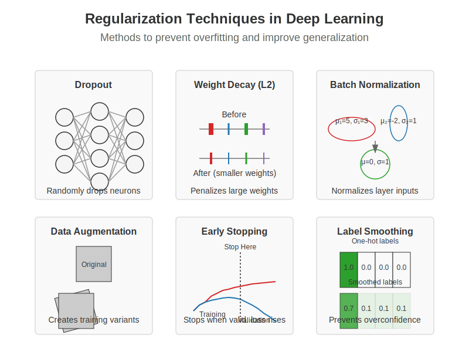

# Chapter 10: Deep Learning: Training & Optimisation

## 10.0 Chapter Goals
- Master deep neural network architectures and training
- Understand optimization algorithms and challenges
- Implement key deep learning components
- Apply best practices for model development

## 10.1 Neural Network Fundamentals

Deep learning has revolutionized AI by enabling models to learn hierarchical representations directly from data. At its core, deep learning is built on neural networks with multiple layers that progressively extract higher-level features.


*Figure 10.1: A multilayer perceptron with two hidden layers, showing how neurons connect between layers and activate through non-linear functions.*

### 10.1.1 Multilayer Perceptrons

Multilayer perceptrons (MLPs) are the foundational architecture of deep learning, consisting of an input layer, one or more hidden layers, and an output layer.

```python
import numpy as np
import matplotlib.pyplot as plt
import torch
import torch.nn as nn
import torch.optim as optim

# Define a simple MLP using PyTorch
class SimpleMLP(nn.Module):
    def __init__(self, input_size, hidden_sizes, output_size):
        """
        A basic multilayer perceptron implementation.
        
        Args:
            input_size: Number of input features
            hidden_sizes: List of hidden layer sizes
            output_size: Number of output units
        """
        super(SimpleMLP, self).__init__()
        
        # Create a list to hold all layers
        layers = []
        
        # Input layer to first hidden layer
        layers.append(nn.Linear(input_size, hidden_sizes[0]))
        layers.append(nn.ReLU())
        
        # Hidden layers
        for i in range(len(hidden_sizes) - 1):
            layers.append(nn.Linear(hidden_sizes[i], hidden_sizes[i+1]))
            layers.append(nn.ReLU())
        
        # Final layer
        layers.append(nn.Linear(hidden_sizes[-1], output_size))
        
        # Combine all layers into a sequential model
        self.model = nn.Sequential(*layers)
    
    def forward(self, x):
        """Forward pass through the network."""
        return self.model(x)

# Create an example MLP
input_size = 10
hidden_sizes = [128, 64, 32]
output_size = 2
model = SimpleMLP(input_size, hidden_sizes, output_size)

# Display model architecture
print(model)
```

The power of MLPs comes from their ability to approximate any continuous function with sufficient neurons in the hidden layers (universal approximation theorem).

### 10.1.2 Activation Functions

Activation functions introduce non-linearity into neural networks, allowing them to learn complex patterns.

```python
def plot_activation_functions():
    """Plot common activation functions used in deep learning."""
    # Generate input values
    x = np.linspace(-5, 5, 1000)
    
    # Calculate activation function outputs
    sigmoid = 1 / (1 + np.exp(-x))
    tanh = np.tanh(x)
    relu = np.maximum(0, x)
    leaky_relu = np.where(x > 0, x, 0.1 * x)
    elu = np.where(x > 0, x, np.exp(x) - 1)
    
    # Create plot
    plt.figure(figsize=(12, 8))
    
    plt.plot(x, sigmoid, label='Sigmoid')
    plt.plot(x, tanh, label='Tanh')
    plt.plot(x, relu, label='ReLU')
    plt.plot(x, leaky_relu, label='Leaky ReLU')
    plt.plot(x, elu, label='ELU')
    
    plt.grid(True)
    plt.legend()
    plt.title('Common Activation Functions')
    plt.xlabel('Input')
    plt.ylabel('Output')
    plt.axhline(y=0, color='k', linestyle='-', alpha=0.3)
    plt.axvline(x=0, color='k', linestyle='-', alpha=0.3)
    
    plt.tight_layout()
    return plt
```

Common activation functions include:

- **ReLU (Rectified Linear Unit)**: $f(x) = \max(0, x)$
  - Pros: Fast computation, reduces vanishing gradient problem
  - Cons: "Dying ReLU" problem (neurons can get stuck)

- **Leaky ReLU**: $f(x) = \max(\alpha x, x)$ where $\alpha$ is a small constant
  - Pros: Addresses dying ReLU problem
  - Cons: Performance improvement is often marginal

- **Sigmoid**: $f(x) = \frac{1}{1 + e^{-x}}$
  - Pros: Outputs between 0 and 1, useful for binary classification
  - Cons: Vanishing gradient problem for extreme inputs

- **Tanh (Hyperbolic Tangent)**: $f(x) = \tanh(x) = \frac{e^x - e^{-x}}{e^x + e^{-x}}$
  - Pros: Zero-centered, useful in recurrent networks
  - Cons: Still suffers from vanishing gradient

- **GELU (Gaussian Error Linear Unit)**: $f(x) = x \cdot \Phi(x)$ where $\Phi$ is the CDF of the standard normal distribution
  - Pros: Smooth, better performance in transformers
  - Cons: More computationally expensive

Recent architectures like transformers commonly use GELU, while CNNs often use ReLU or its variants.

### 10.1.3 Backpropagation Algorithm

Backpropagation is the cornerstone algorithm for training neural networks, efficiently computing gradients through the chain rule.

```python
def manual_backpropagation_example():
    """
    Demonstrate backpropagation with a simple 2-layer network.
    """
    # Simple network: Input -> Hidden (2 neurons) -> Output
    # Forward pass
    def sigmoid(x):
        return 1 / (1 + np.exp(-x))
    
    def sigmoid_derivative(x):
        return x * (1 - x)
    
    # Network parameters
    input_size = 3
    hidden_size = 2
    output_size = 1
    
    # Inputs and target
    X = np.array([[0.1, 0.2, 0.3]])
    y_true = np.array([[0.7]])
    
    # Initialize weights and biases
    np.random.seed(42)
    W1 = np.random.randn(input_size, hidden_size)
    b1 = np.zeros((1, hidden_size))
    W2 = np.random.randn(hidden_size, output_size)
    b2 = np.zeros((1, output_size))
    
    # Forward pass
    hidden_input = np.dot(X, W1) + b1
    hidden_output = sigmoid(hidden_input)
    final_input = np.dot(hidden_output, W2) + b2
    y_pred = sigmoid(final_input)
    
    # Calculate loss
    loss = 0.5 * np.sum((y_pred - y_true) ** 2)
    
    # Backpropagation
    # Output layer error
    output_error = y_pred - y_true
    output_delta = output_error * sigmoid_derivative(y_pred)
    
    # Hidden layer error
    hidden_error = np.dot(output_delta, W2.T)
    hidden_delta = hidden_error * sigmoid_derivative(hidden_output)
    
    # Update weights and biases
    learning_rate = 0.1
    W2 -= learning_rate * np.dot(hidden_output.T, output_delta)
    b2 -= learning_rate * np.sum(output_delta, axis=0, keepdims=True)
    W1 -= learning_rate * np.dot(X.T, hidden_delta)
    b1 -= learning_rate * np.sum(hidden_delta, axis=0, keepdims=True)
    
    return {
        'Initial prediction': y_pred[0][0],
        'Target': y_true[0][0],
        'Loss': loss,
        'Output delta': output_delta[0][0],
        'Hidden delta': hidden_delta[0]
    }
```

The backpropagation algorithm:

1. **Forward Pass**: Compute outputs of all neurons from input to output
2. **Error Calculation**: Compare network output with target to compute error
3. **Backward Pass**: Propagate error backward to assign "responsibility" to each parameter
4. **Parameter Update**: Adjust weights and biases using calculated gradients

While modern deep learning frameworks handle these calculations automatically through automatic differentiation, understanding backpropagation is crucial for developing intuition about neural network training.

### 10.1.4 Vanishing/Exploding Gradients

As neural networks get deeper, the problem of vanishing or exploding gradients becomes more severe:

```python
def demonstrate_gradient_problems():
    """
    Visualize vanishing/exploding gradient problems in deep networks.
    """
    depths = list(range(1, 21))
    
    # Vanishing gradient with sigmoid
    vanishing_grads = [0.25 ** d for d in depths]
    
    # Exploding gradient with poor initialization
    exploding_grads = [1.5 ** d for d in depths]
    
    # Plot
    plt.figure(figsize=(10, 6))
    plt.semilogy(depths, vanishing_grads, 'b-', label='Vanishing Gradient (sigmoid)')
    plt.semilogy(depths, exploding_grads, 'r-', label='Exploding Gradient (poor init)')
    plt.semilogy(depths, [0.1] * len(depths), 'g--', label='Stable Gradient (with techniques)')
    
    plt.xlabel('Network Depth (layers)')
    plt.ylabel('Gradient Magnitude (log scale)')
    plt.title('Vanishing and Exploding Gradients in Deep Networks')
    plt.legend()
    plt.grid(True)
    
    plt.tight_layout()
    return plt
```

Solutions to these gradient problems include:

- Careful weight initialization (e.g., He, Xavier/Glorot)
- Batch normalization
- Residual connections
- Gradient clipping
- Using activation functions that don't saturate (e.g., ReLU)

## 10.2 Optimization Techniques

Training deep neural networks requires effective optimization algorithms. The choice of optimizer significantly impacts training speed and model performance.


*Figure 10.2: Comparison of different optimization algorithms showing convergence paths in a loss landscape. Modern approaches like Adam and RMSprop often converge faster and more reliably than vanilla SGD.*

### 10.2.1 Stochastic Gradient Descent

Stochastic Gradient Descent (SGD) is the most fundamental optimization algorithm for neural networks:

```python
def sgd_optimizer_example():
    """Implement basic SGD and variants."""
    # Generate dummy data
    np.random.seed(42)
    X = np.random.randn(1000, 10)
    w_true = np.random.randn(10, 1)
    y = X @ w_true + 0.1 * np.random.randn(1000, 1)
    
    # Initialize parameters
    w = np.zeros((10, 1))
    
    # SGD parameters
    learning_rate = 0.01
    batch_size = 32
    epochs = 100
    
    # Training loop
    losses = []
    for epoch in range(epochs):
        # Shuffle data
        indices = np.random.permutation(len(X))
        X_shuffled = X[indices]
        y_shuffled = y[indices]
        
        epoch_losses = []
        # Process mini-batches
        for i in range(0, len(X), batch_size):
            X_batch = X_shuffled[i:i+batch_size]
            y_batch = y_shuffled[i:i+batch_size]
            
            # Forward pass
            y_pred = X_batch @ w
            loss = np.mean((y_pred - y_batch) ** 2)
            epoch_losses.append(loss)
            
            # Backward pass (compute gradient)
            grad = 2 * X_batch.T @ (y_pred - y_batch) / batch_size
            
            # Update parameters
            w = w - learning_rate * grad
        
        losses.append(np.mean(epoch_losses))
    
    return {
        'weights': w,
        'true_weights': w_true,
        'final_loss': losses[-1],
        'loss_history': losses
    }
```

SGD variants include:
- **Batch Gradient Descent**: Uses the entire dataset per update
- **Mini-batch SGD**: Uses small batches (typically 32-256 samples)
- **Online SGD**: Updates using one sample at a time

### 10.2.2 Momentum and Adaptive Methods

Modern optimizers build upon SGD by introducing momentum or adaptive learning rates:

```python
def compare_optimizers():
    """Compare convergence speed of different optimizers."""
    import torch
    import torch.nn as nn
    import torch.optim as optim
    
    # Define a simple problem
    X = torch.randn(1000, 20)
    y = torch.randn(1000, 1)
    
    # Define model
    model = nn.Sequential(
        nn.Linear(20, 64),
        nn.ReLU(),
        nn.Linear(64, 1)
    )
    
    # Loss function
    criterion = nn.MSELoss()
    
    # Define optimizers
    optimizers = {
        'SGD': optim.SGD(model.parameters(), lr=0.01),
        'SGD+Momentum': optim.SGD(model.parameters(), lr=0.01, momentum=0.9),
        'Adam': optim.Adam(model.parameters(), lr=0.01),
        'RMSprop': optim.RMSprop(model.parameters(), lr=0.01),
        'AdamW': optim.AdamW(model.parameters(), lr=0.01, weight_decay=1e-4)
    }
    
    # Training loops
    results = {}
    
    for name, optimizer in optimizers.items():
        # Reset model
        model = nn.Sequential(
            nn.Linear(20, 64),
            nn.ReLU(),
            nn.Linear(64, 1)
        )
        
        # Train
        losses = []
        for epoch in range(100):
            optimizer.zero_grad()
            outputs = model(X)
            loss = criterion(outputs, y)
            losses.append(loss.item())
            loss.backward()
            optimizer.step()
        
        results[name] = losses
    
    # Plot
    plt.figure(figsize=(10, 6))
    for name, loss_history in results.items():
        plt.plot(loss_history, label=name)
    
    plt.xlabel('Epoch')
    plt.ylabel('Loss')
    plt.title('Optimizer Convergence Comparison')
    plt.legend()
    plt.yscale('log')
    plt.grid(True)
    
    plt.tight_layout()
    return plt
```

Key optimization algorithms include:

- **SGD with Momentum**: Adds a fraction of the previous update to the current one, helping to escape local minima and accelerate convergence
  - $v_t = \gamma v_{t-1} + \eta \nabla_\theta J(\theta)$
  - $\theta = \theta - v_t$

- **Nesterov Accelerated Gradient**: Computes gradient at the "looked-ahead" position for better convergence
  - $v_t = \gamma v_{t-1} + \eta \nabla_\theta J(\theta - \gamma v_{t-1})$
  - $\theta = \theta - v_t$

- **AdaGrad**: Adapts learning rates per-parameter based on historical gradients
  - $\theta_{t+1} = \theta_t - \frac{\eta}{\sqrt{G_t + \epsilon}} \odot g_t$

- **RMSprop**: Modifies AdaGrad to better handle non-convex functions by using an exponentially weighted moving average
  - $E[g^2]_t = \beta E[g^2]_{t-1} + (1-\beta) g_t^2$
  - $\theta_{t+1} = \theta_t - \frac{\eta}{\sqrt{E[g^2]_t + \epsilon}} g_t$

- **Adam**: Combines momentum and RMSprop ideas for robust performance
  - $m_t = \beta_1 m_{t-1} + (1-\beta_1) g_t$ (momentum)
  - $v_t = \beta_2 v_{t-1} + (1-\beta_2) g_t^2$ (RMSprop)
  - $\hat{m}_t = \frac{m_t}{1-\beta_1^t}$, $\hat{v}_t = \frac{v_t}{1-\beta_2^t}$ (bias correction)
  - $\theta_{t+1} = \theta_t - \frac{\eta}{\sqrt{\hat{v}_t} + \epsilon} \hat{m}_t$

Adam is currently the most widely used optimizer due to its robustness across different architectures and datasets.

### 10.2.3 Learning Rate Schedules

Learning rate scheduling can significantly improve training outcomes:

```python
def learning_rate_schedules():
    """Visualize common learning rate schedules."""
    epochs = np.arange(1, 101)
    
    # Constant
    constant_lr = [0.1] * 100
    
    # Step decay
    step_lr = [0.1 * (0.1 ** (e // 30)) for e in epochs]
    
    # Exponential decay
    exp_lr = [0.1 * np.exp(-0.03 * e) for e in epochs]
    
    # Cosine annealing
    cosine_lr = [0.1 * (1 + np.cos(np.pi * e / 100)) / 2 for e in epochs]
    
    # Linear warmup + cosine decay
    warmup = 10
    warmup_cosine_lr = []
    for e in epochs:
        if e <= warmup:
            lr = 0.1 * e / warmup
        else:
            lr = 0.1 * (1 + np.cos(np.pi * (e - warmup) / (100 - warmup))) / 2
        warmup_cosine_lr.append(lr)
    
    # Plot
    plt.figure(figsize=(10, 6))
    plt.plot(epochs, constant_lr, label='Constant')
    plt.plot(epochs, step_lr, label='Step Decay')
    plt.plot(epochs, exp_lr, label='Exponential Decay')
    plt.plot(epochs, cosine_lr, label='Cosine Annealing')
    plt.plot(epochs, warmup_cosine_lr, label='Warmup + Cosine')
    
    plt.xlabel('Epoch')
    plt.ylabel('Learning Rate')
    plt.title('Learning Rate Schedules')
    plt.legend()
    plt.yscale('log')
    plt.grid(True)
    
    plt.tight_layout()
    return plt
```

Popular learning rate schedules include:

- **Step Decay**: Reduces learning rate by a factor after a set number of epochs
- **Exponential Decay**: Continuously decreases learning rate using an exponential function
- **Cosine Annealing**: Smoothly decreases learning rate following a cosine curve
- **Cyclic Learning Rates**: Cycles between lower and upper learning rate bounds
- **One-Cycle Policy**: Increases learning rate to a maximum, then decreases it
- **Warmup + Decay**: Gradually increases learning rate during initial epochs, then decays

### 10.2.4 Second-order Methods

While first-order methods like SGD use only gradient information, second-order methods incorporate curvature information:

```python
def second_order_methods():
    """Compare first and second-order optimization methods."""
    # Generate a 2D quadratic function with conditioning issues
    def f(x, y):
        return 0.01 * x**2 + 5 * y**2
    
    def grad_f(x, y):
        return np.array([0.02 * x, 10 * y])
    
    def hessian_f(x, y):
        return np.array([[0.02, 0], [0, 10]])
    
    # Starting point
    x0, y0 = 10.0, 2.0
    
    # SGD trajectory
    sgd_path = [(x0, y0)]
    x, y = x0, y0
    lr = 0.1
    for _ in range(20):
        g = grad_f(x, y)
        x -= lr * g[0]
        y -= lr * g[1]
        sgd_path.append((x, y))
    
    # Newton's method trajectory
    newton_path = [(x0, y0)]
    x, y = x0, y0
    for _ in range(5):  # Usually converges in fewer steps
        g = grad_f(x, y)
        H = hessian_f(x, y)
        H_inv = np.linalg.inv(H)
        update = H_inv @ g
        x -= update[0]
        y -= update[1]
        newton_path.append((x, y))
    
    # Plot
    x_range = np.linspace(-10, 10, 100)
    y_range = np.linspace(-2, 2, 100)
    X, Y = np.meshgrid(x_range, y_range)
    Z = f(X, Y)
    
    plt.figure(figsize=(10, 8))
    
    # Contour plot
    plt.contour(X, Y, Z, 20, cmap='viridis', alpha=0.6)
    
    # Plot paths
    sgd_path = np.array(sgd_path)
    newton_path = np.array(newton_path)
    
    plt.plot(sgd_path[:, 0], sgd_path[:, 1], 'r.-', label='SGD', linewidth=2, markersize=8)
    plt.plot(newton_path[:, 0], newton_path[:, 1], 'b.-', label="Newton's Method", linewidth=2, markersize=8)
    
    plt.xlabel('x')
    plt.ylabel('y')
    plt.title("Comparison of First-Order vs. Second-Order Methods")
    plt.legend()
    plt.grid(True)
    
    plt.tight_layout()
    return plt
```

Second-order methods include:

- **Newton's Method**: Uses the Hessian matrix (second derivatives) for updates
  - $\theta_{t+1} = \theta_t - H^{-1}(\theta_t) \nabla_\theta J(\theta_t)$
  - Pros: Fast convergence near optimum
  - Cons: Expensive Hessian computation and inversion

- **Quasi-Newton Methods** (e.g., BFGS, L-BFGS): Approximate the Hessian
  - Pros: Faster than Newton's method
  - Cons: Still too expensive for large neural networks

- **Natural Gradient Descent**: Uses the Fisher information matrix
  - Pros: Invariant to reparameterization
  - Cons: Computation and storage requirements

While second-order methods offer theoretical advantages, their computational requirements generally make them impractical for deep learning. However, approximations like K-FAC (Kronecker-Factored Approximate Curvature) are being explored to make second-order information more accessible.

## 10.3 Regularization Strategies

Regularization helps prevent overfitting by constraining the model's capacity or adding noise to the training process.


*Figure 10.3: Common regularization methods in deep learning, including dropout, weight decay (L2), batch normalization, data augmentation, early stopping, and label smoothing.*

### 10.3.1 Dropout and Batch Normalization

```python
def dropout_example():
    """Implement and visualize dropout."""
    import torch
    import torch.nn as nn
    
    # Define a model with dropout
    class MLPWithDropout(nn.Module):
        def __init__(self, dropout_rate=0.5):
            super().__init__()
            self.fc1 = nn.Linear(784, 256)
            self.dropout1 = nn.Dropout(dropout_rate)
            self.fc2 = nn.Linear(256, 128)
            self.dropout2 = nn.Dropout(dropout_rate)
            self.fc3 = nn.Linear(128, 10)
        
        def forward(self, x):
            x = torch.relu(self.fc1(x))
            x = self.dropout1(x)
            x = torch.relu(self.fc2(x))
            x = self.dropout2(x)
            x = self.fc3(x)
            return x
    
    # Create a toy example for visualization
    model = MLPWithDropout(dropout_rate=0.5)
    
    # Generate random activations for demonstration
    activations = torch.rand(1, 256)
    
    # Apply dropout with different rates
    dropout_rates = [0.0, 0.3, 0.5, 0.7]
    results = []
    
    for rate in dropout_rates:
        dropout = nn.Dropout(rate)
        # Set model to training mode
        dropout.train()
        # Apply dropout
        dropped_activations = dropout(activations)
        results.append((rate, dropped_activations[0].detach().numpy()))
    
    # Visualize
    fig, axes = plt.subplots(len(dropout_rates), 1, figsize=(10, 8))
    
    for i, (rate, acts) in enumerate(results):
        axes[i].bar(range(50), acts[:50], alpha=0.7)  # Show first 50 units
        axes[i].set_title(f'Dropout Rate: {rate}')
        axes[i].set_ylim(0, 1.5)  # Account for scaling during training
        axes[i].grid(True, alpha=0.3)
    
    plt.tight_layout()
    return fig

def batch_norm_example():
    """Demonstrate batch normalization effect."""
    import torch
    import torch.nn as nn
    
    # Create random activations
    np.random.seed(42)
    # Poorly scaled/shifted activations
    activations = np.random.randn(100, 32) * 10 + 5
    
    # Apply batch normalization
    bn = nn.BatchNorm1d(32)
    normalized = bn(torch.tensor(activations, dtype=torch.float32))
    normalized = normalized.detach().numpy()
    
    # Visualize
    fig, axes = plt.subplots(2, 1, figsize=(10, 8))
    
    # Plot raw activation distribution
    for i in range(5):  # Show first 5 features
        axes[0].hist(activations[:, i], alpha=0.3, bins=20, label=f'Feature {i+1}')
    axes[0].set_title('Before Batch Normalization')
    axes[0].grid(True, alpha=0.3)
    axes[0].legend()
    
    # Plot normalized activation distribution
    for i in range(5):
        axes[1].hist(normalized[:, i], alpha=0.3, bins=20, label=f'Feature {i+1}')
    axes[1].set_title('After Batch Normalization')
    axes[1].grid(True, alpha=0.3)
    axes[1].legend()
    
    plt.tight_layout()
    return fig
```

**Dropout** stochastically zeroes activations during training, forcing the network to learn redundant representations:

1. During training: Each neuron is kept with probability `p` (typically 0.5 to 0.8)
2. During inference: All neurons are used, but outputs are scaled by `p`

**Batch Normalization** normalizes activations within a mini-batch, making training more stable:

1. Normalize: $\hat{x}_i = \frac{x_i - \mu_B}{\sqrt{\sigma_B^2 + \epsilon}}$
2. Scale and shift: $y_i = \gamma \hat{x}_i + \beta$

Benefits include:
- Reduced internal covariate shift
- Improved gradient flow
- Regularization effect
- Reduced sensitivity to initialization

### 10.3.2 Weight Decay and Early Stopping

```python
def weight_decay_visualization():
    """Visualize the effect of weight decay on model complexity."""
    from sklearn.linear_model import Ridge
    
    # Generate synthetic data
    np.random.seed(42)
    X = np.sort(np.random.rand(100, 1) * 6 - 3, axis=0)
    y = np.sin(X.ravel()) + np.random.normal(0, 0.1, X.shape[0])
    
    # Fit with different regularization strengths
    alphas = [0, 0.001, 0.01, 0.1, 1.0]
    degrees = 10  # polynomial degree
    
    X_plot = np.linspace(-3, 3, 1000).reshape(-1, 1)
    
    plt.figure(figsize=(12, 8))
    
    for i, alpha in enumerate(alphas):
        # Create polynomial features
        from sklearn.preprocessing import PolynomialFeatures
        from sklearn.pipeline import make_pipeline
        
        model = make_pipeline(
            PolynomialFeatures(degrees),
            Ridge(alpha=alpha)
        )
        
        model.fit(X, y)
        y_plot = model.predict(X_plot)
        
        plt.subplot(len(alphas), 1, i+1)
        plt.scatter(X, y, color='navy', s=30, marker='o', label="Training data")
        plt.plot(X_plot, y_plot, color='red', label="Model")
        plt.plot(X_plot, np.sin(X_plot.ravel()), color='green', label="True function")
        plt.title(f"Weight Decay (L2): α = {alpha}")
        plt.ylim((-1.5, 1.5))
        plt.legend()
    
    plt.tight_layout()
    return plt

def plot_early_stopping():
    """Visualize early stopping based on validation performance."""
    # Simulate training and validation losses
    epochs = np.arange(1, 101)
    
    # Training loss (continues to decrease)
    train_loss = 1.0 / (0.1 * epochs + 1.0) + 0.1
    
    # Validation loss (starts increasing after a while)
    val_loss = 1.0 / (0.1 * epochs + 1.0) + 0.1 + 0.05 * np.maximum(0, epochs - 40) / 60
    
    # Add noise
    np.random.seed(42)
    train_loss += np.random.normal(0, 0.02, len(epochs))
    val_loss += np.random.normal(0, 0.03, len(epochs))
    
    # Determine early stopping point
    patience = 10
    best_val_loss = float('inf')
    best_epoch = 0
    stop_epoch = 0
    
    for i, loss in enumerate(val_loss):
        if loss < best_val_loss:
            best_val_loss = loss
            best_epoch = i
        elif i > best_epoch + patience:
            stop_epoch = i
            break
    
    # Plot
    plt.figure(figsize=(10, 6))
    plt.plot(epochs, train_loss, 'b-', label='Training Loss')
    plt.plot(epochs, val_loss, 'r-', label='Validation Loss')
    
    # Mark early stopping point
    if stop_epoch > 0:
        plt.axvline(x=stop_epoch, color='g', linestyle='--', label=f'Early Stopping (Epoch {stop_epoch})')
    
    # Mark best validation point
    plt.axvline(x=best_epoch, color='m', linestyle=':', label=f'Best Validation (Epoch {best_epoch})')
    
    plt.xlabel('Epochs')
    plt.ylabel('Loss')
    plt.title('Early Stopping Based on Validation Loss')
    plt.legend()
    plt.grid(True)
    
    plt.tight_layout()
    return plt
```

**Weight Decay** (L2 regularization) adds a penalty term to the loss function proportional to the squared weights:

$L_{reg} = L_{original} + \lambda \sum_i w_i^2$

This encourages the model to use smaller weights, reducing model complexity and preventing overfitting.

**Early Stopping** halts training when performance on a validation set stops improving:

1. Monitor validation performance at regular intervals
2. Save the model when it achieves the best validation performance
3. Stop training after a predefined number of epochs without improvement (patience)
4. Restore the best model from the saved checkpoint

Early stopping effectively limits the model's capacity by restricting the number of optimization steps.

### 10.3.3 Data Augmentation

```python
def data_augmentation_example():
    """Demonstrate common data augmentation techniques."""
    try:
        from PIL import Image
        import torchvision.transforms as transforms
        import torchvision.transforms.functional as TF
        
        # Create a sample image (a simple placeholder)
        img = Image.new('RGB', (300, 200), color=(73, 109, 137))
        
        # Define augmentations
        augmentations = [
            ('Original', lambda x: x),
            ('Horizontal Flip', TF.hflip),
            ('Rotation (30°)', lambda x: TF.rotate(x, 30)),
            ('Random Crop', lambda x: TF.crop(x, 50, 50, 150, 100)),
            ('Color Jitter', lambda x: transforms.ColorJitter(brightness=0.5, contrast=0.5, saturation=0.5)(x)),
            ('Random Erasing', lambda x: transforms.RandomErasing(p=1.0, scale=(0.02, 0.1))(transforms.ToTensor()(x)))
        ]
        
        # Apply and visualize
        fig, axes = plt.subplots(2, 3, figsize=(12, 8))
        axes = axes.flatten()
        
        for i, (name, aug_fn) in enumerate(augmentations):
            if name == 'Random Erasing':
                # Special case for random erasing which expects a tensor
                axes[i].imshow(aug_fn.permute(1, 2, 0))
            else:
                axes[i].imshow(aug_fn(img))
            axes[i].set_title(name)
            axes[i].axis('off')
        
        plt.tight_layout()
        return fig
    
    except ImportError:
        # If PIL or torchvision not available, return a text figure
        fig, ax = plt.subplots(figsize=(10, 6))
        ax.text(0.5, 0.5, "Data Augmentation Techniques:\n\n" +
               "• Horizontal/Vertical Flips\n" +
               "• Random Rotations\n" +
               "• Random Crops\n" +
               "• Color Jitter (brightness, contrast, saturation)\n" +
               "• Random Erasing\n" +
               "• Cutout/CutMix/MixUp\n" +
               "• Elastic Transformations",
               horizontalalignment='center',
               verticalalignment='center',
               fontsize=14)
        ax.axis('off')
        return fig
```

Data augmentation artificially increases the size of the training set by applying transformations to the original data:

- **Image Augmentations**: Flips, rotations, crops, color adjustments, random erasing
- **Advanced Techniques**: Mixup (blend images and labels), CutMix (patch replacement), AugMix (augmentation chains)
- **Text Augmentations**: Synonym replacement, word insertion/deletion, back-translation
- **Audio Augmentations**: Time stretching, pitch shifting, noise addition, spectrogram masking

Benefits include:
- Improved generalization
- Robustness to variations
- Reduced overfitting
- Better class balance

### 10.3.4 Label Smoothing

```python
def label_smoothing_example():
    """Demonstrate the effect of label smoothing on model confidence."""
    # Calculate softmax probabilities
    def softmax(x):
        e_x = np.exp(x - np.max(x))
        return e_x / e_x.sum()
    
    # Loss functions
    def cross_entropy(probs, label, epsilon=0.0):
        """Cross entropy with optional label smoothing."""
        n_classes = len(probs)
        
        # Create one-hot encoding
        targets = np.zeros_like(probs)
        targets[label] = 1.0
        
        if epsilon > 0:
            # Apply label smoothing
            targets = (1 - epsilon) * targets + epsilon / n_classes
        
        # Compute loss
        return -np.sum(targets * np.log(probs + 1e-9))
    
    # Generate some logits
    logits_correct = np.array([10.0, 2.0, 1.0, 0.5, 0.1])  # Strongly predicting class 0 (correct)
    logits_wrong = np.array([2.0, 10.0, 1.0, 0.5, 0.1])    # Strongly predicting class 1 (wrong)
    
    probs_correct = softmax(logits_correct)
    probs_wrong = softmax(logits_wrong)
    
    # Class 0 is the true label
    true_label = 0
    
    # Compare losses with and without label smoothing
    smoothing_values = [0.0, 0.1, 0.2]
    results = []
    
    for epsilon in smoothing_values:
        loss_correct = cross_entropy(probs_correct, true_label, epsilon)
        loss_wrong = cross_entropy(probs_wrong, true_label, epsilon)
        
        results.append({
            'epsilon': epsilon,
            'loss_correct': loss_correct,
            'loss_wrong': loss_wrong,
            'ratio': loss_wrong / loss_correct
        })
    
    # Create comparison plot
    fig, axes = plt.subplots(1, 2, figsize=(12, 6))
    
    # Plot probabilities
    bar_positions = np.arange(5)
    axes[0].bar(bar_positions - 0.2, probs_correct, width=0.4, label='Correct Prediction')
    axes[0].bar(bar_positions + 0.2, probs_wrong, width=0.4, label='Incorrect Prediction')
    axes[0].set_xticks(bar_positions)
    axes[0].set_xticklabels([f'Class {i}' for i in range(5)])
    axes[0].set_ylabel('Probability')
    axes[0].set_title('Model Predictions')
    axes[0].legend()
    
    # Plot loss comparisons
    eps_values = [r['epsilon'] for r in results]
    correct_losses = [r['loss_correct'] for r in results]
    wrong_losses = [r['loss_wrong'] for r in results]
    ratios = [r['ratio'] for r in results]
    
    ax1 = axes[1]
    ax1.plot(eps_values, correct_losses, 'b-o', label='Loss (Correct)')
    ax1.plot(eps_values, wrong_losses, 'r-o', label='Loss (Incorrect)')
    ax1.set_xlabel('Label Smoothing (ε)')
    ax1.set_ylabel('Loss Value')
    ax1.set_title('Effect of Label Smoothing on Loss')
    ax1.legend(loc='upper left')
    
    ax2 = ax1.twinx()
    ax2.plot(eps_values, ratios, 'g--s', label='Loss Ratio (Wrong/Correct)')
    ax2.set_ylabel('Loss Ratio', color='g')
    ax2.tick_params(axis='y', labelcolor='g')
    ax2.legend(loc='upper right')
    
    plt.tight_layout()
    return fig
```

Label smoothing replaces one-hot encoded targets with "soft" targets:

$y_i = \begin{cases} 
1 - \epsilon + \epsilon/K & \text{if } i = \text{true class} \\
\epsilon/K & \text{otherwise}
\end{cases}$

where $\epsilon$ is the smoothing parameter and $K$ is the number of classes.

Benefits include:
- Prevents overconfidence
- Improves generalization
- Provides regularization
- Aligns better with inherent data ambiguity

## 10.4 Advanced Architectures

Modern deep learning has evolved sophisticated architectures for different domains.


*Figure 10.4: Key architectural patterns in modern deep learning, including CNNs, ResNets, Inception modules, and Transformer blocks, each addressing specific model design challenges.*

### 10.4.1 Convolutional Neural Networks

```python
def visualize_cnn_architecture():
    """Visualize a basic CNN architecture."""
    fig, ax = plt.subplots(figsize=(12, 5))
    
    # Define architecture components
    components = [
        {"name": "Input", "shape": (64, 64, 3), "x": 0.1, "width": 0.1},
        {"name": "Conv 3×3\n64 filters", "shape": (32, 32, 64), "x": 0.25, "width": 0.1},
        {"name": "Conv 3×3\n128 filters", "shape": (16, 16, 128), "x": 0.4, "width": 0.1},
        {"name": "MaxPool\n2×2", "shape": (8, 8, 128), "x": 0.55, "width": 0.07},
        {"name": "Flatten", "shape": "(8192,)", "x": 0.67, "width": 0.05},
        {"name": "Dense\n512 units", "shape": "(512,)", "x": 0.77, "width": 0.08},
        {"name": "Dense\n10 units", "shape": "(10,)", "x": 0.9, "width": 0.05}
    ]
    
    # Draw boxes
    for i, comp in enumerate(components):
        color = plt.cm.viridis(i / len(components))
        height = min(0.2 + 0.05 * i, 0.5)
        
        # Draw component box
        rect = plt.Rectangle(
            (comp["x"], 0.5 - height/2), 
            comp["width"], height, 
            facecolor=color, alpha=0.7, edgecolor='black'
        )
        ax.add_patch(rect)
        
        # Add labels
        ax.text(comp["x"] + comp["width"]/2, 0.5, comp["name"], 
                ha='center', va='center', fontsize=10, fontweight='bold')
        
        ax.text(comp["x"] + comp["width"]/2, 0.5 - height/2 - 0.05, str(comp["shape"]), 
                ha='center', va='top', fontsize=8)
        
        # Add connecting arrows
        if i > 0:
            prev = components[i-1]
            ax.annotate("", 
                        xy=(comp["x"], 0.5),
                        xytext=(prev["x"] + prev["width"], 0.5),
                        arrowprops=dict(arrowstyle="-|>", color='black'))
    
    # Label axes
    ax.text(0.5, 0.95, "Convolutional Neural Network Architecture", 
            ha='center', va='center', fontsize=14, fontweight='bold')
    
    # Set limits
    ax.set_xlim(0, 1)
    ax.set_ylim(0, 1)
    ax.axis('off')
    
    plt.tight_layout()
    return fig
```

CNNs use specialized layers designed for processing grid-like data (e.g., images):

- **Convolutional Layers**: Apply filters to detect local patterns
  - Parameters: filter size, stride, padding, dilation
  - Properties: weight sharing, translation invariance

- **Pooling Layers**: Downsample feature maps
  - Types: max pooling, average pooling, global pooling
  - Purpose: Reduce dimensions, introduce invariance

- **Feature Hierarchy**: Early layers detect edges and textures; later layers detect complex shapes and objects

Notable CNN architectures include:
- **LeNet-5**: First successful CNN architecture
- **AlexNet**: Breakthrough in image classification (2012)
- **VGG**: Standardized architecture with small filters
- **Inception/GoogLeNet**: Parallel filter operations at different scales
- **ResNet**: Introduced residual connections, enabling extremely deep networks

### 10.4.2 Residual Networks

```python
def visualize_residual_block():
    """Visualize a residual block from ResNet."""
    fig, ax = plt.subplots(figsize=(8, 6))
    
    # Draw main path
    # Input
    rect_input = plt.Rectangle((0.3, 0.8), 0.4, 0.1, facecolor='lightblue', edgecolor='black')
    ax.add_patch(rect_input)
    ax.text(0.5, 0.85, "Input", ha='center', va='center')
    
    # Conv 1
    rect_conv1 = plt.Rectangle((0.3, 0.65), 0.4, 0.1, facecolor='lightgreen', edgecolor='black')
    ax.add_patch(rect_conv1)
    ax.text(0.5, 0.7, "Conv 3×3", ha='center', va='center')
    
    # Batch Norm 1
    rect_bn1 = plt.Rectangle((0.3, 0.55), 0.4, 0.05, facecolor='lightyellow', edgecolor='black')
    ax.add_patch(rect_bn1)
    ax.text(0.5, 0.575, "BatchNorm", ha='center', va='center')
    
    # ReLU 1
    rect_relu1 = plt.Rectangle((0.3, 0.5), 0.4, 0.05, facecolor='lightpink', edgecolor='black')
    ax.add_patch(rect_relu1)
    ax.text(0.5, 0.525, "ReLU", ha='center', va='center')
    
    # Conv 2
    rect_conv2 = plt.Rectangle((0.3, 0.35), 0.4, 0.1, facecolor='lightgreen', edgecolor='black')
    ax.add_patch(rect_conv2)
    ax.text(0.5, 0.4, "Conv 3×3", ha='center', va='center')
    
    # Batch Norm 2
    rect_bn2 = plt.Rectangle((0.3, 0.25), 0.4, 0.05, facecolor='lightyellow', edgecolor='black')
    ax.add_patch(rect_bn2)
    ax.text(0.5, 0.275, "BatchNorm", ha='center', va='center')
    
    # Addition
    circle_add = plt.Circle((0.5, 0.15), 0.05, facecolor='white', edgecolor='black')
    ax.add_patch(circle_add)
    ax.text(0.5, 0.15, "+", ha='center', va='center', fontsize=15, fontweight='bold')
    
    # Output
    rect_output = plt.Rectangle((0.3, 0.05), 0.4, 0.05, facecolor='lightblue', edgecolor='black')
    ax.add_patch(rect_output)
    ax.text(0.5, 0.075, "Output", ha='center', va='center')
    
    # ReLU (final)
    rect_relu2 = plt.Rectangle((0.3, 0), 0.4, 0.05, facecolor='lightpink', edgecolor='black')
    ax.add_patch(rect_relu2)
    ax.text(0.5, 0.025, "ReLU", ha='center', va='center')
    
    # Draw shortcut path
    ax.plot([0.5, 0.7, 0.7, 0.5], [0.8, 0.8, 0.15, 0.15], 'r-', linewidth=2)
    ax.text(0.7, 0.45, "Shortcut Connection", ha='center', va='center', rotation=90, color='red')
    
    # Draw arrows
    arrow_props = dict(arrowstyle='->', color='black', linewidth=1.5)
    ax.annotate('', xy=(0.5, 0.65), xytext=(0.5, 0.7), arrowprops=arrow_props)
    ax.annotate('', xy=(0.5, 0.55), xytext=(0.5, 0.6), arrowprops=arrow_props)
    ax.annotate('', xy=(0.5, 0.5), xytext=(0.5, 0.55), arrowprops=arrow_props)
    ax.annotate('', xy=(0.5, 0.35), xytext=(0.5, 0.4), arrowprops=arrow_props)
    ax.annotate('', xy=(0.5, 0.25), xytext=(0.5, 0.3), arrowprops=arrow_props)
    ax.annotate('', xy=(0.5, 0.15), xytext=(0.5, 0.2), arrowprops=arrow_props)
    ax.annotate('', xy=(0.5, 0.05), xytext=(0.5, 0.1), arrowprops=arrow_props)
    ax.annotate('', xy=(0.5, 0), xytext=(0.5, 0.05), arrowprops=arrow_props)
    
    # Title
    ax.text(0.5, 0.95, "ResNet Block", ha='center', va='center', fontsize=14, fontweight='bold')
    
    # Set limits
    ax.set_xlim(0, 1)
    ax.set_ylim(0, 1)
    ax.axis('off')
    
    plt.tight_layout()
    return fig
```

Residual Networks (ResNets) introduced skip connections to address the degradation problem in very deep networks:

$\mathbf{y} = F(\mathbf{x}, \{W_i\}) + \mathbf{x}$

where $F$ represents the residual mapping and $\mathbf{x}$ is the identity shortcut connection.

Benefits include:
- Easier optimization (shortcuts provide gradient highways)
- Better gradient flow in very deep networks
- Stabilized training
- State-of-the-art performance on many tasks

Variants of residual connections include:
- **Pre-activation ResNet**: Improved ordering of batch normalization and activation
- **ResNeXt**: Grouped convolutions for increased width
- **DenseNet**: Dense connections between all layers in a block
- **EfficientNet**: Balanced network depth, width, and resolution scaling

### 10.4.3 Normalization Techniques

```python
def compare_normalizations():
    """Visualize differences between normalization techniques."""
    # Create toy feature maps (B, C, H, W)
    np.random.seed(42)
    batch_size = 4
    channels = 3
    height = 4
    width = 4
    
    # Create feature maps with different distributions per channel
    features = np.zeros((batch_size, channels, height, width))
    
    # Channel 0: Normal distribution with mean 10, std 5
    features[:, 0, :, :] = np.random.normal(10, 5, (batch_size, height, width))
    
    # Channel 1: Normal distribution with mean 0, std 1
    features[:, 1, :, :] = np.random.normal(0, 1, (batch_size, height, width))
    
    # Channel 2: Normal distribution with mean -5, std 3
    features[:, 2, :, :] = np.random.normal(-5, 3, (batch_size, height, width))
    
    # Apply different normalizations (simplified implementations)
    
    # Batch Normalization (normalize across batch, per channel)
    batch_norm = np.zeros_like(features)
    for c in range(channels):
        mean = np.mean(features[:, c, :, :])
        std = np.std(features[:, c, :, :])
        batch_norm[:, c, :, :] = (features[:, c, :, :] - mean) / (std + 1e-5)
    
    # Layer Normalization (normalize across channels, per sample)
    layer_norm = np.zeros_like(features)
    for b in range(batch_size):
        mean = np.mean(features[b, :, :, :])
        std = np.std(features[b, :, :, :])
        layer_norm[b, :, :, :] = (features[b, :, :, :] - mean) / (std + 1e-5)
    
    # Instance Normalization (normalize across spatial dims, per sample and channel)
    instance_norm = np.zeros_like(features)
    for b in range(batch_size):
        for c in range(channels):
            mean = np.mean(features[b, c, :, :])
            std = np.std(features[b, c, :, :])
            instance_norm[b, c, :, :] = (features[b, c, :, :] - mean) / (std + 1e-5)
    
    # Group Normalization (normalize across spatial dims and channel groups, per sample)
    group_size = 1  # 1 group with 3 channels for this example
    group_norm = np.zeros_like(features)
    for b in range(batch_size):
        for g in range(0, channels, group_size):
            mean = np.mean(features[b, g:g+group_size, :, :])
            std = np.std(features[b, g:g+group_size, :, :])
            group_norm[b, g:g+group_size, :, :] = (features[b, g:g+group_size, :, :] - mean) / (std + 1e-5)
    
    # Create visualizations
    fig, axes = plt.subplots(2, 3, figsize=(15, 10))
    
    # Helper function to visualize feature map distributions
    def plot_distributions(ax, data, title):
        flat_data_by_channel = [data[:, c, :, :].flatten() for c in range(channels)]
        for c, channel_data in enumerate(flat_data_by_channel):
            ax.hist(channel_data, bins=20, alpha=0.7, label=f'Channel {c}')
        ax.set_title(title)
        ax.grid(True, alpha=0.3)
        ax.legend()
    
    # Plot distributions
    plot_distributions(axes[0, 0], features, 'Original Features')
    plot_distributions(axes[0, 1], batch_norm, 'Batch Normalization')
    plot_distributions(axes[0, 2], layer_norm, 'Layer Normalization')
    plot_distributions(axes[1, 0], instance_norm, 'Instance Normalization')
    plot_distributions(axes[1, 1], group_norm, 'Group Normalization')
    
    # Diagram of normalization dimensions
    axes[1, 2].axis('off')
    axes[1, 2].text(0.5, 0.9, 'Normalization Dimensions', ha='center', fontsize=12, fontweight='bold')
    axes[1, 2].text(0.5, 0.75, 'BatchNorm: Normalize across (N, H, W)', ha='center')
    axes[1, 2].text(0.5, 0.65, 'LayerNorm: Normalize across (C, H, W)', ha='center')
    axes[1, 2].text(0.5, 0.55, 'InstanceNorm: Normalize across (H, W)', ha='center')
    axes[1, 2].text(0.5, 0.45, 'GroupNorm: Normalize across (G, H, W)', ha='center')
    axes[1, 2].text(0.5, 0.3, 'N: Batch size, C: Channels', ha='center')
    axes[1, 2].text(0.5, 0.2, 'H: Height, W: Width, G: Group', ha='center')
    
    plt.tight_layout()
    return fig
```

Different normalization techniques stabilize training by normalizing activations:

- **Batch Normalization**: Normalizes across the batch dimension
  - Pros: Very effective, improves training speed
  - Cons: Batch size dependent, less effective with small batches
  - $\hat{x}_i = \frac{x_i - \mu_B}{\sqrt{\sigma_B^2 + \epsilon}}$

- **Layer Normalization**: Normalizes across all features for each sample
  - Pros: Batch size independent, good for recurrent networks
  - Cons: May not work well for CNNs
  - $\hat{x}_i = \frac{x_i - \mu_L}{\sqrt{\sigma_L^2 + \epsilon}}$

- **Instance Normalization**: Normalizes across spatial dimensions for each channel and sample
  - Pros: Effective for style transfer, independent of batch size
  - Cons: Loses statistical information about the dataset
  - $\hat{x}_{ijk} = \frac{x_{ijk} - \mu_{ij}}{\sqrt{\sigma_{ij}^2 + \epsilon}}$

- **Group Normalization**: Normalizes across groups of channels
  - Pros: Batch size independent, works well for smaller batches
  - Cons: Group size is a hyperparameter to tune
  - $\hat{x}_{ijg} = \frac{x_{ijg} - \mu_{ig}}{\sqrt{\sigma_{ig}^2 + \epsilon}}$

Choosing the right normalization technique depends on the architecture, task, and computational constraints.

### 10.4.4 Activation Functions

Modern activation functions improve on traditional ones like sigmoid and tanh:

- **ReLU**: Most common, but suffers from dying neurons
- **Leaky ReLU**: Prevents dying neurons with a small slope for negative inputs
- **Parametric ReLU (PReLU)**: Learns the slope parameter during training
- **ELU (Exponential Linear Unit)**: Smooth negative values with an exponential curve
- **GELU (Gaussian Error Linear Unit)**: Used in transformers, approximates $x \cdot \Phi(x)$
- **Swish/SiLU**: Self-gated activation $x \cdot \sigma(x)$, often outperforms ReLU
- **Mish**: Smooth alternative to Swish with better performance

## 10.5 Training Dynamics

Understanding the training dynamics of deep networks provides insights into optimization challenges and generalization.

### 10.5.1 Loss Landscapes


*Figure 10.5: Visualization of neural network loss landscape showing the complex optimization surface with local minima, saddle points, and flat regions.*

Loss landscapes in deep networks are complex, high-dimensional surfaces with many local minima, saddle points, and flat regions:

- **Local Minima**: Points where the loss is lower than all nearby points
- **Global Minimum**: The lowest possible loss value
- **Saddle Points**: Points with zero gradient but not minima (common in high dimensions)
- **Flat Regions**: Areas with very small gradients that slow training
- **Sharp Minima**: Minima with high curvature, often associated with poor generalization
- **Wide Minima**: Minima with low curvature, often associated with good generalization

Recent research suggests that most critical points in deep networks are saddle points rather than local minima, and that finding wide minima leads to better generalization.

### 10.5.2 Generalization Theory

Generalization is the ability of a model to perform well on unseen data:

- **Empirical Risk Minimization**: Minimizing loss on training data
- **Structural Risk Minimization**: Balancing empirical risk and model complexity
- **Regularization**: Constraining model complexity to improve generalization
- **VC Dimension**: Theoretical measure of model capacity
- **Rademacher Complexity**: Measure of a model's ability to fit random noise

Modern deep learning often violates classical generalization bounds because models can memorize random data yet still generalize well on real data. This paradox has led to new theories:

- **Flat Minima Hypothesis**: Models that find flat regions of the loss landscape generalize better
- **Implicit Regularization**: Optimization methods like SGD inherently bias toward simpler solutions
- **Neural Tangent Kernel**: Connects neural network training to kernel methods in the infinite-width limit

### 10.5.3 Double Descent Phenomenon

```python
def double_descent_curve():
    """Visualize the double descent phenomenon."""
    # Model complexity (e.g., number of parameters)
    complexity = np.linspace(1, 100, 1000)
    
    # Critical complexity where model can perfectly fit training data
    critical_complexity = 40
    
    # Classical U-shaped risk curve
    classical_risk = 1.0 / (complexity + 0.1) + 0.02 * complexity
    
    # Double descent risk curve
    interpolation_peak = 5.0 * np.exp(-0.2 * (complexity - critical_complexity)**2)
    modern_risk = 1.0 / (complexity + 0.1) + 0.01 * np.exp(-0.05 * complexity) + interpolation_peak
    
    # Training error (decreases monotonically)
    train_error = 2.0 / (1 + np.exp(0.1 * (complexity - critical_complexity))) - 1
    
    # Plot
    plt.figure(figsize=(10, 6))
    
    plt.plot(complexity, classical_risk, 'r--', label='Classical Theory (U-shape)')
    plt.plot(complexity, modern_risk, 'b-', label='Modern Observation (Double Descent)')
    plt.plot(complexity, train_error, 'g-.', label='Training Error')
    
    # Mark interpolation threshold
    plt.axvline(x=critical_complexity, color='gray', linestyle=':', alpha=0.7)
    plt.text(critical_complexity + 1, 2.5, 'Interpolation Threshold', rotation=90)
    
    # Annotate regions
    plt.annotate('Underfitting', xy=(10, 1.2), xytext=(10, 2.0), 
                 arrowprops=dict(arrowstyle='->'))
    
    plt.annotate('Interpolation\nRegime', xy=(critical_complexity, 2.5), xytext=(critical_complexity - 15, 3.5), 
                 arrowprops=dict(arrowstyle='->'))
    
    plt.annotate('Modern Generalization', xy=(80, 0.5), xytext=(70, 1.5), 
                 arrowprops=dict(arrowstyle='->'))
    
    plt.xlabel('Model Complexity')
    plt.ylabel('Risk (Test Error)')
    plt.title('Double Descent Phenomenon')
    plt.legend()
    plt.grid(True, alpha=0.3)
    
    plt.tight_layout()
    return plt
```

The double descent phenomenon challenges the classical bias-variance tradeoff:

1. **Classical U-curve**: As model complexity increases, test error first decreases (reducing bias), then increases (increasing variance)

2. **Double Descent**: After the interpolation threshold (where training error reaches zero), test error can *decrease again* with increasing model complexity

This phenomenon helps explain why overparameterized deep networks (with more parameters than training examples) can still generalize well.

### 10.5.4 Neural Tangent Kernel

The Neural Tangent Kernel (NTK) is a theoretical tool for understanding neural network training:

- Connects neural networks to kernel methods
- Shows that in the infinite-width limit, neural networks behave like linear models in a fixed feature space
- Explains why wide networks train stably and generalize well
- Predicts training dynamics of wide networks

While primarily theoretical, NTK insights inform network initialization and architecture design.

## 10.6 Code Lab: Implementing a Neural Network from Scratch

Let's implement a simple neural network without using deep learning frameworks to understand the core concepts better:

```python
def neural_network_from_scratch():
    """Implement a simple neural network from scratch."""
    # Define network architecture
    input_size = 2
    hidden_size = 3
    output_size = 1
    
    # Generate synthetic data
    np.random.seed(42)
    X = np.random.randn(100, input_size)
    # True function: XOR-like (non-linear)
    y = np.array([(x[0] > 0) != (x[1] > 0) for x in X]).reshape(-1, 1).astype(float)
    
    # Initialize weights and biases
    def init_params():
        np.random.seed(42)
        W1 = np.random.randn(input_size, hidden_size) * 0.1
        b1 = np.zeros((1, hidden_size))
        W2 = np.random.randn(hidden_size, output_size) * 0.1
        b2 = np.zeros((1, output_size))
        return {'W1': W1, 'b1': b1, 'W2': W2, 'b2': b2}
    
    # Activation functions
    def sigmoid(x):
        return 1 / (1 + np.exp(-x))
    
    def sigmoid_derivative(x):
        s = sigmoid(x)
        return s * (1 - s)
    
    # Forward pass
    def forward(X, params):
        W1, b1, W2, b2 = params['W1'], params['b1'], params['W2'], params['b2']
        
        # Hidden layer
        Z1 = X @ W1 + b1
        A1 = sigmoid(Z1)
        
        # Output layer
        Z2 = A1 @ W2 + b2
        A2 = sigmoid(Z2)
        
        cache = {'Z1': Z1, 'A1': A1, 'Z2': Z2, 'A2': A2, 'X': X}
        return A2, cache
    
    # Compute loss
    def compute_loss(A2, y):
        m = y.shape[0]
        loss = -np.sum(y * np.log(A2 + 1e-8) + (1 - y) * np.log(1 - A2 + 1e-8)) / m
        return loss
    
    # Backward pass
    def backward(cache, y, params):
        m = y.shape[0]
        W1, W2 = params['W1'], params['W2']
        A1, A2 = cache['A1'], cache['A2']
        X = cache['X']
        
        # Output layer
        dZ2 = A2 - y
        dW2 = A1.T @ dZ2 / m
        db2 = np.sum(dZ2, axis=0, keepdims=True) / m
        
        # Hidden layer
        dA1 = dZ2 @ W2.T
        dZ1 = dA1 * sigmoid_derivative(cache['Z1'])
        dW1 = X.T @ dZ1 / m
        db1 = np.sum(dZ1, axis=0, keepdims=True) / m
        
        gradients = {'dW1': dW1, 'db1': db1, 'dW2': dW2, 'db2': db2}
        return gradients
    
    # Update parameters
    def update_params(params, gradients, learning_rate):
        params['W1'] -= learning_rate * gradients['dW1']
        params['b1'] -= learning_rate * gradients['db1']
        params['W2'] -= learning_rate * gradients['dW2']
        params['b2'] -= learning_rate * gradients['db2']
        return params
    
    # Training loop
    def train(X, y, hidden_size, learning_rate, epochs):
        # Initialize parameters
        params = init_params()
        
        # Track loss
        losses = []
        
        # Training iterations
        for i in range(epochs):
            # Forward pass
            A2, cache = forward(X, params)
            
            # Compute loss
            loss = compute_loss(A2, y)
            losses.append(loss)
            
            # Backward pass
            gradients = backward(cache, y, params)
            
            # Update parameters
            params = update_params(params, gradients, learning_rate)
            
            # Print loss every 1000 epochs
            if i % 1000 == 0:
                print(f"Epoch {i}, Loss: {loss:.4f}")
        
        return params, losses
    
    # Train the network
    params, losses = train(X, y, hidden_size, learning_rate=0.5, epochs=5000)
    
    # Visualize the results
    def visualize_results():
        # Visualization of training progress
        plt.figure(figsize=(12, 5))
        
        # Loss curve
        plt.subplot(1, 2, 1)
        plt.plot(losses)
        plt.title('Training Loss')
        plt.xlabel('Epoch')
        plt.ylabel('Loss')
        plt.grid(True)
        
        # Decision boundary
        plt.subplot(1, 2, 2)
        
        # Create a mesh grid
        h = 0.01
        x_min, x_max = X[:, 0].min() - 1, X[:, 0].max() + 1
        y_min, y_max = X[:, 1].min() - 1, X[:, 1].max() + 1
        xx, yy = np.meshgrid(np.arange(x_min, x_max, h),
                             np.arange(y_min, y_max, h))
        
        # Make predictions on the mesh grid
        Z, _ = forward(np.c_[xx.ravel(), yy.ravel()], params)
        Z = Z.reshape(xx.shape)
        
        # Plot decision boundary
        plt.contourf(xx, yy, Z, cmap=plt.cm.Spectral, alpha=0.8)
        
        # Plot training examples
        plt.scatter(X[:, 0], X[:, 1], c=y.ravel(), cmap=plt.cm.Spectral, edgecolors='k')
        plt.title('Decision Boundary')
        plt.xlabel('Feature 1')
        plt.ylabel('Feature 2')
        
        plt.tight_layout()
        return plt
    
    return visualize_results()
```

This implementation demonstrates the core components of neural networks:

1. **Forward Propagation**: Computing activations through the network
2. **Loss Calculation**: Measuring how far predictions are from targets
3. **Backward Propagation**: Computing gradients for each parameter
4. **Parameter Updates**: Adjusting weights and biases using gradients

While modern deep learning frameworks automate these steps, understanding the underlying mechanics is crucial for debugging, customization, and optimization.

## 10.7 Take-aways

- **Framework Abstraction**: Modern deep learning frameworks like PyTorch and TensorFlow abstract low-level details, allowing researchers to focus on architecture design and experimentation.

- **Training Stability**: Achieving stable training requires careful attention to initialization, normalization, learning rates, and gradient flow.

- **Regularization Importance**: Regularization techniques critically impact model generalization, with techniques like dropout, batch normalization, and weight decay combining for best results.

- **Architectural Innovations**: Advances like residual connections enable training of extremely deep networks by mitigating gradient flow issues.

- **Optimization Challenges**: Deep learning optimization remains challenging due to non-convex loss landscapes, saddle points, and the need to escape poor local minima.

- **Empirical Focus**: Despite theoretical progress, deep learning remains heavily empirical, with practical techniques often preceding theoretical understanding.

## 10.8 Further Reading & Media

- Goodfellow, I., Bengio, Y., & Courville, A. (2016). *Deep Learning*. MIT Press. [http://www.deeplearningbook.org](http://www.deeplearningbook.org)

- Smith, L. N. (2018). "A disciplined approach to neural network hyper-parameters: Part 1 - learning rate, batch size, momentum, and weight decay." *arXiv preprint arXiv:1803.09820*.

- Li, H., Xu, Z., Taylor, G., Studer, C., & Goldstein, T. (2018). "Visualizing the Loss Landscape of Neural Nets." *Advances in Neural Information Processing Systems*.

- Loshchilov, I., & Hutter, F. (2019). "Decoupled Weight Decay Regularization." *International Conference on Learning Representations*.

- Zhang, C., Bengio, S., Hardt, M., Recht, B., & Vinyals, O. (2021). "Understanding deep learning (still) requires rethinking generalization." *Communications of the ACM, 64*(3), 107-115.

- He, K., Zhang, X., Ren, S., & Sun, J. (2016). "Deep Residual Learning for Image Recognition." *IEEE Conference on Computer Vision and Pattern Recognition*.

- Jacot, A., Gabriel, F., & Hongler, C. (2018). "Neural Tangent Kernel: Convergence and Generalization in Neural Networks." *Advances in Neural Information Processing Systems*.

- Ioffe, S., & Szegedy, C. (2015). "Batch Normalization: Accelerating Deep Network Training by Reducing Internal Covariate Shift." *International Conference on Machine Learning*.

- 3Blue1Brown YouTube Series: "Neural Networks" [https://www.youtube.com/playlist?list=PLZHQObOWTQDNU6R1_67000Dx_ZCJB-3pi](https://www.youtube.com/playlist?list=PLZHQObOWTQDNU6R1_67000Dx_ZCJB-3pi)