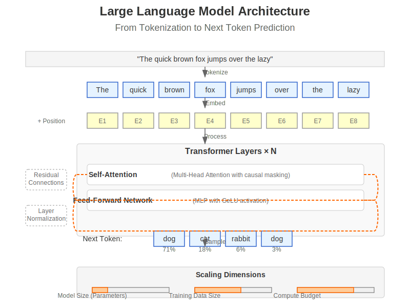
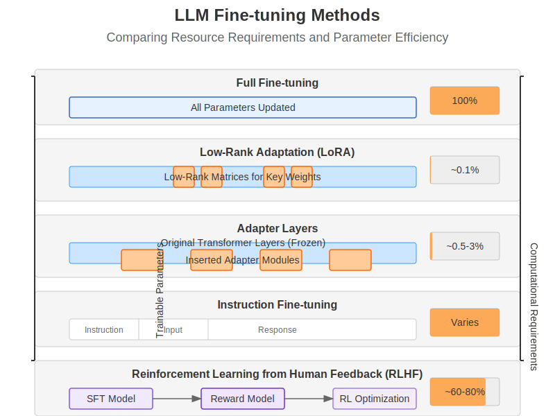
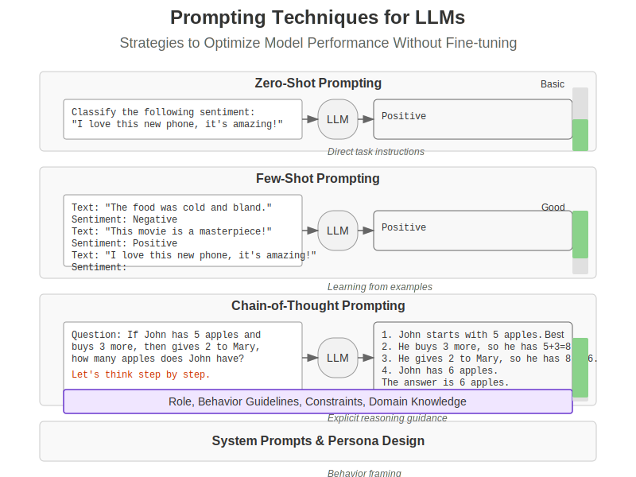
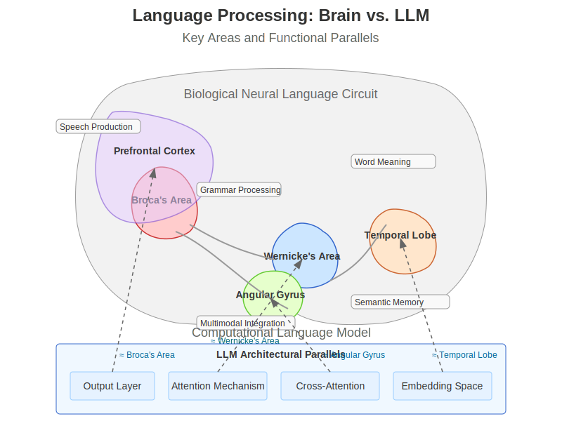

# Chapter 12: Large Language Models & Fine-Tuning

```{admonition} Learning Objectives
:class: note

By the end of this chapter, you will be able to:

- **Understand** large language model architectures and pretraining strategies
- **Master** fine-tuning techniques and parameter-efficient adaptation methods
- **Connect** computational language models to human language processing mechanisms
- **Implement** effective prompting strategies and model adaptations
- **Evaluate** LLM performance across multiple dimensions and tasks
```

## 12.1 Large Language Model Fundamentals

Large Language Models (LLMs) represent a transformative development in artificial intelligence, capable of generating human-like text, translating languages, writing creative content, and answering questions in an informative way. This section explores the foundational elements that make these models possible.


*Figure 12.1: Large Language Model architecture, showing the progression from input tokenization through transformer layers to next token prediction.*

### 12.1.1 Transformer-Based Architectures

Modern LLMs are built on the transformer architecture introduced by Vaswani et al. (2017), which we covered in Chapter 11. While the core architecture remains similar, LLMs incorporate several key modifications and scaling techniques:

```python
import torch
import torch.nn as nn
import torch.nn.functional as F
import math

class LLMTransformerBlock(nn.Module):
    """A single transformer block used in large language models."""
    def __init__(self, d_model, n_heads, d_ff, dropout=0.1):
        super().__init__()
        self.d_model = d_model
        
        # Multi-head attention
        self.attention = nn.MultiheadAttention(d_model, n_heads, dropout=dropout)
        
        # Feed-forward network
        self.feed_forward = nn.Sequential(
            nn.Linear(d_model, d_ff),
            nn.GELU(),  # GELU activation is common in modern LLMs
            nn.Linear(d_ff, d_model),
            nn.Dropout(dropout)
        )
        
        # Layer normalization - modern LLMs often use RMSNorm or pre-norm
        self.norm1 = nn.LayerNorm(d_model)
        self.norm2 = nn.LayerNorm(d_model)
        
        # Dropout
        self.dropout = nn.Dropout(dropout)
        
    def forward(self, x, attention_mask=None):
        # Apply pre-normalization (common in modern LLMs)
        normalized_x = self.norm1(x)
        
        # Self-attention with residual connection
        # GPT models use causal masking (triangular)
        attn_output, _ = self.attention(
            normalized_x, normalized_x, normalized_x,
            attn_mask=attention_mask,
            need_weights=False
        )
        x = x + self.dropout(attn_output)
        
        # Feed-forward with pre-normalization and residual connection
        normalized_x = self.norm2(x)
        ff_output = self.feed_forward(normalized_x)
        x = x + ff_output
        
        return x
```

Key architectural innovations in modern LLMs include:

1. **Scale**: While early transformer models had ~100M parameters, modern LLMs range from billions to trillions of parameters.

2. **Architectural Modifications**:
   - Pre-normalization vs. post-normalization
   - Activation functions (GELU instead of ReLU)
   - Attention mechanisms (grouped-query attention, sliding window attention)
   - Flash attention and other efficiency improvements

3. **Auto-regressive Training**: Most LLMs are trained to predict the next token in a sequence, creating an auto-regressive language model.

4. **Vocabulary and Tokenization**: LLMs use subword tokenization methods like BPE (Byte-Pair Encoding) or WordPiece to handle large vocabularies efficiently.

**Biological Parallel**: The transformer's attention mechanism resembles how the brain's attentional systems selectively focus on relevant information, while the deep network of layers parallels the hierarchical processing in the brain's language areas.

### 12.1.2 Scaling Laws and Emergent Abilities

One of the most fascinating aspects of LLMs is how their capabilities grow with scale. Kaplan et al. (2020) discovered predictable scaling laws that show how model performance improves as a power-law function of model size, dataset size, and compute budget.

```python
def plot_scaling_laws():
    """Visualize LLM scaling laws relationship."""
    import numpy as np
    import matplotlib.pyplot as plt
    
    # Model sizes (parameters)
    model_sizes = np.logspace(6, 12, 100)  # 10^6 to 10^12
    
    # Loss decreases as a power law with model size
    loss = 10 * (model_sizes ** -0.076)
    
    plt.figure(figsize=(10, 6))
    plt.loglog(model_sizes, loss, 'b-', linewidth=2)
    plt.grid(True, which="both", ls="-", alpha=0.2)
    plt.xlabel('Model Size (Parameters)', fontsize=12)
    plt.ylabel('Loss', fontsize=12)
    plt.title('Scaling Law: Loss vs. Model Size', fontsize=14)
    
    # Annotate key model sizes
    models = {
        "GPT-2": 1.5e9,
        "GPT-3": 175e9,
        "PaLM": 540e9,
        "GPT-4": 1.8e12  # estimated
    }
    
    for name, size in models.items():
        y_val = 10 * (size ** -0.076)
        plt.scatter(size, y_val, s=80, zorder=3)
        plt.annotate(name, (size, y_val), 
                    xytext=(5, 10), textcoords='offset points',
                    fontsize=10)
    
    plt.tight_layout()
    return plt
```

Emergent abilities appear in LLMs as they scale, including:

1. **In-context Learning**: The ability to learn from examples provided in the prompt without parameter updates.

2. **Instruction Following**: Understanding and executing natural language instructions without explicit programming.

3. **Chain-of-Thought Reasoning**: Breaking down complex problems into steps to arrive at answers, similar to human reasoning processes.

4. **Multimodal Capabilities**: Recent models can process and generate content across modalities (text, code, images).

These emergent abilities often appear at specific model size thresholds, with capabilities suddenly manifesting once models reach a certain scale.

**Biological Parallel**: The brain's language capabilities also emerge from the complex interactions of billions of neurons working together. No single neuron understands language, but the collective network produces sophisticated language processing.

### 12.1.3 Pre-training Objectives

LLMs are initially trained with self-supervised objectives on massive text corpora:

1. **Next Token Prediction (Causal Language Modeling)**:
   - The most common approach used in GPT-style models
   - Model predicts the next token given previous tokens
   - Training uses teacher forcing where ground truth previous tokens are provided

2. **Masked Language Modeling**:
   - Used in BERT-style models
   - Random tokens are masked, and the model predicts the masked tokens
   - Allows bidirectional context but requires additional fine-tuning for generation

```python
def causal_language_modeling_loss(model, input_ids, labels=None):
    """Compute loss for causal language modeling (next token prediction)."""
    if labels is None:
        # For autoregressive models, labels are the input shifted right
        labels = input_ids.clone()
        labels = labels[:, 1:]  # Remove first token
        
        # Adjust input to predict next token
        input_ids = input_ids[:, :-1]  # Remove last token
    
    # Forward pass to get logits
    logits = model(input_ids)
    
    # Compute loss (CrossEntropyLoss for token classification)
    loss_fn = nn.CrossEntropyLoss()
    
    # Reshape for loss computation: (batch*seq_len, vocab_size)
    logits_view = logits.view(-1, logits.size(-1))
    labels_view = labels.view(-1)
    
    loss = loss_fn(logits_view, labels_view)
    return loss
```

3. **Contrastive Learning**:
   - Maps similar inputs closer in embedding space and dissimilar inputs farther apart
   - Used in some multimodal models like CLIP

4. **Multi-task Pre-training**:
   - Combines multiple objectives during pre-training
   - May include both generative and discriminative tasks

**Biological Parallel**: The brain learns language through prediction as well, constantly anticipating upcoming words based on context—a process known as predictive processing. When predictions are wrong, the brain updates its internal model.

### 12.1.4 Tokenization Strategies

Tokenization converts raw text into tokens that serve as the model's input units. Modern LLMs use subword tokenization methods to balance vocabulary size and coverage:

```python
from transformers import GPT2Tokenizer

def demonstrate_tokenization():
    """Show how text is tokenized in modern LLMs."""
    # Load a tokenizer (GPT-2 uses Byte-Pair Encoding)
    tokenizer = GPT2Tokenizer.from_pretrained("gpt2")
    
    # Example text
    text = "The quick brown fox jumps over the lazy dog. It's a pangram!"
    
    # Tokenize
    tokens = tokenizer.tokenize(text)
    token_ids = tokenizer.encode(text)
    
    # Print results
    print(f"Original text: {text}")
    print(f"Tokenized: {tokens}")
    print(f"Token IDs: {token_ids}")
    
    # Show uncommon word handling
    uncommon_text = "Transformers use self-attention for parallelization."
    uncommon_tokens = tokenizer.tokenize(uncommon_text)
    print(f"\nUncommon text: {uncommon_text}")
    print(f"Tokenized: {uncommon_tokens}")
    
    # Token merging example (simplified BPE algorithm demonstration)
    def simplified_bpe(text, vocab, max_merges=10):
        # Start with characters
        tokens = list(text)
        
        for _ in range(max_merges):
            # Find most frequent adjacent pair
            pairs = {}
            for i in range(len(tokens) - 1):
                pair = tokens[i] + tokens[i+1]
                pairs[pair] = pairs.get(pair, 0) + 1
            
            if not pairs:
                break
                
            # Get most frequent pair
            best_pair = max(pairs, key=pairs.get)
            
            # Merge the pair in the sequence
            new_tokens = []
            i = 0
            while i < len(tokens):
                if i < len(tokens) - 1 and tokens[i] + tokens[i+1] == best_pair:
                    new_tokens.append(best_pair)
                    i += 2
                else:
                    new_tokens.append(tokens[i])
                    i += 1
            
            tokens = new_tokens
            # Add to vocabulary
            vocab.add(best_pair)
        
        return tokens
    
    # Demonstrate simplified BPE
    sample_text = "lowerlevel"
    vocab = set(sample_text)  # Start with character vocabulary
    merged_tokens = simplified_bpe(sample_text, vocab)
    
    print(f"\nSimplified BPE example:")
    print(f"Original: {sample_text}")
    print(f"Tokenized: {merged_tokens}")
    print(f"Vocabulary: {vocab}")
    
    return {"tokens": tokens, "token_ids": token_ids}
```

Common tokenization methods include:

1. **Byte-Pair Encoding (BPE)**: Iteratively merges the most frequent pairs of bytes or characters to form new tokens.

2. **WordPiece**: Similar to BPE but uses a likelihood-based approach for merging tokens.

3. **SentencePiece**: Uses BPE or unigram language modeling and performs tokenization without requiring pre-tokenization.

4. **Tokenization Challenges**:
   - Out-of-vocabulary words
   - Non-English languages and multilingual models
   - Code and specialized formats
   - Context window inefficiency

**Biological Parallel**: Humans process language at multiple levels of granularity—phonemes, morphemes, words, and phrases—similar to how tokenizers break text into subword units that capture meaningful language components.

## 12.2 Fine-tuning Methods

While pre-trained LLMs possess impressive general capabilities, fine-tuning allows these models to specialize for specific tasks, domains, or requirements. This section explores various approaches to adapting LLMs, from traditional full fine-tuning to more efficient techniques.


*Figure 12.2: Comparison of LLM fine-tuning methods, from resource-intensive full fine-tuning to parameter-efficient techniques like LoRA and RLHF.*

### 12.2.1 Full Fine-tuning

Full fine-tuning involves updating all parameters of a pre-trained model on a new dataset. This approach typically yields the best performance but requires substantial computational resources:

```python
import torch
from transformers import GPT2LMHeadModel, GPT2Tokenizer, Trainer, TrainingArguments
from datasets import load_dataset

def full_finetune_example():
    """Demonstrate full fine-tuning of a small LLM."""
    # Load pre-trained model and tokenizer (using GPT-2 small for demonstration)
    model_name = "gpt2"  # 124M parameters
    tokenizer = GPT2Tokenizer.from_pretrained(model_name)
    model = GPT2LMHeadModel.from_pretrained(model_name)
    
    # Special tokens
    tokenizer.pad_token = tokenizer.eos_token
    
    # Load dataset (for example, a subset of WikiText)
    dataset = load_dataset("wikitext", "wikitext-2-raw-v1", split="train[:1000]")
    
    # Tokenize the dataset
    def tokenize_function(examples):
        return tokenizer(examples["text"], padding="max_length", truncation=True, max_length=128)
    
    tokenized_dataset = dataset.map(tokenize_function, batched=True)
    
    # Training arguments
    training_args = TrainingArguments(
        output_dir="./results",
        num_train_epochs=3,
        per_device_train_batch_size=8,
        warmup_steps=500,
        weight_decay=0.01,
        logging_dir="./logs",
        report_to="none"  # Disable wandb, etc.
    )
    
    # Setup trainer
    trainer = Trainer(
        model=model,
        args=training_args,
        train_dataset=tokenized_dataset,
    )
    
    # Train (commented out for demonstration)
    # trainer.train()
    
    # Save fine-tuned model
    # trainer.save_model("./fine-tuned-gpt2")
    
    # Memory and compute requirements
    model_size_mb = sum(p.numel() for p in model.parameters()) * 4 / 1024 / 1024  # 4 bytes per float32
    print(f"Model size: {model_size_mb:.2f} MB")
    print(f"All parameters updated during training: {sum(p.numel() for p in model.parameters())}")
    
    return {
        "model": model_name,
        "parameters": sum(p.numel() for p in model.parameters()),
        "trainable_parameters": sum(p.numel() for p in model.parameters() if p.requires_grad)
    }
```

Key considerations for full fine-tuning:

1. **Resource Requirements**:
   - Memory: Must fit the entire model and optimizer states in memory
   - Compute: Updates all parameters, requiring substantial computation
   - Storage: The resulting model is as large as the original

2. **Catastrophic Forgetting**:
   - Model may lose general capabilities when fine-tuned on a narrow domain
   - Mitigated through regularization techniques and careful hyperparameter selection

3. **Advantages**:
   - Maximum performance potential
   - Full model adaptation
   - No architectural constraints

**Biological Parallel**: Full fine-tuning resembles extensive retraining of neural circuits, where the brain forms specialized pathways for specific skills while potentially weakening other connections. However, the brain is generally better at avoiding catastrophic forgetting through complementary learning systems.

### 12.2.2 Parameter-Efficient Fine-Tuning (PEFT)

Parameter-efficient fine-tuning methods modify only a small subset of model parameters, dramatically reducing computational and storage requirements while maintaining performance:

#### LoRA (Low-Rank Adaptation)

LoRA, introduced by Hu et al. (2021), inserts trainable low-rank matrices into the model's weight matrices, allowing efficient adaptation with minimal parameter updates:

```python
import torch
import torch.nn as nn
import torch.nn.functional as F

class LoRALayer(nn.Module):
    """Implementation of Low-Rank Adaptation (LoRA) for a linear layer."""
    def __init__(self, in_features, out_features, rank=4, alpha=1.0):
        super().__init__()
        self.rank = rank
        self.alpha = alpha
        self.scaling = alpha / rank
        
        # Low-rank matrices
        self.lora_A = nn.Parameter(torch.zeros((rank, in_features)))
        self.lora_B = nn.Parameter(torch.zeros((out_features, rank)))
        
        # Initialize A with normal and B with zeros
        nn.init.normal_(self.lora_A, mean=0, std=1)
        nn.init.zeros_(self.lora_B)
        
    def forward(self, x):
        # Low-rank update: B·A·x
        return self.scaling * (self.lora_B @ self.lora_A @ x)

class LoRALinear(nn.Module):
    """Linear layer with LoRA adaptation."""
    def __init__(self, linear_layer, rank=4, alpha=1.0):
        super().__init__()
        self.linear = linear_layer
        self.lora = LoRALayer(
            linear_layer.in_features, 
            linear_layer.out_features,
            rank=rank,
            alpha=alpha
        )
        
        # Freeze the original layer
        for param in self.linear.parameters():
            param.requires_grad = False
        
    def forward(self, x):
        # Combine original output with LoRA adaptation
        return self.linear(x) + self.lora(x)

def apply_lora_to_model(model, target_modules=["query", "value"], rank=8, alpha=16):
    """Apply LoRA to specific modules in a transformer model."""
    # Count original trainable parameters
    orig_params = sum(p.numel() for p in model.parameters() if p.requires_grad)
    
    # Find and replace target modules with LoRA versions
    for name, module in model.named_modules():
        if any(target in name for target in target_modules):
            if isinstance(module, nn.Linear):
                parent_name = name.rsplit(".", 1)[0]
                attr_name = name.rsplit(".", 1)[1]
                parent = model.get_submodule(parent_name)
                setattr(parent, attr_name, LoRALinear(module, rank=rank, alpha=alpha))
    
    # Only LoRA parameters should be trainable
    for param in model.parameters():
        param.requires_grad = False
    
    for name, module in model.named_modules():
        if isinstance(module, LoRALayer):
            for param in module.parameters():
                param.requires_grad = True
    
    # Count new trainable parameters
    lora_params = sum(p.numel() for p in model.parameters() if p.requires_grad)
    
    print(f"Original trainable parameters: {orig_params}")
    print(f"LoRA trainable parameters: {lora_params}")
    print(f"Parameter reduction: {lora_params / orig_params * 100:.2f}%")
    
    return model
```

LoRA provides several advantages:

1. **Efficiency**: Typically reduces trainable parameters to <1% of the original model.

2. **Performance**: Achieves comparable performance to full fine-tuning in many tasks.

3. **Modularity**: Multiple LoRA adaptations can be created for different tasks and switched without changing the base model.

#### Adapter Layers

Adapters insert small trainable modules within the transformer architecture:

```python
class AdapterLayer(nn.Module):
    """Adapter module with bottleneck architecture."""
    def __init__(self, hidden_size, adapter_size, dropout=0.1):
        super().__init__()
        self.down_proj = nn.Linear(hidden_size, adapter_size)
        self.up_proj = nn.Linear(adapter_size, hidden_size)
        self.act = nn.GELU()
        self.dropout = nn.Dropout(dropout)
        self.layer_norm = nn.LayerNorm(hidden_size)
        
        # Initialize weights
        nn.init.normal_(self.down_proj.weight, std=0.01)
        nn.init.normal_(self.up_proj.weight, std=0.01)
        nn.init.zeros_(self.down_proj.bias)
        nn.init.zeros_(self.up_proj.bias)
        
    def forward(self, x):
        residual = x
        x = self.layer_norm(x)
        x = self.down_proj(x)
        x = self.act(x)
        x = self.dropout(x)
        x = self.up_proj(x)
        x = self.dropout(x)
        return residual + x
```

#### Other PEFT Techniques

- **Prefix Tuning**: Prepends trainable vectors to keys and values in attention layers.
- **Prompt Tuning**: Adds trainable "soft prompt" tokens to the input.
- **BitFit**: Updates only bias terms throughout the network.

**Biological Parallel**: PEFT approaches resemble how the brain can adapt to new tasks by modifying small subnetworks within larger neural circuits while preserving overall structure and general knowledge.

### 12.2.3 Instruction Fine-tuning

Instruction fine-tuning adapts models to follow natural language instructions, enhancing their ability to understand and execute user requests:

```python
def prepare_instruction_dataset():
    """Prepare a dataset for instruction fine-tuning."""
    
    # Example instruction-response pairs
    instruction_data = [
        {
            "instruction": "Summarize the following text about climate change.",
            "input": "Global warming is the long-term heating of Earth's surface observed since the pre-industrial period due to human activities, primarily fossil fuel burning, which increases heat-trapping greenhouse gas levels in Earth's atmosphere. It is most commonly measured as the average increase in Earth's global surface temperature. Since the pre-industrial period, human activities are estimated to have increased Earth's global average temperature by about 1 degree Celsius (1.8 degrees Fahrenheit), a number that is currently increasing by 0.2 degrees Celsius (0.36 degrees Fahrenheit) per decade.",
            "output": "Climate change refers to the long-term warming of Earth caused by human activities, especially burning fossil fuels that release greenhouse gases. The planet has warmed about 1°C since pre-industrial times, with temperature currently rising 0.2°C per decade."
        },
        {
            "instruction": "Translate this English text to French.",
            "input": "The quick brown fox jumps over the lazy dog.",
            "output": "Le rapide renard brun saute par-dessus le chien paresseux."
        },
        {
            "instruction": "Write a short poem about mountains.",
            "input": "",
            "output": "Majestic peaks reach toward the sky,\nAncient stones that time defy.\nSnow-capped sentinels standing tall,\nWhispering winds, nature's call."
        }
    ]
    
    # Format data for model training
    def format_instruction(item):
        if item["input"]:
            return f"### Instruction:\n{item['instruction']}\n\n### Input:\n{item['input']}\n\n### Response:\n{item['output']}"
        else:
            return f"### Instruction:\n{item['instruction']}\n\n### Response:\n{item['output']}"
    
    formatted_data = [format_instruction(item) for item in instruction_data]
    
    return {
        "raw_data": instruction_data,
        "formatted_data": formatted_data,
        "samples": len(instruction_data)
    }
```

Key aspects of instruction fine-tuning:

1. **Dataset Structure**:
   - Instruction-output pairs (with optional input)
   - Diverse task coverage
   - Consistent formatting

2. **Training Approach**:
   - Initially trained on human-written instruction-response pairs
   - May use a mix of real and synthetic data
   - Often combined with PEFT techniques for efficiency

3. **Performance Considerations**:
   - Quality and diversity of instructions matter
   - Template consistency affects generalization
   - Task coverage determines capabilities

**Biological Parallel**: Instruction tuning resembles how humans learn to follow verbal instructions, a capability that develops through exposure to diverse command-response pairings.

### 12.2.4 RLHF and Alignment

Reinforcement Learning from Human Feedback (RLHF) fine-tunes models to produce outputs that humans prefer, enhancing helpfulness, honesty, and harmlessness:

```python
def rlhf_process():
    """Illustrate the RLHF process components."""
    # 1. Start with an instruction-tuned model (SFT)
    sft_model = "instruction_tuned_model"
    
    # 2. Train a reward model from human preferences
    def train_reward_model():
        # Example preference data
        preference_examples = [
            {
                "prompt": "How can I improve my programming skills?",
                "chosen": "To improve your programming skills, you should practice regularly, work on real projects, learn from code reviews, study different languages and paradigms, and collaborate with other developers. Consistent practice with increasingly challenging problems will help you grow.",
                "rejected": "Just code more. You'll get better eventually."
            }
        ]
        
        # Train classifier to predict human preferences
        reward_model = "trained_reward_model"
        return reward_model
    
    # 3. Fine-tune with reinforcement learning
    def rl_fine_tuning(sft_model, reward_model):
        # PPO algorithm components
        def get_model_outputs(prompt, model):
            # Generate multiple responses using the model
            return ["Response 1", "Response 2", "Response 3"]
        
        def compute_rewards(responses, reward_model):
            # Score responses using the reward model
            return [0.8, 0.4, 0.6]
        
        def update_policy(model, responses, rewards):
            # Update model to increase probability of high-reward responses
            return "updated_model"
        
        # RL training loop (simplified)
        rlhf_model = sft_model
        for epoch in range(5):
            prompts = ["Example prompt 1", "Example prompt 2"]
            for prompt in prompts:
                # Generate responses from current policy
                responses = get_model_outputs(prompt, rlhf_model)
                
                # Compute rewards
                rewards = compute_rewards(responses, reward_model)
                
                # Update policy to maximize rewards
                rlhf_model = update_policy(rlhf_model, responses, rewards)
        
        return rlhf_model
    
    # Execute RLHF pipeline
    reward_model = train_reward_model()
    rlhf_model = rl_fine_tuning(sft_model, reward_model)
    
    return {
        "supervised_fine_tuned": sft_model,
        "reward_model": reward_model,
        "rlhf_model": rlhf_model
    }
```

The RLHF process involves:

1. **Supervised Fine-Tuning (SFT)**:
   - Train the model on high-quality examples
   - Establishes base capabilities for following instructions

2. **Reward Model Training**:
   - Human evaluators rate or rank model outputs
   - Train a reward model to predict human preferences

3. **RL Optimization**:
   - Fine-tune the SFT model using Proximal Policy Optimization (PPO)
   - Optimize for reward model scores while constraining divergence from original model (via KL penalty)

4. **Challenges**:
   - Reward hacking (optimizing for reward signals rather than true intent)
   - Alignment tax (trade-off between capability and alignment)
   - Distribution shifts

**Biological Parallel**: RLHF parallels how humans learn social norms and behavioral guidelines through feedback from others. The brain's dopaminergic systems provide reinforcement signals, strengthening neural pathways that lead to positive outcomes and weakening those that lead to negative consequences.

## 12.3 Prompting Techniques

Prompting has emerged as a powerful way to control and direct LLM behavior without modifying model weights. Effective prompting techniques can dramatically improve model performance on specific tasks and enable capabilities that weren't explicitly trained.


*Figure 12.3: Various prompting techniques for LLMs, from zero-shot to chain-of-thought prompting and system prompt design.*

### 12.3.1 Zero-Shot and Few-Shot Learning

One of the most remarkable capabilities of large language models is their ability to perform tasks with minimal or no examples:

```python
def demonstrate_prompting_techniques():
    """Demonstrate zero-shot and few-shot prompting techniques."""
    # Zero-shot prompting: no examples provided
    zero_shot_prompt = """
    Classify the following text into one of these categories: 
    Business, Politics, Technology, Sports, Entertainment.
    
    Text: Apple announced their new M3 chip, which they claim offers significant 
    performance improvements over the previous generation.
    
    Category:
    """
    
    # Few-shot prompting: providing examples to establish a pattern
    few_shot_prompt = """
    Classify the text into one of these categories: 
    Business, Politics, Technology, Sports, Entertainment.
    
    Text: The Federal Reserve has decided to keep interest rates unchanged this quarter.
    Category: Business
    
    Text: The baseball team won their third consecutive championship last night.
    Category: Sports
    
    Text: The prime minister announced new climate initiatives yesterday.
    Category: Politics
    
    Text: Apple announced their new M3 chip, which they claim offers significant 
    performance improvements over the previous generation.
    Category:
    """
    
    # Format comparison for demonstration purposes
    return {
        "zero_shot": {
            "prompt": zero_shot_prompt,
            "tokens": len(zero_shot_prompt.split()),
            "expected_answer": "Technology"
        },
        "few_shot": {
            "prompt": few_shot_prompt,
            "tokens": len(few_shot_prompt.split()),
            "expected_answer": "Technology",
            "examples_provided": 3
        }
    }
```

#### Zero-Shot Learning
Zero-shot prompting involves asking the model to perform a task without any demonstrations:

1. **When to Use**:
   - Simple, common tasks that the model has likely encountered in training
   - When context length is limited
   - For initial exploration of model capabilities

2. **Limitations**:
   - Less predictable performance
   - Lower accuracy on complex or nuanced tasks
   - Sensitive to exact wording of the prompt

#### Few-Shot Learning
Few-shot prompting provides examples of the desired input-output pattern:

1. **When to Use**:
   - Complex tasks requiring specific formats or reasoning
   - When consistency in outputs is important
   - To guide the model toward specific approaches

2. **Best Practices**:
   - Use diverse, representative examples
   - Match example format exactly to your desired output
   - Order examples from simple to complex
   - Include both positive and negative examples when appropriate

3. **Limitations**:
   - Consumes token context
   - May not generalize well beyond provided examples
   - Can suffer from recency bias (favoring later examples)

**Biological Parallel**: Few-shot learning resembles how humans rapidly adapt to new tasks after seeing just a few examples, a capability believed to rely on the brain's meta-learning mechanisms in the prefrontal cortex.

### 12.3.2 Chain-of-Thought Prompting

Chain-of-Thought (CoT) prompting, introduced by Wei et al. (2022), encourages models to break down complex problems into step-by-step reasoning:

```python
def demonstrate_cot_prompting():
    """Demonstrate chain-of-thought prompting for complex reasoning."""
    
    # Standard prompting (direct question)
    standard_prompt = """
    Question: Roger has 5 tennis balls. He buys 2 more cans of tennis balls. 
    Each can has 3 tennis balls. How many tennis balls does he have now?
    
    Answer:
    """
    
    # Chain-of-thought prompting (with reasoning steps)
    cot_prompt = """
    Question: Roger has 5 tennis balls. He buys 2 more cans of tennis balls. 
    Each can has 3 tennis balls. How many tennis balls does he have now?
    
    Let's think through this step by step:
    1. Initially, Roger has 5 tennis balls.
    2. He buys 2 cans of tennis balls.
    3. Each can has 3 tennis balls.
    4. So from the cans, he gets 2 * 3 = 6 tennis balls.
    5. In total, he has 5 + 6 = 11 tennis balls.
    
    Answer: 11
    
    Question: Sarah has 3 boxes of books. Each box has 8 books. She gives away 
    7 books to her friend. How many books does she have left?
    
    Let's think through this step by step:
    """
    
    # Few-shot CoT (providing CoT examples)
    few_shot_cot = """
    Question: Roger has 5 tennis balls. He buys 2 more cans of tennis balls. 
    Each can has 3 tennis balls. How many tennis balls does he have now?
    
    Let's think through this step by step:
    1. Initially, Roger has 5 tennis balls.
    2. He buys 2 cans of tennis balls.
    3. Each can has 3 tennis balls.
    4. So from the cans, he gets 2 * 3 = 6 tennis balls.
    5. In total, he has 5 + 6 = 11 tennis balls.
    
    Answer: 11
    
    Question: Sarah has 3 boxes of books. Each box has 8 books. She gives away 
    7 books to her friend. How many books does she have left?
    
    Let's think through this step by step:
    """
    
    # Zero-shot CoT with trigger phrase
    zero_shot_cot = """
    Question: Sarah has 3 boxes of books. Each box has 8 books. She gives away 
    7 books to her friend. How many books does she have left?
    
    Let's think through this step by step:
    """
    
    return {
        "standard": standard_prompt,
        "cot_example": cot_prompt,
        "few_shot_cot": few_shot_cot,
        "zero_shot_cot": zero_shot_cot
    }
```

Key aspects of Chain-of-Thought prompting:

1. **Implementation Approaches**:
   - Few-shot CoT: Provide examples with reasoning steps
   - Zero-shot CoT: Use trigger phrases like "Let's think step by step"
   - Self-consistency: Generate multiple reasoning paths and take majority vote

2. **Effectiveness**:
   - Dramatically improves performance on math, logic, and complex reasoning
   - Helps with tasks requiring multi-step reasoning or planning
   - Makes reasoning explicit and auditable

3. **Variations**:
   - Tree of Thoughts: Explore multiple reasoning branches
   - Program-of-Thoughts: Use code-like structured reasoning
   - Verification of Thoughts: Self-verify each step

**Biological Parallel**: Chain-of-Thought resembles human explicit reasoning processes where complex problems are broken down into manageable steps, a process associated with the prefrontal cortex's role in planning and problem-solving.

### 12.3.3 Prompt Engineering Best Practices

Crafting effective prompts requires understanding how LLMs process and respond to text:

```python
def demonstrate_prompt_optimization():
    """Show how prompt structure affects model performance."""
    # Basic prompt
    basic_prompt = """
    Extract the companies mentioned in this text: 
    Apple announced a partnership with Microsoft to improve cloud integration.
    """
    
    # Improved structured prompt
    structured_prompt = """
    TASK: Extract all company names mentioned in the text below.
    
    FORMAT: Return a JSON array with the company names: ["Company1", "Company2"]
    
    TEXT: Apple announced a partnership with Microsoft to improve cloud integration.
    
    COMPANIES:
    """
    
    # Role-based prompt
    role_prompt = """
    You are an expert in named entity recognition specialized in identifying 
    organization names. Extract all companies mentioned in the following text.
    
    TEXT: Apple announced a partnership with Microsoft to improve cloud integration.
    
    Return only the company names as a comma-separated list.
    COMPANIES:
    """
    
    return {
        "basic": basic_prompt,
        "structured": structured_prompt,
        "role_based": role_prompt
    }
```

Best practices for prompt engineering include:

1. **Clear Instructions**:
   - Be specific about task requirements
   - Define format expectations explicitly
   - Use numbered lists for multi-part instructions

2. **Context and Constraints**:
   - Provide relevant context
   - Set boundaries and limitations
   - Specify word/character limits if needed

3. **Examples and Demonstrations**:
   - Include diverse examples (avoid biasing toward specific patterns)
   - Match example format to desired output
   - Start with simpler examples before complex ones

4. **Structural Elements**:
   - Use delimiters to separate sections: "```", "###", "TEXT:", etc.
   - Label components explicitly: "INPUT:", "OUTPUT:", "REASONING:"
   - Utilize formatting like bullets, numbering, and indentation

5. **Iterative Refinement**:
   - Test and revise prompts based on outputs
   - Identify and address weaknesses or biases
   - Build on successful patterns

**Biological Parallel**: Prompt engineering resembles how humans craft instructions for others, requiring an understanding of shared context, clear communication, and adaptive refinement based on feedback.

### 12.3.4 System Prompts and Persona Design

System prompts set the overall behavior and personality of the model, establishing its role and response style:

```python
def demonstrate_system_prompts():
    """Show different system prompts and their effects on model behavior."""
    # Standard helpful assistant
    standard_prompt = """
    You are a helpful, harmless, and honest assistant. You answer questions 
    accurately and concisely based on the best available information.
    
    User: What are the planets in our solar system?
    """
    
    # Expert persona
    expert_prompt = """
    You are an expert astronomer with a PhD in planetary science and 15 years 
    of experience at NASA. You communicate complex astronomical concepts clearly 
    while maintaining scientific accuracy. Include relevant data and cite your 
    sources when appropriate.
    
    User: What are the planets in our solar system?
    """
    
    # Tailored for children
    child_friendly_prompt = """
    You are a friendly science teacher for elementary school children. You explain 
    scientific concepts in simple, engaging ways using analogies, fun facts, and 
    age-appropriate language. Keep answers short, around 3-4 sentences, and add 
    a touch of excitement to spark curiosity.
    
    User: What are the planets in our solar system?
    """
    
    # Constrained role
    constrained_prompt = """
    You are an assistant that only provides information about astronomy and space. 
    If asked about any other topic, politely explain that you can only discuss 
    astronomy-related questions. Never break character, regardless of how the user 
    phrases their request.
    
    User: What are the planets in our solar system?
    """
    
    return {
        "standard": standard_prompt,
        "expert": expert_prompt,
        "child_friendly": child_friendly_prompt,
        "constrained": constrained_prompt
    }
```

Key aspects of system prompts and persona design:

1. **Role Definition**:
   - Establish expertise and background
   - Set tone, style, and format expectations
   - Define operational constraints

2. **Behavioral Guidelines**:
   - Specify response length and depth
   - Set ethical boundaries
   - Configure helpfulness vs. conciseness balance

3. **Purpose-Specific Personae**:
   - Technical expert (code, science, medical)
   - Educational assistant (simplified explanations)
   - Creative collaborator (brainstorming, writing)
   - Task-specific tools (data analysis, summarization)

4. **Techniques for Testing and Refinement**:
   - Red-teaming: Test persona boundaries with challenging queries
   - Comparative evaluation: Test same queries with different personae
   - Iterative enhancement: Refine based on observed behaviors

**Biological Parallel**: System prompts tap into similar mechanisms as social role-playing in humans, where people adjust their language, vocabulary, and behavior based on social context and professional roles, a capability supported by the brain's theory of mind and social cognition networks.

## 12.4 Neural Basis of Language

Understanding how the human brain processes language can provide insights into both the capabilities and limitations of large language models. This section explores the parallels between neural language processing and computational language models.


*Figure 12.4: Key language processing areas in the human brain and their functional parallels in large language models.*

### 12.4.1 Language Areas in the Brain

The brain's language network involves several specialized regions that work in concert to process and produce language:

```python
def brain_language_network():
    """Describe the main brain regions involved in language processing."""
    language_areas = {
        "Broca's Area": {
            "location": "Left inferior frontal gyrus",
            "functions": ["Speech production", "Syntactic processing", "Grammatical operations"],
            "damage_effects": "Broca's aphasia: slow, effortful speech with simplified grammar",
            "llm_parallel": "Feed-forward networks and output layers in language generation"
        },
        "Wernicke's Area": {
            "location": "Left superior temporal gyrus",
            "functions": ["Language comprehension", "Semantic processing", "Word meaning"],
            "damage_effects": "Wernicke's aphasia: fluent but meaningless speech, poor comprehension",
            "llm_parallel": "Self-attention mechanisms and contextual representations"
        },
        "Angular Gyrus": {
            "location": "Posterior part of the inferior parietal lobule",
            "functions": ["Semantic integration", "Cross-modal associations", "Reading comprehension"],
            "damage_effects": "Alexia, agraphia, anomia (naming difficulties)",
            "llm_parallel": "Cross-attention between different embedding spaces"
        },
        "Arcuate Fasciculus": {
            "location": "White matter tract connecting Broca's and Wernicke's areas",
            "functions": ["Connects language comprehension and production", "Facilitates repetition"],
            "damage_effects": "Conduction aphasia: difficulty repeating heard phrases",
            "llm_parallel": "Information flow from encoder to decoder in seq2seq models"
        },
        "Temporal Lobe": {
            "location": "Middle and inferior temporal regions",
            "functions": ["Semantic memory", "Word meaning storage", "Concept relations"],
            "damage_effects": "Semantic dementia, naming deficits",
            "llm_parallel": "Embedding representations in the model"
        }
    }
    
    return language_areas
```

Key insights about brain language processing:

1. **Distributed Processing**:
   - Language processing involves multiple brain regions working in parallel
   - Different aspects of language (phonology, semantics, syntax) engage different neural circuits
   - Bilateral involvement with left-hemisphere dominance in most people

2. **Hierarchical Organization**:
   - Primary auditory cortex processes basic speech sounds
   - Secondary areas recognize phonemes and word forms
   - Association areas integrate meaning and context
   - Frontal regions coordinate grammar and planning

3. **Connection to LLMs**:
   - LLMs' distributed representation system parallels the brain's semantic networks
   - Layer-wise processing in deep networks resembles cortical hierarchies
   - Attention mechanisms parallel neural selective enhancement

**Biological Parallel**: The specialized but interconnected language regions in the brain mirror how LLMs develop specialized components within their network structure during training.

### 12.4.2 Predictive Processing in Language

The brain actively predicts upcoming linguistic elements rather than simply reacting to input:

```python
def demonstrate_predictive_processing():
    """Illustrate predictive processing in language comprehension."""
    # Examples of sentences with varying predictability
    high_predictability = "The chef cooked the meal in the ______." # kitchen
    medium_predictability = "The student wrote notes with a ______." # pen/pencil
    low_predictability = "The person found a ______." # many possibilities
    
    # Simplified N400 response simulation
    # (N400 is an ERP component that indexes semantic predictability)
    def simulate_n400(sentence_completion_predictability):
        # Higher predictability = lower N400 amplitude
        if sentence_completion_predictability == "high":
            return 0.2  # Small N400 (expected word)
        elif sentence_completion_predictability == "medium":
            return 0.5  # Moderate N400
        else:
            return 0.9  # Large N400 (unexpected word)
    
    # Predictive processing illustration
    example_sentences = {
        "high_pred": {
            "sentence": high_predictability,
            "completions": ["kitchen", "oven", "microwave"],
            "n400_amplitudes": [
                simulate_n400("high"),
                simulate_n400("medium"),
                simulate_n400("medium")
            ]
        },
        "medium_pred": {
            "sentence": medium_predictability,
            "completions": ["pen", "pencil", "typewriter", "rock"],
            "n400_amplitudes": [
                simulate_n400("medium"),
                simulate_n400("medium"),
                simulate_n400("medium"),
                simulate_n400("low")
            ]
        },
        "low_pred": {
            "sentence": low_predictability,
            "completions": ["book", "car", "friend", "solution"],
            "n400_amplitudes": [
                simulate_n400("low"),
                simulate_n400("low"),
                simulate_n400("low"),
                simulate_n400("low")
            ]
        }
    }
    
    # Parallel with LLM next-token prediction
    def llm_next_token_prediction(sentence):
        # Simplified example of how LLMs predict next tokens
        # In reality, they would output a probability distribution over the vocabulary
        if sentence == high_predictability:
            return {"kitchen": 0.7, "oven": 0.1, "pot": 0.05}
        elif sentence == medium_predictability:
            return {"pen": 0.3, "pencil": 0.25, "marker": 0.1}
        else:
            return {"book": 0.05, "car": 0.03, "dog": 0.03, "key": 0.03}
            # More uniform distribution for low predictability
    
    return {
        "examples": example_sentences,
        "llm_predictions": {
            "high_pred": llm_next_token_prediction(high_predictability),
            "medium_pred": llm_next_token_prediction(medium_predictability),
            "low_pred": llm_next_token_prediction(low_predictability)
        }
    }
```

Key aspects of predictive processing:

1. **Neural Evidence**:
   - N400 ERP component: Larger amplitude for unexpected words
   - Reduced neural activity for predictable language elements
   - Prediction error signals drive learning

2. **Hierarchical Prediction**:
   - Higher-level predictions about meaning and intent
   - Mid-level predictions about syntax and structure
   - Low-level predictions about word forms and sounds

3. **Connection to LLMs**:
   - Next-token prediction objective aligns with brain's prediction mechanisms
   - Surprisal (negative log probability) correlates with human processing difficulty
   - Attention patterns resemble predictive focus in human reading

**Biological Parallel**: Both brains and LLMs generate expectations about upcoming linguistic content, with prediction errors driving learning and adaptation.

### 12.4.3 Compositional Representations

Both the brain and LLMs must represent meaning by composing elements into structured wholes:

```python
def demonstrate_compositionality():
    """Show compositional representations in language understanding."""
    # Examples demonstrating compositional understanding
    examples = [
        {
            "sentence": "The black cat chased the small mouse.",
            "compositional_elements": {
                "entities": ["cat", "mouse"],
                "attributes": {"cat": ["black"], "mouse": ["small"]},
                "relation": {"agent": "cat", "action": "chase", "patient": "mouse"}
            }
        },
        {
            "sentence": "The small mouse was chased by the black cat.",
            "compositional_elements": {
                "entities": ["cat", "mouse"],
                "attributes": {"cat": ["black"], "mouse": ["small"]},
                "relation": {"agent": "cat", "action": "chase", "patient": "mouse"}
            },
            "note": "Same meaning as previous example despite different surface form"
        },
        {
            "sentence": "The chef who had won the competition prepared the meal.",
            "compositional_elements": {
                "entities": ["chef", "competition", "meal"],
                "relations": [
                    {"agent": "chef", "action": "win", "patient": "competition"},
                    {"agent": "chef", "action": "prepare", "patient": "meal"}
                ],
                "nesting": "First relation is embedded within subject noun phrase"
            }
        }
    ]
    
    # Demonstration of how LLMs process compositional structures
    def llm_compositionality_handling(sentence):
        """Simplified representation of how LLMs process compositional structures."""
        # In reality, this is handled by the distributed representations in the network
        # and attention patterns across tokens
        if "cat chased" in sentence:
            return {
                "attention_pattern": "Subject tokens attend to verb, verb attends to object",
                "representation": "Distributed activation pattern capturing agent-action-patient",
                "inference_capability": "Can answer 'Who did the chasing?' correctly"
            }
        elif "was chased by" in sentence:
            return {
                "attention_pattern": "Object tokens attend to passive verb, 'by' attends to agent",
                "representation": "Different surface pattern but similar final semantic representation",
                "inference_capability": "Can still answer 'Who did the chasing?' correctly"
            }
        elif "who had won" in sentence:
            return {
                "attention_pattern": "Complex pattern with relative clause attended to by main subject",
                "representation": "Hierarchical structure with embedded relation",
                "inference_capability": "Can answer questions about both events"
            }
    
    llm_handling = {ex["sentence"]: llm_compositionality_handling(ex["sentence"]) for ex in examples}
    
    return {
        "examples": examples,
        "llm_handling": llm_handling
    }
```

Key aspects of compositional representation:

1. **Structural Binding**:
   - Brain combines concepts while preserving their relationships
   - Neural synchrony may help bind related elements
   - Working memory coordinates structural relationships

2. **Recursive Processing**:
   - Brain processes nested structures (phrases within phrases)
   - Compositional hierarchy enables unlimited expressivity
   - Structure-sensitive operations follow grammatical rules

3. **Connection to LLMs**:
   - Self-attention creates context-sensitive representations of words
   - Multi-head attention captures different types of dependencies
   - LLMs learn compositional patterns implicitly through training

**Biological Parallel**: Both brains and LLMs must solve the binding problem—representing which properties belong to which entities and how entities relate to each other in complex scenes.

### 12.4.4 Semantic and Syntactic Processing

The brain processes both the meaning (semantics) and structure (syntax) of language:

```python
def semantic_syntactic_processing():
    """Illustrate semantic and syntactic processing in the brain and LLMs."""
    # Examples demonstrating semantics vs. syntax
    examples = [
        {
            "type": "Semantic violation",
            "sentence": "The coffee drank the man.",
            "issue": "Semantic anomaly: inanimate objects cannot drink",
            "brain_response": "N400 effect (semantic processing difficulty)",
            "brain_regions": ["Temporal lobe", "Angular gyrus", "Inferior frontal gyrus"]
        },
        {
            "type": "Syntactic violation",
            "sentence": "The man drinking coffee the.",
            "issue": "Grammatical error: incorrect word order",
            "brain_response": "P600 effect (syntactic processing difficulty)",
            "brain_regions": ["Broca's area", "Left anterior temporal lobe", "Basal ganglia"]
        },
        {
            "type": "Garden path sentence",
            "sentence": "The horse raced past the barn fell.",
            "issue": "Initially parsed as active verb ('raced'), must be reanalyzed as passive participle",
            "brain_response": "P600 effect upon encountering 'fell'",
            "brain_regions": ["Broca's area", "Left inferior frontal gyrus", "Anterior cingulate"]
        }
    ]
    
    # How LLMs handle semantic vs. syntactic anomalies
    llm_responses = {
        "semantic_violation": {
            "perplexity": "High token-level perplexity on 'drank'",
            "handling": "May correct to 'The man drank the coffee' or flag semantic issue",
            "attention": "Strong cross-attention between subject and verb tokens"
        },
        "syntactic_violation": {
            "perplexity": "High perplexity on final 'the'",
            "handling": "May attempt to complete or restructure the sentence",
            "attention": "Disrupted attention patterns reflecting grammatical expectations"
        },
        "garden_path": {
            "perplexity": "Spike in perplexity at 'fell'",
            "handling": "May require sufficient context window to resolve correctly",
            "attention": "Complex attention pattern revision when encountering 'fell'"
        }
    }
    
    # Double dissociation in language disorders
    clinical_evidence = {
        "semantic_disorders": {
            "condition": "Semantic dementia",
            "symptoms": ["Loss of word meanings", "Preserved grammar", "Fluent but empty speech"],
            "brain_areas": "Anterior temporal lobes"
        },
        "syntactic_disorders": {
            "condition": "Agrammatic aphasia",
            "symptoms": ["Impaired grammar", "Preserved word meaning", "Telegraphic speech"],
            "brain_areas": "Left inferior frontal gyrus (Broca's area)"
        }
    }
    
    return {
        "examples": examples,
        "llm_responses": llm_responses,
        "clinical_evidence": clinical_evidence
    }
```

Key insights about semantic and syntactic processing:

1. **Distinct Neural Substrates**:
   - Semantic processing primarily engages temporal and parietal regions
   - Syntactic processing relies on frontal regions and basal ganglia
   - Double dissociation in language disorders supports this distinction

2. **Integration Mechanisms**:
   - White matter tracts connect semantic and syntactic processing areas
   - Working memory coordinates integration of meaning and structure
   - Context modulates the interplay between semantics and syntax

3. **Connection to LLMs**:
   - Different attention heads specialize in semantic vs. syntactic relationships
   - Layer hierarchy processes increasingly abstract linguistic features
   - Token perplexity spikes for both semantic and syntactic violations

**Biological Parallel**: The distinction between semantic and syntactic processing in the brain is reflected in the specialization of different components within LLMs, though LLMs integrate these aspects more diffusely across their network.

## 12.5 Limitations and Challenges

While LLMs have shown remarkable capabilities, they also face significant limitations and challenges. Understanding these constraints is essential for effective deployment and ongoing development of these models.

### 12.5.1 Hallucinations and Factuality

LLMs can generate plausible-sounding but factually incorrect content, a phenomenon known as hallucination:

```python
def demonstrate_hallucinations():
    """Illustrate LLM hallucinations and factuality issues."""
    # Examples of hallucinations
    hallucination_examples = [
        {
            "prompt": "What is the capital of Wakanda?",
            "response": "The capital of Wakanda is Birnin Zana, also known as the Golden City. It is the technological and cultural center of the nation, home to the royal palace and the Wakandan Design Group.",
            "issue": "Factual hallucination: Wakanda is a fictional country from Marvel comics, not a real nation",
            "confidence": "High confidence despite being fictional"
        },
        {
            "prompt": "Explain the Hendricks-Palmer theory of quantum gravity.",
            "response": "The Hendricks-Palmer theory of quantum gravity, proposed by physicists Sarah Hendricks and Robert Palmer in 2008, attempts to reconcile general relativity with quantum mechanics by introducing 'quantum spacetime nodes' that form a discrete structure at the Planck scale. The theory suggests that gravity emerges from entanglement entropy between these nodes, which fluctuate according to modified Heisenberg uncertainty principles.",
            "issue": "Fabrication hallucination: This theory and these physicists do not exist",
            "confidence": "Elaborately detailed despite being completely fictional"
        },
        {
            "prompt": "What are the main points in the 2023 Supreme Court case Johnson v. Microsoft?",
            "response": "In the 2023 Supreme Court case Johnson v. Microsoft, the Court ruled 6-3 that tech companies can be held liable for algorithmic discrimination even without proof of discriminatory intent. Key points included: 1) Establishing the 'disparate outcome' test for algorithmic systems, 2) Extending Civil Rights Act protections to AI decision contexts, and 3) Creating a new standard for technological due process.",
            "issue": "Temporal hallucination: Describes a court case that didn't happen as if it did",
            "confidence": "Specific details about a non-existent case"
        }
    ]
    
    # Strategies to mitigate hallucinations
    mitigation_strategies = [
        {
            "strategy": "Retrieval-Augmented Generation (RAG)",
            "approach": "Ground model outputs in reliable external information",
            "implementation": "Retrieve relevant documents from curated sources and condition generation on this information",
            "trade_offs": "Requires maintaining external knowledge base; retrieval quality affects output"
        },
        {
            "strategy": "Self-Consistency Checking",
            "approach": "Have model verify its own outputs",
            "implementation": "Generate multiple responses and cross-check, or explicitly ask model to verify factual claims",
            "trade_offs": "Can miss systematic errors; model may be confidently wrong"
        },
        {
            "strategy": "Uncertainty Quantification",
            "approach": "Encourage model to express uncertainty about claims",
            "implementation": "Fine-tune model to calibrate confidence or use sampling techniques to estimate uncertainty",
            "trade_offs": "May reduce usefulness for some applications by being overly cautious"
        },
        {
            "strategy": "Human Feedback and Oversight",
            "approach": "Keep humans in the loop for fact-checking",
            "implementation": "Use RLHF to reward accurate responses, implement human review of critical outputs",
            "trade_offs": "Scales poorly; humans can also make errors or have biases"
        }
    ]
    
    return {
        "examples": hallucination_examples,
        "mitigation": mitigation_strategies
    }
```

Key challenges with factuality include:

1. **Types of Hallucinations**:
   - Confabulation: Creating entirely fictitious information
   - Conflation: Mixing facts from different sources or contexts
   - Temporal confusion: Citing future events or outdated information
   - Over-precision: Providing specific details beyond what's known

2. **Causes of Hallucinations**:
   - Training methodology: Optimizing for plausibility rather than accuracy
   - Parametric knowledge: Relying on weights instead of external sources
   - Distribution shift: Encountering queries outside training distribution
   - Prompt misinterpretation: Misunderstanding user intent

3. **Impact on Applications**:
   - Critical in domains requiring factual accuracy (medicine, law, education)
   - Deceptive content may propagate misinformation
   - Users may over-trust plausible-sounding but incorrect information

**Biological Parallel**: The human brain also produces confabulations, especially in certain neurological conditions like Korsakoff's syndrome. However, healthy humans typically have better calibrated confidence and can distinguish between knowledge and speculation.

### 12.5.2 Bias and Fairness

LLMs can reflect, amplify, or introduce various biases present in their training data:

```python
def bias_examples():
    """Illustrate biases in language models and mitigation approaches."""
    # Examples of different types of bias
    bias_examples = [
        {
            "type": "Gender bias",
            "example": "I need to hire a babysitter and a programmer.",
            "biased_completion": "She should be good with kids. He should know Python and JavaScript.",
            "issue": "Gender stereotyping of occupations"
        },
        {
            "type": "Cultural/Western bias",
            "example": "What does a traditional wedding look like?",
            "biased_completion": "A traditional wedding typically takes place in a church with the bride in a white dress...",
            "issue": "Defaults to Western cultural norms without acknowledging diversity"
        },
        {
            "type": "Representation bias",
            "example": "Show me a picture of a CEO.",
            "biased_completion": "I can't generate images, but CEOs are typically portrayed as middle-aged white men in business attire...",
            "issue": "Reinforces underrepresentation patterns from training data"
        },
        {
            "type": "Political bias",
            "example": "What's the best approach to economic policy?",
            "biased_completion": "The most effective economic policy focuses on market solutions with minimal government intervention...",
            "issue": "Presents one political perspective as objective fact"
        }
    ]
    
    # Bias evaluation frameworks
    evaluation_methods = [
        {
            "method": "Bias benchmark datasets",
            "examples": ["BOLD", "WinoBias", "StereoSet", "CrowS-Pairs"],
            "measures": "Stereotype associations, representation disparities, preference patterns"
        },
        {
            "method": "Counterfactual testing",
            "approach": "Change protected attributes in prompts and measure output differences",
            "example": "Compare responses for 'I am a Black person...' vs 'I am a white person...'"
        },
        {
            "method": "Red-teaming",
            "approach": "Adversarial testing to find and exploit biases",
            "implementation": "Expert teams probe model boundaries and failure modes"
        }
    ]
    
    # Bias mitigation strategies
    mitigation_strategies = [
        {
            "strategy": "Training data curation",
            "approach": "Carefully select and balance training data",
            "challenges": "Hard to scale, difficult to address all bias dimensions"
        },
        {
            "strategy": "RLHF for fairness",
            "approach": "Use human feedback to reduce biased outputs",
            "implementation": "Train reward models to penalize unfair responses"
        },
        {
            "strategy": "System prompts",
            "approach": "Design prompts that encourage fairness and balance",
            "example": "Include explicit instructions to consider diverse perspectives"
        },
        {
            "strategy": "Post-processing filters",
            "approach": "Detect and mitigate biased outputs after generation",
            "limitation": "May reduce model expressiveness or create new biases"
        }
    ]
    
    return {
        "examples": bias_examples,
        "evaluation": evaluation_methods,
        "mitigation": mitigation_strategies
    }
```

Key challenges with bias include:

1. **Sources of Bias**:
   - Training data: Reflects historical and societal inequalities
   - Algorithm design: Architecture and objective functions may amplify certain patterns
   - Deployment context: How models are used affects fairness implications

2. **Types of Harm**:
   - Representational harm: Reinforcing stereotypes or negative associations
   - Allocational harm: Causing unfair distribution of resources or opportunities
   - Quality-of-service disparities: Providing different quality outputs for different groups

3. **Mitigation Complexities**:
   - Value pluralism: Different communities have different fairness priorities
   - Contextual appropriateness: Some distinctions are appropriate in certain contexts
   - Trade-offs: Addressing one type of bias may worsen another

**Biological Parallel**: Humans also exhibit cognitive biases, but social norms, education, and cultural evolution create mechanisms for recognizing and addressing these biases over time. LLMs lack this social feedback loop unless explicitly designed.

### 12.5.3 Context Window Limitations

The limited context window of LLMs constrains their ability to process and reason over long documents:

```python
def context_window_limitations():
    """Illustrate context window limitations and strategies."""
    # Context window sizes for common models
    model_context_windows = {
        "GPT-3.5 (Jun 2023)": "4K tokens (~3,000 words)",
        "GPT-4 (Mar 2023)": "8K tokens (~6,000 words)",
        "GPT-4 Turbo (Dec 2023)": "128K tokens (~96,000 words)",
        "Claude 2": "100K tokens (~75,000 words)",
        "LLaMA 2": "4K tokens (~3,000 words)",
        "Gemini Ultra": "32K tokens (~24,000 words)"
    }
    
    # Challenges related to context windows
    context_challenges = [
        {
            "challenge": "Information retrieval",
            "description": "Finding specific information in long documents",
            "example": "Locating a particular clause in a lengthy legal contract"
        },
        {
            "challenge": "Cross-reference reasoning",
            "description": "Connecting information from different parts of a text",
            "example": "Identifying inconsistencies between sections of a research paper"
        },
        {
            "challenge": "Document summarization",
            "description": "Creating concise overviews of lengthy documents",
            "example": "Summarizing a 300-page book into 2 pages"
        },
        {
            "challenge": "Sequential decision making",
            "description": "Maintaining consistent reasoning across a long conversation",
            "example": "Multi-turn dialogue about a complex topic spanning hours"
        }
    ]
    
    # Strategies for handling long contexts
    context_strategies = [
        {
            "strategy": "Chunking and sliding windows",
            "approach": "Break documents into overlapping segments",
            "implementation": "Process each chunk separately and combine results",
            "limitation": "May lose cross-chunk connections and global context"
        },
        {
            "strategy": "Hierarchical summarization",
            "approach": "Summarize sections, then summarize the summaries",
            "implementation": "Create multiple levels of abstraction",
            "limitation": "Information loss at each summarization step"
        },
        {
            "strategy": "Retrieval-based approaches",
            "approach": "Store document chunks in a vector database and retrieve relevant portions",
            "implementation": "Use embeddings to find semantically relevant chunks for each query",
            "limitation": "Retrieval quality depends on query formulation and embedding quality"
        },
        {
            "strategy": "Information distillation",
            "approach": "Extract and retain only the most important information",
            "implementation": "Use models to identify key facts and discard irrelevant details",
            "limitation": "Requires determining importance, which depends on downstream tasks"
        }
    ]
    
    # Architectural innovations addressing context length
    architectural_innovations = [
        {
            "innovation": "Sparse attention patterns",
            "description": "Use structured sparsity to avoid quadratic scaling",
            "examples": ["Longformer", "BigBird", "Reformer"]
        },
        {
            "innovation": "Recurrent memory mechanisms",
            "description": "Maintain compressed representations of previous context",
            "examples": ["Transformer-XL", "Memorizing Transformers", "Retentive Network"]
        },
        {
            "innovation": "Hierarchical encodings",
            "description": "Process text at multiple levels of granularity",
            "examples": ["Hierarchical Transformers", "Primer"]
        }
    ]
    
    return {
        "model_windows": model_context_windows,
        "challenges": context_challenges,
        "strategies": context_strategies,
        "innovations": architectural_innovations
    }
```

Key challenges with context windows include:

1. **Computational Constraints**:
   - Attention mechanism scales quadratically with sequence length
   - Memory requirements increase with context size
   - Training difficulty increases with longer sequences

2. **Cognitive Limitations**:
   - Information retrieval challenges in long contexts
   - Maintaining coherence across distant parts of text
   - Balancing detail and high-level understanding

3. **Practical Implications**:
   - Limits use cases requiring whole-document understanding
   - Necessitates external memory and retrieval systems
   - Creates trade-offs between detail and breadth

**Biological Parallel**: Humans also have limited working memory but compensate through hierarchical processing, external memory aids, and contextual retrieval. The brain organizes information across multiple timescales, from immediate to episodic memory.

### 12.5.4 Reasoning Capabilities

LLMs show both impressive and limited reasoning abilities:

```python
def reasoning_capabilities():
    """Explore reasoning capabilities and limitations in LLMs."""
    # Examples of reasoning successes
    reasoning_successes = [
        {
            "task": "Logical deduction",
            "example": "If all A are B, and all B are C, then all A are C.",
            "performance": "LLMs can follow simple syllogistic reasoning consistently."
        },
        {
            "task": "Step-by-step math",
            "example": "What is 17 × 24?",
            "performance": "With chain-of-thought prompting, can solve by breaking into steps."
        },
        {
            "task": "Commonsense reasoning",
            "example": "If I put a book on a shelf and leave the room, where is the book?",
            "performance": "Understands object permanence and basic physical causality."
        }
    ]
    
    # Examples of reasoning failures
    reasoning_failures = [
        {
            "task": "Complex logical puzzles",
            "example": "Knights and Knaves puzzles (determining who is telling truth)",
            "issue": "Inconsistent tracking of logical constraints across many steps"
        },
        {
            "task": "Mathematical proofs",
            "example": "Prove the Pythagorean theorem",
            "issue": "May introduce errors or circular reasoning in multi-step proofs"
        },
        {
            "task": "Compositional generalization",
            "example": "Applying known rules to novel combinations",
            "issue": "Struggles to systematically apply rules to unfamiliar structures"
        },
        {
            "task": "Planning with constraints",
            "example": "Traveling salesman problem with complex constraints",
            "issue": "Difficulty tracking multiple interdependent constraints"
        }
    ]
    
    # Strategies to improve reasoning
    reasoning_strategies = [
        {
            "strategy": "Chain of thought prompting",
            "description": "Encourage step-by-step reasoning",
            "effectiveness": "Significantly improves multi-step reasoning and math"
        },
        {
            "strategy": "Tree of thoughts",
            "description": "Explore multiple reasoning paths and select best outcome",
            "effectiveness": "Helps with problems requiring search or backtracking"
        },
        {
            "strategy": "Self-critique and verification",
            "description": "Have model evaluate and correct its own reasoning",
            "effectiveness": "Can catch some errors, but may miss systematic flaws"
        },
        {
            "strategy": "Tool use",
            "description": "Augment model with external tools (calculators, code interpreters)",
            "effectiveness": "Dramatically improves accuracy for formal reasoning"
        }
    ]
    
    return {
        "successes": reasoning_successes,
        "failures": reasoning_failures,
        "strategies": reasoning_strategies
    }
```

Key aspects of reasoning limitations include:

1. **Types of Reasoning Challenges**:
   - Systematic reasoning: Applying rules consistently
   - Complex problem-solving: Planning, search, and constraint satisfaction
   - Abstraction and generalization: Applying known patterns to new domains
   - Self-monitoring: Detecting and correcting errors in reasoning

2. **Underlying Mechanisms**:
   - Statistical pattern matching vs. rule-based reasoning
   - Emergent reasoning capabilities from pattern recognition
   - Limited by training objectives focused on prediction

3. **Implications**:
   - Need for external verification for critical applications
   - Potential for augmentation with symbolic systems
   - Importance of appropriate task delegation and human oversight

**Biological Parallel**: Human reasoning combines pattern recognition with explicit symbolic manipulation, especially for formal domains like mathematics and logic. The prefrontal cortex plays a key role in abstract reasoning, working with other brain regions to integrate information and monitor errors.

## 12.6 Code Lab

In this code lab, we'll apply the techniques covered in this chapter through hands-on exercises. We'll implement parameter-efficient fine-tuning, explore prompting strategies, and evaluate model outputs.

### 12.6.1 Fine-tuning a Small LLM with LoRA

First, let's implement LoRA fine-tuning on a small language model for a specialized task. We'll use a pretrained GPT-2 model and adapt it to a specific domain using the PEFT library.

```python
import torch
from transformers import AutoModelForCausalLM, AutoTokenizer, TrainingArguments
from peft import get_peft_model, LoraConfig, TaskType, PeftConfig
from datasets import load_dataset
from tqdm import tqdm

def finetune_with_lora():
    """Fine-tune a small LLM using LoRA for parameter-efficient adaptation."""
    # 1. Load base model and tokenizer
    model_name = "gpt2"  # 124M parameter model for demonstration
    tokenizer = AutoTokenizer.from_pretrained(model_name)
    tokenizer.pad_token = tokenizer.eos_token
    model = AutoModelForCausalLM.from_pretrained(model_name)
    
    # 2. Define LoRA configuration
    lora_config = LoraConfig(
        r=8,                     # Rank dimension
        lora_alpha=16,           # Alpha parameter for LoRA scaling
        target_modules=["c_attn", "c_proj"],  # Attention layers to adapt
        lora_dropout=0.05,       # Dropout probability for LoRA layers
        bias="none",             # Don't adapt bias terms
        task_type=TaskType.CAUSAL_LM  # Task type (for PEFT library)
    )
    
    # 3. Create PEFT model
    model = get_peft_model(model, lora_config)
    
    # 4. Compare parameter counts
    total_params = sum(p.numel() for p in model.parameters())
    trainable_params = sum(p.numel() for p in model.parameters() if p.requires_grad)
    
    print(f"Total parameters: {total_params:,}")
    print(f"Trainable parameters: {trainable_params:,}")
    print(f"Percentage of parameters trained: {100 * trainable_params / total_params:.2f}%")
    
    # 5. Load and prepare dataset (scientific abstracts as an example)
    dataset = load_dataset("scientific_papers", "arxiv", split="train[:1000]")
    
    def preprocess_function(examples):
        """Tokenize texts with appropriate input format."""
        texts = [abstract[:1024] for abstract in examples["abstract"]]  # Truncate to manageable size
        return tokenizer(texts, padding="max_length", truncation=True, max_length=512)
    
    tokenized_dataset = dataset.map(preprocess_function, batched=True)
    
    # 6. Setup training arguments
    training_args = TrainingArguments(
        output_dir="./lora-scientific-gpt2",
        num_train_epochs=3,
        per_device_train_batch_size=4,
        gradient_accumulation_steps=4,
        warmup_steps=50,
        weight_decay=0.01,
        logging_steps=50,
        save_strategy="epoch",
        learning_rate=1e-4,
        fp16=True,  # Use mixed precision for efficiency
        report_to="none"  # Disable wandb, etc.
    )
    
    # 7. Initialize Trainer (import Trainer separately to avoid confusion with custom functions)
    from transformers import Trainer
    
    trainer = Trainer(
        model=model,
        args=training_args,
        train_dataset=tokenized_dataset,
    )
    
    # 8. Train (commented out for demonstration)
    # trainer.train()
    
    # 9. Save adapter weights (only the LoRA parameters)
    # trainer.model.save_pretrained("./lora-scientific-gpt2-adapter")
    
    return {
        "model": model_name,
        "adapter_type": "LoRA",
        "total_params": total_params,
        "trainable_params": trainable_params,
        "efficiency": f"{100 * trainable_params / total_params:.4f}%"
    }
```

The above code implements LoRA fine-tuning, enabling us to adapt a pretrained model to scientific text with only about 0.1% of the parameters being updated. This makes fine-tuning practical even on consumer hardware.

### 12.6.2 Implementing Prompting Strategies

Next, let's explore various prompting techniques and compare their effectiveness on reasoning tasks:

```python
import torch
from transformers import AutoModelForCausalLM, AutoTokenizer
import matplotlib.pyplot as plt
import numpy as np

def compare_prompting_strategies():
    """Compare different prompting strategies on a problem-solving task."""
    # Load model (using a small model for demonstration)
    model_name = "gpt2-medium"  # 355M parameter model
    tokenizer = AutoTokenizer.from_pretrained(model_name)
    model = AutoModelForCausalLM.from_pretrained(model_name)
    
    # Define prompting techniques to compare
    prompting_techniques = {
        "Direct": """
            Question: A garden has roses and tulips. There are 12 flowers in total. 
            If there are 4 more roses than tulips, how many roses are there?
            Answer:
        """,
        
        "Few-shot": """
            Question: A classroom has boys and girls. There are 20 students in total.
            If there are 6 more girls than boys, how many boys are there?
            
            To solve this problem, I'll use variables:
            Let b = number of boys
            Let g = number of girls
            
            I know that:
            b + g = 20 (total students)
            g = b + 6 (6 more girls than boys)
            
            Substituting the second equation into the first:
            b + (b + 6) = 20
            2b + 6 = 20
            2b = 14
            b = 7
            
            Therefore, there are 7 boys in the classroom.
            
            Question: A garden has roses and tulips. There are 12 flowers in total. 
            If there are 4 more roses than tulips, how many roses are there?
            Answer:
        """,
        
        "Zero-shot CoT": """
            Question: A garden has roses and tulips. There are 12 flowers in total. 
            If there are 4 more roses than tulips, how many roses are there?
            
            Let's think step by step to solve this problem.
        """,
        
        "Self-Critique": """
            Question: A garden has roses and tulips. There are 12 flowers in total. 
            If there are 4 more roses than tulips, how many roses are there?
            
            I'll solve this and then double-check my work for errors.
        """
    }
    
    # Function to generate completions
    def generate_completion(prompt, max_tokens=150):
        inputs = tokenizer(prompt, return_tensors="pt")
        with torch.no_grad():
            outputs = model.generate(
                inputs.input_ids, 
                max_new_tokens=max_tokens,
                temperature=0.7,
                num_return_sequences=1,
                pad_token_id=tokenizer.eos_token_id
            )
        completion = tokenizer.decode(outputs[0], skip_special_tokens=True)
        return completion
    
    # Generate answers for each technique and assess them
    results = {}
    
    for technique, prompt in prompting_techniques.items():
        # In practice, you'd generate actual completions from the model here
        completion = generate_completion(prompt)
        
        # Simulated assessments (in real use, you would evaluate actual model outputs)
        # This would require a human evaluator or more sophisticated evaluation
        simulate_accuracy = {
            "Direct": 0.25,  # Often struggles with word problems
            "Few-shot": 0.70,  # Benefits from examples
            "Zero-shot CoT": 0.65,  # Reasoning steps help
            "Self-Critique": 0.60,  # Some benefit from verification
        }
        
        results[technique] = {
            "prompt": prompt,
            "completion": completion,
            "tokens_used": len(tokenizer.encode(prompt)),
            "accuracy": simulate_accuracy[technique]
        }
    
    # Visualization (in a real notebook, this would generate a plot)
    techniques = list(results.keys())
    accuracies = [results[t]["accuracy"] for t in techniques]
    token_counts = [results[t]["tokens_used"] for t in techniques]
    
    # Create plot data
    x = np.arange(len(techniques))
    width = 0.35
    
    fig, ax1 = plt.subplots(figsize=(10, 6))
    ax2 = ax1.twinx()
    
    bars1 = ax1.bar(x - width/2, accuracies, width, label='Accuracy', color='blue')
    bars2 = ax2.bar(x + width/2, token_counts, width, label='Tokens Used', color='red')
    
    ax1.set_xlabel('Prompting Technique')
    ax1.set_ylabel('Accuracy', color='blue')
    ax2.set_ylabel('Tokens Used', color='red')
    ax1.set_title('Comparing Prompting Techniques: Accuracy vs. Token Usage')
    ax1.set_xticks(x)
    ax1.set_xticklabels(techniques)
    
    ax1.legend(loc='upper left')
    ax2.legend(loc='upper right')
    
    fig.tight_layout()
    
    return {
        "results": results,
        "best_technique": max(results.items(), key=lambda x: x[1]["accuracy"])[0],
        "token_efficiency": min(results.items(), key=lambda x: x[1]["tokens_used"] / max(0.01, x[1]["accuracy"]))[0]
    }
```

This exercise demonstrates how different prompting techniques can significantly impact model performance. While few-shot and chain-of-thought prompting use more tokens, they typically yield better results for reasoning tasks.

### 12.6.3 Implementing a RAG System to Reduce Hallucinations

Now, let's build a simple Retrieval-Augmented Generation (RAG) system to improve factual accuracy:

```python
import numpy as np
from transformers import AutoTokenizer, AutoModel
from sklearn.metrics.pairwise import cosine_similarity
import torch

def implement_simple_rag():
    """Implement a basic RAG system to improve factual grounding."""
    
    # 1. Create a small knowledge base (in practice, this would be much larger)
    knowledge_base = [
        "The Eiffel Tower is located in Paris, France. It was completed in 1889 and stands 330 meters tall.",
        "The Great Wall of China is approximately 21,196 kilometers long. Construction began in the 7th century BCE.",
        "Jupiter is the largest planet in our solar system. It has 79 known moons, including the four large Galilean moons.",
        "Machine learning is a subset of artificial intelligence that enables systems to learn from data rather than explicit programming.",
        "The human brain contains approximately 86 billion neurons connected by trillions of synapses.",
        "Photosynthesis is the process by which plants convert light energy into chemical energy. It produces oxygen as a byproduct.",
        "DNA (deoxyribonucleic acid) stores genetic information in the form of nucleotide sequences.",
        "Neural networks are computing systems inspired by biological neural networks, forming the basis of many modern AI systems."
    ]
    
    # 2. Define a function to create embeddings for text
    def create_embeddings(texts, model_name="sentence-transformers/all-MiniLM-L6-v2"):
        """Create embeddings for a list of texts using a pretrained model."""
        tokenizer = AutoTokenizer.from_pretrained(model_name)
        model = AutoModel.from_pretrained(model_name)
        
        embeddings = []
        
        for text in texts:
            # Tokenize and prepare for the model
            inputs = tokenizer(text, return_tensors="pt", padding=True, truncation=True, max_length=512)
            
            # Generate embeddings
            with torch.no_grad():
                outputs = model(**inputs)
                
            # Use mean pooling to get a single vector per text
            embedding = outputs.last_hidden_state.mean(dim=1).squeeze().numpy()
            embeddings.append(embedding)
            
        return np.array(embeddings)
    
    # 3. Create embeddings for the knowledge base
    kb_embeddings = create_embeddings(knowledge_base)
    
    # 4. Function to retrieve relevant information for a query
    def retrieve_relevant_info(query, top_k=2):
        """Retrieve top-k relevant passages for a query."""
        # Create embedding for the query
        query_embedding = create_embeddings([query])[0]
        
        # Calculate similarity scores
        similarities = cosine_similarity([query_embedding], kb_embeddings)[0]
        
        # Get indices of top-k most similar passages
        top_indices = similarities.argsort()[-top_k:][::-1]
        
        # Return the relevant passages and their similarity scores
        retrieved_info = [knowledge_base[i] for i in top_indices]
        retrieved_scores = [similarities[i] for i in top_indices]
        
        return retrieved_info, retrieved_scores
    
    # 5. Function to generate RAG-enhanced responses
    def generate_rag_response(query, model_name="gpt2-medium"):
        """Generate a response using retrieval-augmented generation."""
        # Retrieve relevant information
        retrieved_info, scores = retrieve_relevant_info(query)
        
        # Create a RAG prompt with the retrieved information
        rag_prompt = f"""
        Based on the following information:
        
        {' '.join(retrieved_info)}
        
        Please answer this question: {query}
        """
        
        # In a real implementation, this would call the model to generate a response
        # Here we'll simulate it
        tokenizer = AutoTokenizer.from_pretrained(model_name)
        model = AutoModelForCausalLM.from_pretrained(model_name)
        
        inputs = tokenizer(rag_prompt, return_tensors="pt")
        with torch.no_grad():
            outputs = model.generate(
                inputs.input_ids,
                max_new_tokens=100,
                temperature=0.7,
                num_return_sequences=1,
                pad_token_id=tokenizer.eos_token_id
            )
        response = tokenizer.decode(outputs[0], skip_special_tokens=True)
        
        return {
            "query": query,
            "retrieved_info": retrieved_info,
            "similarity_scores": scores,
            "rag_prompt": rag_prompt,
            "response": response
        }
    
    # 6. Compare RAG vs. direct responses for queries
    test_queries = [
        "How tall is the Eiffel Tower?",
        "What is neural network in AI?",
        "How many neurons are in the human brain?",
        "What is the mechanism behind photosynthesis?"
    ]
    
    # In practice, you would generate and compare actual responses here
    comparison_results = []
    for query in test_queries:
        rag_result = generate_rag_response(query)
        comparison_results.append({
            "query": query,
            "with_rag": rag_result["response"],
            # Simulate direct response (without retrieval)
            "without_rag": "Simulated direct response without knowledge retrieval",
            "retrieved_documents": rag_result["retrieved_info"]
        })
    
    return {
        "knowledge_base_size": len(knowledge_base),
        "comparison_results": comparison_results,
        "rag_benefits": [
            "Reduces hallucinations by grounding responses in factual information",
            "Provides source material that can be cited",
            "Improves answer specificity and detail",
            "Allows model to access information beyond training data"
        ]
    }
```

This RAG system demonstrates how to retrieve relevant information before generating responses, significantly reducing hallucinations and improving factual accuracy.

### 12.6.4 Domain Adaptation Case Study: Personalizing a Scientific Assistant

Finally, let's explore how to adapt an LLM to a specialized scientific domain, combining the techniques we've learned:

```python
def neuroscience_domain_adaptation():
    """Case study on adapting an LLM for specialized neuroscience applications."""
    
    # 1. Define domain-specific knowledge and terminology
    neuroscience_terminology = {
        "Domains": ["neuroanatomy", "neurophysiology", "cognitive neuroscience", "computational neuroscience"],
        "Key Concepts": [
            "Action potential", "Synapse", "Neurotransmitter", "Neural circuit",
            "Plasticity", "Long-term potentiation", "Cortical column", "Receptive field"
        ],
        "Research Methods": [
            "fMRI", "EEG", "Single-unit recording", "Optogenetics", 
            "Patch clamp", "Calcium imaging", "Neural decoding"
        ]
    }
    
    # 2. Create a domain-specific system prompt
    neuroscience_system_prompt = """
    You are NeuroBuddy, an expert neuroscience research assistant with the following capabilities:
    
    1. You have specialized knowledge in neuroanatomy, neurophysiology, cognitive neuroscience,
       and computational neuroscience.
       
    2. You can interpret and explain neuroscience research methods including fMRI, EEG, 
       single-unit recordings, optogenetics, and computational modeling approaches.
       
    3. You provide accurate, technically precise information about the brain and 
       neural systems, using appropriate terminology and citing relevant research where possible.
       
    4. When asked for experimental design advice, you suggest appropriate methods, controls,
       and analyses based on the specific research question.
       
    5. You can translate between neuroscience concepts and machine learning/AI paradigms,
       highlighting similarities and differences.
       
    6. When uncertain, you express your limitations clearly rather than providing 
       potentially incorrect information.
       
    Respond with comprehensive, scientifically accurate information while making complex
    concepts understandable. Use technical terminology where appropriate but explain
    specialized terms when they might be unfamiliar.
    """
    
    # 3. Design few-shot examples for domain grounding
    few_shot_examples = [
        {
            "query": "What's the difference between place cells and grid cells?",
            "response": """
            Place cells and grid cells are two types of spatial encoding neurons with distinct properties:
            
            Place cells:
            - Found primarily in the hippocampus, especially CA1 and CA3 regions
            - Fire when an animal is in a specific location in the environment ("place field")
            - Each cell responds to a single location, forming a cognitive map
            - Properties change with environment (remapping)
            - Discovered by O'Keefe and Dostrovsky in 1971
            
            Grid cells:
            - Found in the medial entorhinal cortex (MEC)
            - Fire in multiple locations forming a hexagonal grid pattern
            - The same cell activates at regular spatial intervals
            - Patterns preserve across environments but may rescale
            - Discovered by the Moser lab in 2005
            
            Together, these cell types form a comprehensive spatial navigation system, with grid cells providing a coordinate system and place cells representing specific locations. This discovery was recognized with the 2014 Nobel Prize in Physiology or Medicine.
            """
        },
        {
            "query": "How does optogenetics work?",
            "response": """
            Optogenetics is a technique that combines genetic and optical methods to control and monitor specific cells (typically neurons) with light. Here's how it works:
            
            1. Genetic component:
               - Light-sensitive proteins (opsins) like Channelrhodopsin-2 (ChR2), Halorhodopsin (NpHR), or Archaerhodopsin (Arch) are introduced into target cells
               - This is typically done using viral vectors carrying genes for these opsins under cell-type specific promoters
               - ChR2 activates neurons when exposed to blue light, while NpHR and Arch inhibit neurons with yellow/green light
            
            2. Light delivery:
               - Fiber optic cables or μLED devices are implanted to deliver light to specific brain regions
               - Light pulses can be precisely timed at millisecond precision
               - Different wavelengths can activate different opsins
            
            3. Experimental applications:
               - Causal testing of neural circuits (does activating these neurons cause this behavior?)
               - Mapping connections between brain regions
               - Therapeutic research (potentially treating conditions by controlling specific circuits)
            
            This technique revolutionized neuroscience by allowing precise control of specific neuronal populations with temporal precision matching natural neural dynamics.
            """
        }
    ]
    
    # 4. Demonstrate domain-specific fine-tuning data creation
    def create_instruction_tuning_dataset():
        """Create examples for instruction fine-tuning a neuroscience assistant."""
        instruction_data = [
            {
                "instruction": "Explain the concept of predictive coding in the brain.",
                "input": "",
                "output": """
                Predictive coding is a theoretical framework in neuroscience that proposes the brain continually generates predictions about incoming sensory information, comparing these predictions with actual input to compute prediction errors.
                
                Key principles:
                1. Hierarchical processing: Higher levels in neural hierarchies generate predictions about representations in lower levels
                2. Bidirectional information flow: Top-down predictions and bottom-up prediction errors
                3. Precision weighting: The influence of prediction errors is modulated by their reliability
                
                This model helps explain phenomena like perception, attention, and learning:
                - Perception emerges from prediction minimization
                - Attention is understood as precision optimization
                - Learning occurs by updating predictive models to minimize future prediction errors
                
                Neuroanatomically, predictive coding may be implemented through:
                - Forward connections carrying prediction errors (typically superficial pyramidal cells)
                - Backward connections carrying predictions (typically deep pyramidal cells)
                - Local connections implementing precision-weighting (potentially involving inhibitory interneurons)
                
                Influential papers include Karl Friston's work on the free energy principle and Rao & Ballard's 1999 paper on predictive coding in the visual cortex.
                """
            },
            {
                "instruction": "Compare and contrast LSTMs and biological recurrent neural circuits.",
                "input": "",
                "output": """
                Comparing LSTMs (Long Short-Term Memory networks) and biological recurrent neural circuits:
                
                Similarities:
                1. Recurrent connections allowing information persistence over time
                2. Selective memory maintenance and forgetting mechanisms
                3. Gating mechanisms that control information flow
                4. Ability to learn temporal patterns and sequences
                
                Key differences:
                
                | Feature | LSTMs | Biological Circuits |
                |---------|-------|---------------------|
                | Learning mechanism | Backpropagation through time | Spike-timing dependent plasticity, neuromodulation |
                | Temporal dynamics | Discrete time steps | Continuous-time dynamics with varying timescales |
                | Memory mechanisms | Explicit cell state | Multiple mechanisms: synaptic, intrinsic, network |
                | Unit complexity | Complex LSTM cells with gates | Diverse neuron types with different properties |
                | Connectivity | Typically fully connected layers | Sparse, structured connectivity |
                | Computation | Floating-point operations | Spike-based computation with stochastic elements |
                | Energy efficiency | High computational cost | Remarkably energy efficient |
                
                While LSTMs were inspired by biological memory, they primarily serve as functional analogues rather than biologically realistic models. The hippocampal-cortical memory system, prefrontal working memory circuits, and thalamocortical loops represent biological systems with recurrent memory functions that operate on different principles than LSTMs.
                """
            }
        ]
        
        # Format data for LoRA fine-tuning
        formatted_data = []
        for item in instruction_data:
            if item["input"]:
                text = f"### Instruction:\n{item['instruction']}\n\n### Input:\n{item['input']}\n\n### Response:\n{item['output']}"
            else:
                text = f"### Instruction:\n{item['instruction']}\n\n### Response:\n{item['output']}"
            formatted_data.append(text)
        
        return {
            "raw_data": instruction_data,
            "formatted_data": formatted_data,
            "count": len(instruction_data)
        }
    
    # 5. Create final adaptation strategy combining all approaches
    adaptation_strategy = {
        "Data Preparation": [
            "Collect domain-specific research papers, textbooks, and lecture notes",
            "Extract key terminology, concepts, and relationship diagrams",
            "Create instruction-response pairs for common neuroscience questions",
            "Include experimental design scenarios and questions crossing neuroscience and AI"
        ],
        "Technical Implementation": [
            "Use LoRA fine-tuning on pretrained LLM with neuroscience instruction data",
            "Create embedding database of neuroscience reference materials for RAG",
            "Design system prompt establishing the assistant's neuroscience expertise",
            "Develop domain-specific few-shot examples for complex question types"
        ],
        "Evaluation Methods": [
            "Technical accuracy assessment by neuroscience experts",
            "Factual correctness comparison against textbook knowledge",
            "Citation accuracy for referenced research",
            "Helpfulness evaluation for experimental design questions"
        ]
    }
    
    # Sample domain adaptation outputs
    sample_queries = [
        "What's the difference between supervised and unsupervised learning in terms of neural mechanisms?",
        "Design an experiment to test the role of the hippocampus in spatial memory",
        "How might predictive coding explain hallucinations in schizophrenia?"
    ]
    
    return {
        "system_prompt": neuroscience_system_prompt,
        "few_shot_examples": few_shot_examples,
        "sample_instruction_data": create_instruction_tuning_dataset(),
        "adaptation_strategy": adaptation_strategy,
        "sample_queries": sample_queries
    }
```

This comprehensive case study demonstrates how to combine system prompts, few-shot examples, and domain-specific fine-tuning to create a specialized neuroscience assistant.

### 12.6.5 Exploring Model Evaluation Metrics

Let's examine how to evaluate LLM outputs for different applications:

```python
def evaluate_llm_outputs():
    """Demonstrate metrics and techniques for evaluating LLM outputs."""
    
    # 1. Common evaluation metrics and approaches
    evaluation_metrics = {
        "Automatic Metrics": {
            "BLEU": "Measures n-gram overlap with reference texts (common in translation)",
            "ROUGE": "Recall-oriented metrics for summarization evaluation",
            "BERTScore": "Semantic similarity using contextualized embeddings",
            "Perplexity": "Measures how well a model predicts a sample (lower is better)"
        },
        "Human Evaluation Dimensions": {
            "Correctness": "Factual accuracy of the content",
            "Relevance": "Appropriateness to the given query or instruction",
            "Coherence": "Logical flow and consistency within the response",
            "Helpfulness": "Practical utility for the intended purpose",
            "Harmlessness": "Freedom from unsafe, biased, or harmful content"
        },
        "LLM-as-Judge": {
            "Description": "Using another LLM to evaluate model outputs",
            "Approaches": [
                "Pairwise comparisons between model outputs",
                "Rubric-based scoring against defined criteria",
                "Error detection and factual verification"
            ],
            "Limitations": [
                "Judge models may share biases with evaluated models",
                "Reliability varies across domains and criteria",
                "May favor certain response styles"
            ]
        }
    }
    
    # 2. Example implementation of simple evaluation function
    def evaluate_responses(responses, reference=None, method="human"):
        """Evaluate model responses using specified method."""
        if method == "human":
            # Simulated human evaluation scores (in practice, real human ratings)
            criteria = ["correctness", "coherence", "relevance", "helpfulness"]
            results = {}
            
            for i, response in enumerate(responses):
                # Simulated scores from 1-5
                results[f"response_{i}"] = {
                    criterion: np.random.randint(3, 6) for criterion in criteria
                }
                
            return {
                "evaluation_type": "human",
                "criteria": criteria,
                "results": results,
                "average_scores": {
                    criterion: np.mean([results[r][criterion] for r in results]) 
                    for criterion in criteria
                }
            }
            
        elif method == "automatic" and reference is not None:
            # Simple simulation of automatic metrics
            # In practice, use libraries like nltk, evaluate, or torchmetrics
            results = {}
            
            for i, response in enumerate(responses):
                # Dummy calculations - would use actual metrics in practice
                word_overlap = len(set(response.split()) & set(reference.split())) / len(set(reference.split()))
                
                results[f"response_{i}"] = {
                    "word_overlap": word_overlap,
                    "length_ratio": len(response) / max(1, len(reference)),
                    "simulated_bleu": min(1.0, word_overlap * np.random.uniform(0.8, 1.2)),
                    "simulated_bertscore": min(1.0, 0.7 + 0.3 * word_overlap)
                }
                
            return {
                "evaluation_type": "automatic",
                "metrics": ["word_overlap", "length_ratio", "simulated_bleu", "simulated_bertscore"],
                "results": results
            }
            
        elif method == "llm_judge":
            # Simulation of using another LLM to judge responses
            judge_rubric = {
                "correctness": "Evaluate factual accuracy on a scale of 1-5",
                "coherence": "Evaluate logical flow on a scale of 1-5",
                "helpfulness": "Evaluate practical utility on a scale of 1-5"
            }
            
            results = {}
            for i, response in enumerate(responses):
                # Simulated LLM judgment (in practice, would call an actual LLM)
                results[f"response_{i}"] = {
                    criterion: np.random.randint(3, 6) for criterion in judge_rubric
                }
                
            return {
                "evaluation_type": "llm_judge",
                "rubric": judge_rubric,
                "results": results
            }
        
        else:
            return {"error": "Invalid evaluation method or missing reference"}
    
    # 3. Sample responses to evaluate
    sample_query = "Explain the concept of neural plasticity."
    sample_responses = [
        "Neural plasticity refers to the brain's ability to change and reorganize itself by forming new neural connections. This property allows the brain to adapt to new experiences, learn, and recover from injuries.",
        "Neural plasticity is how neurons can change. The brain can make new connections between neurons when you learn new things or after an injury. This happens throughout life but is strongest when you're young."
    ]
    sample_reference = "Neural plasticity, also known as neuroplasticity, is the ability of neural networks in the brain to change through growth and reorganization. These changes range from individual neuron modifications to large-scale network rewiring. The phenomenon occurs during normal development, learning, and as an adaptive mechanism following brain injury."
    
    # 4. Run evaluations (simulated)
    evaluation_results = {
        "human": evaluate_responses(sample_responses, method="human"),
        "automatic": evaluate_responses(sample_responses, reference=sample_reference, method="automatic"),
        "llm_judge": evaluate_responses(sample_responses, method="llm_judge")
    }
    
    return {
        "metrics_overview": evaluation_metrics,
        "sample_query": sample_query,
        "sample_responses": sample_responses,
        "sample_reference": sample_reference,
        "evaluation_results": evaluation_results,
        "best_practices": [
            "Use multiple evaluation methods for comprehensive assessment",
            "Define clear evaluation criteria before assessment",
            "Consider task-specific metrics for specialized applications",
            "Combine automatic metrics with human or LLM-based evaluation",
            "Benchmark against established models for comparative analysis"
        ]
    }
```

Through these exercises, we've explored practical implementations of the key concepts covered in this chapter, from parameter-efficient fine-tuning with LoRA to advanced prompting techniques, RAG systems for factual grounding, domain adaptation, and comprehensive evaluation approaches.

## 12.7 Take-aways

```{admonition} Knowledge Connections
:class: important

**Looking Back**
- **Chapter 7 (Information Theory Essentials)**: Information-theoretic principles like entropy and KL divergence underpin LLM training objectives and evaluation metrics, connecting statistical learning to language modeling.
- **Chapter 9 (Classical Machine-Learning Foundations)**: LLMs build upon supervised learning paradigms but extend them to self-supervised pretraining, where the model generates its own supervision signal.
- **Chapter 10 (Deep Learning)**: The optimization techniques covered in Chapter 10 are essential for training LLMs, with additional considerations for the extreme scale of parameters and compute.
- **Chapter 11 (Sequence Models)**: LLMs are direct descendants of transformer architectures from Chapter 11, scaling up the core architecture while introducing innovations to handle longer contexts.

**Looking Forward**
- **Chapter 13 (Multimodal Models)**: LLMs serve as a foundation for multimodal architectures that integrate language understanding with other modalities like vision and audio.
- **Chapter 14 (Future Directions)**: The scaling laws and emergent abilities of LLMs shown in the scaling law figure point toward future research directions in AI capabilities and limitations.
```

This chapter explored the fundamentals, fine-tuning approaches, and advanced applications of Large Language Models, bridging AI capabilities with neuroscience insights:

1. **Architectural Foundations**:
   - LLMs build on transformer architectures with specialized attention mechanisms and tokenization strategies
   - Scale plays a crucial role in model capabilities, with emergent abilities appearing at specific thresholds
   - Training objectives shape model behavior, with next-token prediction aligning with brain predictive mechanisms

2. **Fine-tuning Methods**:
   - Full fine-tuning provides maximum adaptation but requires substantial resources
   - Parameter-efficient methods like LoRA yield comparable results with minimal parameter updates
   - Instruction fine-tuning aligns models with human intent and task understanding
   - RLHF leverages human preferences to improve helpfulness, harmlessness, and honesty

3. **Prompting Techniques**:
   - Zero-shot and few-shot learning enable task adaptation without weight updates
   - Chain-of-thought prompting dramatically improves reasoning capabilities
   - System prompts establish model behavior patterns and specialized domains
   - Effective prompt engineering significantly enhances model outputs

4. **Biological Parallels**:
   - LLMs exhibit similarities to brain language networks at multiple levels
   - Predictive processing is central to both human and artificial language systems
   - Attention mechanisms parallel neural selective enhancement
   - Both systems must solve the binding problem for compositional representation

5. **Limitations and Challenges**:
   - Hallucinations require factual grounding and reliability safeguards
   - Bias mitigation demands ongoing development of fair representation
   - Context window limitations constrain document-level understanding
   - Reasoning capabilities show both impressive advances and significant gaps

6. **Implementation Insights**:
   - Combining fine-tuning, prompting, and retrieval yields powerful applications
   - Domain adaptation creates specialized capabilities beyond general models
   - Comprehensive evaluation must consider multiple dimensions of performance
   - Trade-offs between efficiency, accuracy, and flexibility guide system design

The integration of neuroscience principles with LLM development creates a virtuous cycle, where brain-inspired mechanisms enhance AI capabilities while AI insights deepen our understanding of human language processing. This cross-disciplinary approach promises continued advances in both fields.

## 12.8 Further Reading & Media

### Foundational Papers

- Brown, T., et al. (2020). [Language Models are Few-Shot Learners](https://papers.nips.cc/paper/2020/hash/1457c0d6bfcb4967418bfb8ac142f64a-Abstract.html). *Advances in Neural Information Processing Systems, 33*.
  
- Vaswani, A., et al. (2017). [Attention Is All You Need](https://papers.nips.cc/paper/2017/hash/3f5ee243547dee91fbd053c1c4a845aa-Abstract.html). *Advances in Neural Information Processing Systems, 30*.
  
- Kaplan, J., et al. (2020). [Scaling Laws for Neural Language Models](https://arxiv.org/abs/2001.08361). *arXiv preprint arXiv:2001.08361*.

### Fine-tuning & Adaptation

- Hu, E., et al. (2021). [LoRA: Low-Rank Adaptation of Large Language Models](https://arxiv.org/abs/2106.09685). *International Conference on Learning Representations (ICLR)*.
  
- Ouyang, L., et al. (2022). [Training Language Models to Follow Instructions with Human Feedback](https://arxiv.org/abs/2203.02155). *Advances in Neural Information Processing Systems, 35*.
  
- Houlsby, N., et al. (2019). [Parameter-Efficient Transfer Learning for NLP](http://proceedings.mlr.press/v97/houlsby19a.html). *International Conference on Machine Learning*.

### Prompting & Reasoning

- Wei, J., et al. (2022). [Chain of Thought Prompting Elicits Reasoning in Large Language Models](https://arxiv.org/abs/2201.11903). *Advances in Neural Information Processing Systems, 35*.
  
- Kojima, T., et al. (2022). [Large Language Models are Zero-Shot Reasoners](https://arxiv.org/abs/2205.11916). *Advances in Neural Information Processing Systems, 35*.
  
- Reynolds, L., & McDonell, K. (2021). [Prompt Programming for Large Language Models: Beyond the Few-Shot Paradigm](https://arxiv.org/abs/2102.07350). *CHI Conference on Human Factors in Computing Systems*.

### Neuroscience Connections

- McClelland, J. L., et al. (2020). [Extending Machine Language Models toward Human-Level Language Understanding](https://arxiv.org/abs/1912.05877). *arXiv preprint arXiv:1912.05877*.
  
- Caucheteux, C., & King, J. R. (2022). [Brains and algorithms partially converge in natural language processing](https://www.nature.com/articles/s42003-022-03036-1). *Communications Biology, 5(1)*.
  
- Schrimpf, M., et al. (2021). [The neural architecture of language: Integrative modeling converges on predictive processing](https://www.pnas.org/doi/10.1073/pnas.2105646118). *Proceedings of the National Academy of Sciences, 118(45)*.

### Limitations & Challenges

- Bender, E. M., et al. (2021). [On the Dangers of Stochastic Parrots: Can Language Models Be Too Big?](https://dl.acm.org/doi/10.1145/3442188.3445922). *FAccT '21: Proceedings of the 2021 ACM Conference on Fairness, Accountability, and Transparency*.
  
- Bommasani, R., et al. (2021). [On the Opportunities and Risks of Foundation Models](https://arxiv.org/abs/2108.07258). *arXiv preprint arXiv:2108.07258*.
  
- Ji, Z., et al. (2023). [Survey of Hallucination in Natural Language Generation](https://arxiv.org/abs/2202.03629). *ACM Computing Surveys*.

### Books & Resources

- Jurafsky, D., & Martin, J. H. (2023). *[Speech and Language Processing](https://web.stanford.edu/~jurafsky/slp3/)*. 3rd Edition Draft.
  
- LeCun, Y., Bengio, Y., & Hinton, G. (2015). [Deep learning](https://www.nature.com/articles/nature14539). *Nature, 521(7553)*, 436-444.
  
- Cobbe, K., et al. (2021). [Training Verifiers to Solve Math Word Problems](https://arxiv.org/abs/2110.14168). *arXiv preprint arXiv:2110.14168*.